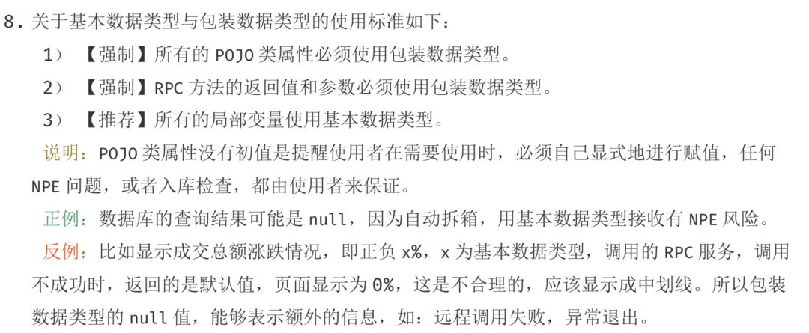

# 参考地址

[参考地址](http://hollischuang.gitee.io/tobetopjavaer/#/basics/java-basic/success-isSuccess-and-bollean-Bollean)

<!--more-->

# boolean和Boolean类型属性不使用is开头

看下面的代码

```java
package setterproperty;
public class BooleanProperty {
    private Boolean isAaa;
    private Boolean bbb;
    private boolean isCcc;
    private boolean ddd;
    private String isEee;

    public String getIsEee() {
        return isEee;
    }

    public void setIsEee(String isEee) {
        this.isEee = isEee;
    }

    public Boolean getAaa() {
        return isAaa;
    }

    public void setAaa(Boolean aaa) {
        isAaa = aaa;
    }

    public Boolean getBbb() {
        return bbb;
    }

    public void setBbb(Boolean bbb) {
        this.bbb = bbb;
    }

    public boolean isCcc() {
        return isCcc;
    }

    public void setCcc(boolean ccc) {
        isCcc = ccc;
    }

    public boolean isDdd() {
        return ddd;
    }

    public void setDdd(boolean ddd) {
        this.ddd = ddd;
    }
}
```

上面的代码定义了**三类**， **五个**属性，并且生成了`set`和`get`方法

* `Boolean`类型，属性分别带有`is`开头和不带有`is`开头（包装类）
* `boolean`类型，属性分别带有`is`开头和不带有`is`开头（基本类型）
* `string`类型，属性分别带有`is`开头和不带有`is`开头

上面的`set`和`get`方法是`idea`自动生成的，可以看到对于`Boolean`以及`boolean`类型的属性，如果是以`is`开头的，那么在生成`set`方法的时候不是在前面加上`set`，而是直接使用`is`开头，对于其他类型的值没有影响。


# Boolean和boolean的区别

看一下阿里巴巴`java`开发手册中对于基本类型和包装类型的使用标准



其实也很容易理解，因为基本数据类型都是有默认值的，但是包装数据类型没有默认值。所以程序如果使用基本类型，那么有可能不是我们想要的结果，但是由于有默认值，程序并没有抛出异常，但是结果不对（对于结果不对时不应该使用默认值计算，而是应该我们自己处理）。若使用包装类型，当程序返回`null`的时候就说明此时结果已经是不对的，需要我们自己去处理。