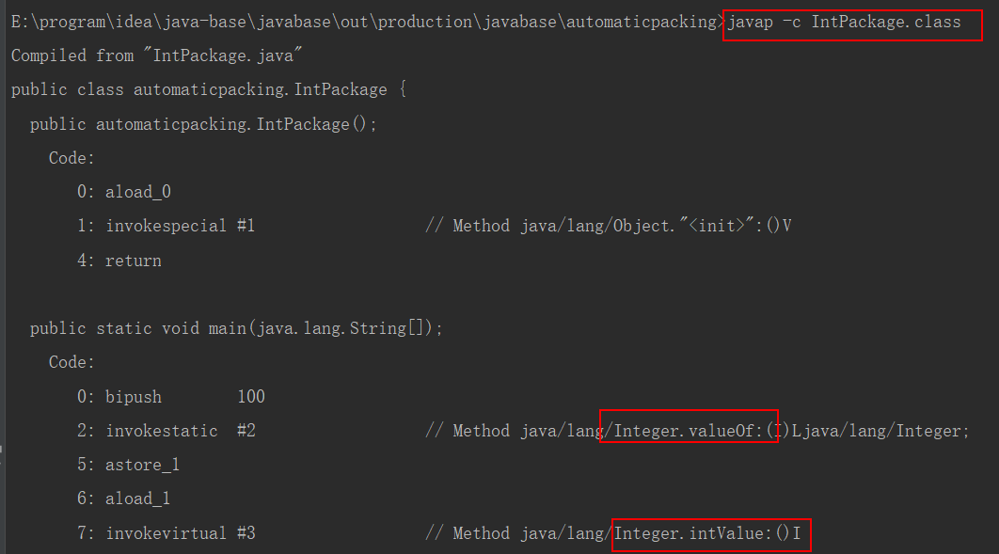
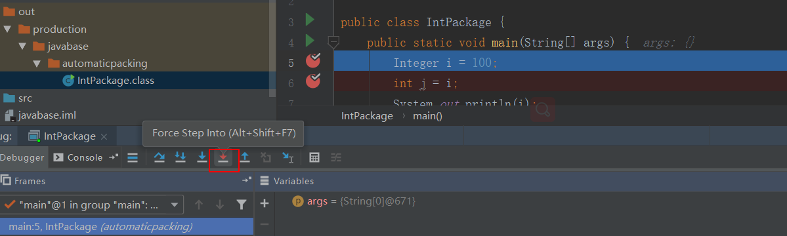

# 自动拆装箱

```java
package automaticpacking;

public class IntPackage {
    public static void main(String[] args) {
        // 自动装箱
        Integer i = 100;
        // 自动拆箱
        int j = i;
        System.out.println(i);
    }
}
```

<!--more-->

## 两种方式查看自动拆装箱的代码

### 反编译法

将上面的代码使用`javap`命令反编译一下：



可以看到其实自动拆装箱是通过`Integer.valueOf()`和`Integer.intValue()`

### 调试法

上面是通过反编译的形式可以知道底层调用的代码是什么，其实中`idea`中还有一种方式是断点调试



可以看到上面的图片，可以点击`force step into`来进入代码。

#### `step into` 和 `force step into`的区别

* `step into`可以进入自己写的方法内部去调试
* `force step into`可以进入任何方法内部进行调试，由于这里我们是要进入`jdk`的包内部代码进行调试，所以需要使用`force step into`


# Integer类型的缓存问题

看下面的代码

```java
package automaticpacking;

public class IntPackage {
    public static void main(String[] args) {
        Integer i = 100;
        Integer j = 100;
        Integer i2 = 200;
        Integer j2 = 200;
        int i3 = 300;
        int j3 = 300;
        System.out.println(i == j); // true
        System.out.println(i2 == j2); // false
        System.out.println(i3 == j3); // true
    }
}
```

上面的代码输出个结果是不是有点奇怪， 第二个结果和第三个结果还是比较号理解的

* 基本类型的比较肯定比较值就可以咯。所以输出结果为`true`没有疑问
* 包装类型为什么第一个是`true`，第二个是`false`呢

## Integer类型缓存值

我们通过调试法看下 `Integer i = 100`这句代码是如何执行的。

```java
public static Integer valueOf(int i) {
    if (i >= IntegerCache.low && i <= IntegerCache.high)
      return IntegerCache.cache[i + (-IntegerCache.low)];
    return new Integer(i);
}
```

* 看源码就知道 `IntegerCache.low`固定为-128
* `IntegerCache.high`是可以配置的，看下源码注释`-XX:AutoBoxCacheMax=<size>`，所以可以通过这个参数类配置最大值。

## 包装类型的比较的坑

上面只是分析了`Integer`类型，其实还有其他包装类型也是一样的有缓存的值，所以对于包装类型有一点需要知道，**包装类型的比较最好都通过`equals`方法来进行比较**

