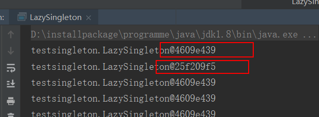
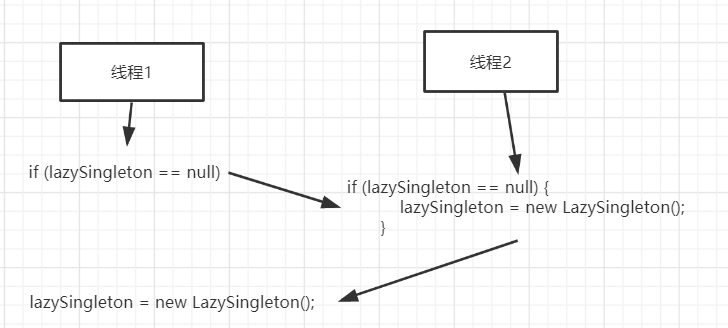
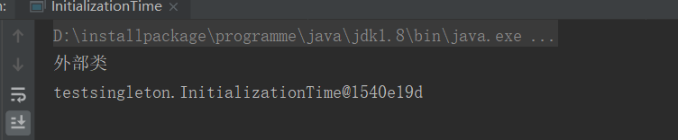

本文主要分析七种形式的单例模式

1. 饿汉式
2. 懒汉式
3. 懒汉式加同步方法
4. `DCL(double check locking)`
5. `volatile+double-check`
6. `holder`
7. 枚举

<!--more-->

# 饿汉式

* 所谓饿汉式就是一开始就将对象创建出来
* 构造方法私有
* 提供获取实例的方法

```java
package testsingleton;
public class HungrySingleton {
    private static HungrySingleton hungrySingleton = new HungrySingleton();
    private HungrySingleton(){
    }
    public static HungrySingleton getHungrySingleton(){
        return hungrySingleton;
    }
    public static void main(String[] args) {
        for (int i = 0; i < 20; i++) {
            new Thread(() -> {
                System.out.println(getHungrySingleton());
            }).start();
        }
    }
}
```

## 优势

* 线程安全

## 缺点

* 非懒加载模式，性能不高


# 懒汉式

* 懒汉式就是当使用的时候才会创建这个对象

```java
package testsingleton;
public class LazySingleton {
    private static LazySingleton lazySingleton;
    private LazySingleton(){
    }
    public static LazySingleton getInstance(){
        if (lazySingleton == null) {
            lazySingleton = new LazySingleton();
        }
        return lazySingleton;
    }
    public static void main(String[] args) {
        for (int i = 0; i < 4000; i++) {
            new Thread(()->{
                System.out.println(getInstance());
            }).start();
        }
    }
}
```

但是这种方式会有线程问题




## 线程不安全分析



如上图所示，

* 线程1执行到 `if(lazySinleton == null)`的时候时间片使用完
* 线程2进入到这块代码，由于线程1还没有创建出对象，所以线程2进来，为空的判断仍然是成立的
* 线程2进入`if`并且创建了对象
* 线程1在前面已经进入了`if`判断，只是还没有创建对象而已，现在轮到线程1了，那么线程1会继续执行创建对象的代码
* 这样就出现了多个对象，也就是线程安全的问题

# 懒汉式加同步方法

上面看到懒汉式可以做到懒加载，但是存在线程不安全的问题，所以可以通过加锁的方式来解决。

```java
package testsingleton;
public class LazySingletonWithLock {
    private static LazySingletonWithLock lazySingleton;
    private LazySingletonWithLock(){
    }
    public static synchronized LazySingletonWithLock getInstance(){
        if (lazySingleton == null) {
            lazySingleton = new LazySingletonWithLock();
        }
        return lazySingleton;
    }
    public static void main(String[] args) {
        for (int i = 0; i < 4000; i++) {
            new Thread(()->{
                System.out.println(getInstance());
            }).start();
        }
    }
}
```

如上面代码所示，也就是在获取实例的代码中加上`synchronized`关键字，这样可以保证线程安全，但是当在方法中加上`synchronized`关键字之后就相当于是退化为串行了，因为加上了`synchronized`关键字时，该方法会被一个线程锁住，其余的线程想要进入该方法就必须要上一个线程退出才行，所以就相当于是单线程了，不能发挥多线程的优势。解决方式请看`DCL`方式

# DCL

所谓`DCL`方式就是`double check lock`，就是双重判断，代码如下

```java
package testsingleton;
public class DCL {
    private static DCL lazySingleton;
    private DCL() {
    }
    public static DCL getInstance() {
        if (lazySingleton == null) {
            synchronized (DCL.class) {
                if (lazySingleton == null) {
                    lazySingleton = new DCL();
                }
            }
        }
        return lazySingleton;
    }
    public static void main(String[] args) {
        for (int i = 0; i < 4000; i++) {
            new Thread(() -> {
                System.out.println(getInstance());
            }).start();
        }
    }
}
```

如上面代码所示，就是在获取实例的方法中做了两个判断，在懒汉式中已经分析为什么会出现线程安全问题，现在加锁之后再判断一次就可以解决这个问题。

## 疑问

上面的代码中如果换成下面这样有没有效果？为什么？

```java
package testsingleton;
public class DCL {
    private static DCL lazySingleton;
    private DCL() {
    }
    public static DCL getInstance() {
       synchronized (DCL.class) {
           if (lazySingleton == null) {
                if (lazySingleton == null) {
                    lazySingleton = new DCL();
                }
            }
        }
        return lazySingleton;
    }
    public static void main(String[] args) {
        for (int i = 0; i < 4000; i++) {
            new Thread(() -> {
                System.out.println(getInstance());
            }).start();
        }
    }
}
```

也就是将`synchronized`放在第一个`if`判断的外面，而不是里面。这样做和第一种方式有什么区别？

# volatile+DCL

上面`DCL`方法可以解决线程安全，并且是懒加载的方式，但是还是可能会有问题，因为上面的案例中是只有一个实例变量，如果这个类中还有其余的变量。先看下面代码：

```java
public class VolatileAndDCL {
    private Connection connection;
    private static VolatileAndDCL lazySingleton;
}
```

比如一个类中有这样的两个变量，变量的实例化在字节码层面是在<init>方法中进行初始化的，在代码层面第一个变量是在第二个变量的后面，所以会讲道理在实例化`lazySingleton`的时候`connection`应该是已经实例化了，但是`jvm`可能会发生指令重排，所以可能`lazySingleton`实例化的时候，`connection`还没有被实例化，这样就会发生一个问题，当线程1实例化了`lazySingleton`，然后线程2拿到`lazySingleton`，因为`lazySingleton`已经不为空，所以线程2不会执行实例化的代码，这样当线程2在使用`connection`的时候就会出现空指针异常，此时可以使用`volatile`关键字来解决，这个关键字就是让强制让`jvm`不进行指令重排。

```java
public class VolatileAndDCL {
    private Connection connection;
    private volatile static VolatileAndDCL lazySingleton;
}
```

这样在`lazySingleton`前面的代码一定会先执行到。

# holder

还有一种更巧妙的方式是通过静态内部类的方式来实现单例模式

代码如下：

```java
package testsingleton;
public class HolderDemo {
    private static HolderDemo lazySingleton;
    private HolderDemo() {
    }
    private static class Holder {
        private static HolderDemo holderDemo = new HolderDemo();
    }
    public static HolderDemo getInstance(){
        return Holder.holderDemo;
    }
    public static void main(String[] args) {
        new Thread(()->{
            for (int i = 0; i < 4000; i++) {
                System.out.println(getInstance());
            }
        }).start();
    }
}
```

对于使用静态内部类的方式需要知道两点

* 一个类只会被初始化一次

* 初始化外部类的时候并不会立即将内部类也初始化，看下面代码

	```java
	package testsingleton;
	public class InitializationTime {
	    static {
	        System.out.println("外部类");
	    }
	    public static class InnerClass {
	        static {
	            System.out.println("内部类的静态块");
	        }
	    }
	    public static void main(String[] args) {
	        System.out.println(new InitializationTime());
	        //System.out.println(new InnerClass());
	    }
	}
	```

	上面的代码只是实例化外部类，打印结果如下：

	

	通过上面的截图可以知道，内部类的`static`块的内容并没有并执行，说明内部类是没有初始化的，内部类的初始化时机是只有当内部类被使用的时候才会初始化。

# 枚举

上面是通过内部类来实现的，还有一种方式是通过枚举来实现，代码如下：

```java
package testsingleton;
public class EnumSingletonDemo {
    private EnumSingletonDemo() {
    }

    //延迟加载
    private enum EnumHolder {
        INSTANCE;
        private EnumSingletonDemo instance = null;

        EnumHolder() {
            instance = new EnumSingletonDemo();
        }

        public EnumSingletonDemo getInstance() {
            return instance;
        }
    }//懒加载

    public static EnumSingletonDemo getInstance() {
        return EnumHolder.INSTANCE.getInstance();
    }
    public static void main(String[] args) {
        System.out.println(EnumSingletonDemo.getInstance());
    }
}
```

如果不熟悉枚举的同学，请前往[枚举](https://www.personalstudy.ltd/2020/04/25/java/%E6%9E%9A%E4%B8%BE/%E6%9E%9A%E4%B8%BE/)。