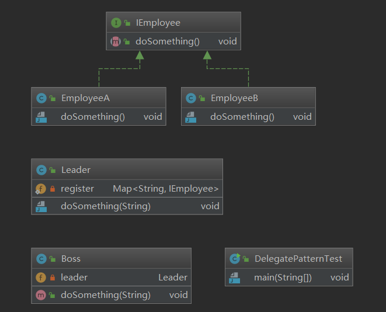

# 基本概念

委派模式主要的基本作用是负责任务的调用和分配，和代理模式很类似。但是还是有一定的区别的

* 代理模式注重过程
* 委派模式注重结果

<!--more-->

委派模式在`spring`中的典型应用就是`DispatcherServlet`，之前没有使用`springMVC`框架，也就是使用原生的`servlet`的时候，是每一个不同的请求都有一个映射地址(这个映射地址在`web.xml`中进行配置)，这个映射地址就是对应到该请求的处理类，使用`springMVC`框架之后，我们都是直接将请求映射到`controller`中的方法中，那么是怎么直接映射到方法中的呢，其实`DispatcherServlet`类就是充当的委派者的模式，我们所有的请求都会被`DispatcherServlet`这个类拦截，然后在这个类中进行任务调度。

来看一下委派模式的案例。

# 案例代码

## 涉及对象

* boss
* leader
* employee

来看一下这几个`UML`类图的关系




* `Boss`中有`leader`的引用，
* `Boss`给`leader`下达任务
* `leader`将任务委派给具体的员工去做

Boss类

```java
package designmode.delegatepattern;

public class Boss {
    private Leader leader = new Leader();
    public void doSomething(String command){
        this.leader.doSomething(command);
    }
}
```

leader类

```java
package designmode.delegatepattern;
import java.util.HashMap;
import java.util.Map;
public class Leader {
    private static Map<String, IEmployee> register = new HashMap<>(2);
    static {
        register.put("技能A", new EmployeeA());
        register.put("技能B", new EmployeeB());
    }

    public void doSomething(String command) {
        register.get(command).doSomething();
    }
}
```

员工接口

```java
package designmode.delegatepattern;
public interface IEmployee {
    void doSomething();
}
```

具体员工类

```java
package designmode.delegatepattern;

public class EmployeeA implements IEmployee {
    @Override
    public void doSomething() {
        System.out.println("我是员工A,我擅长技能A");
    }
}
```

```java
package designmode.delegatepattern;

public class EmployeeB implements IEmployee{
    @Override
    public void doSomething() {
        System.out.println("我是员工B,我擅长技能B");
    }
}
```

测试类

```java
package designmode.delegatepattern;
public class DelegatePatternTest {
    public static void main(String[] args) {
        Boss boss = new Boss();
        boss.doSomething("技能A");
        boss.doSomething("技能B");
    }
}
```

