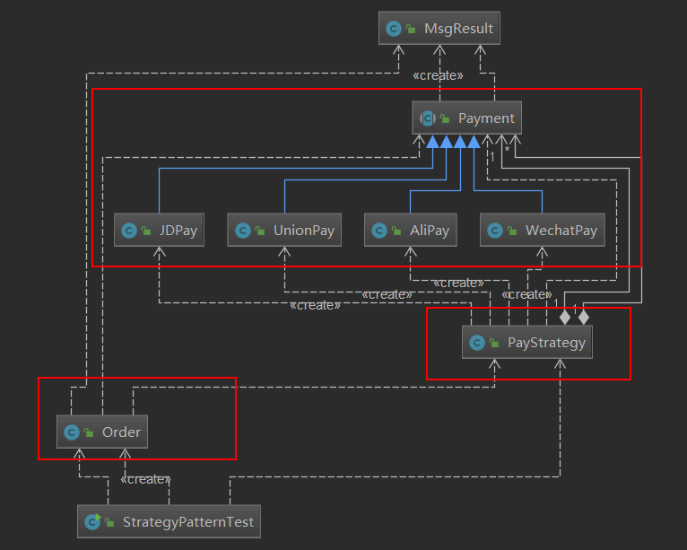

# 基本概念

策略模式是一种定义一系列算法的方法，从概念上来看，所有这些算法完成的都是相同的工作，只是实现不同，它可以以相同的方式调用所有的算法，减少了各种算法类与使用算法类之间的耦合。

<!--more-->

# 案例

比如我们平时买东西付款方式可以用多种

* 支付宝支付
* 微信支付
* 银联支付
* 京东白条支付

现在来看一下平时我们代码应该如何写。

## 不使用策略模式

### 支付订单类

```java
package designmode.strategypattern.normal;

import designmode.strategypattern.MsgResult;
import designmode.strategypattern.PayStrategy;
import designmode.strategypattern.Payment;

/**
 * Created by Tom.
 */
public class NormalOrder {
    private String uid;
    private String orderId;
    private double amount;

    public NormalOrder(String uid, String orderId, double amount){
        this.uid = uid;
        this.orderId = orderId;
        this.amount = amount;
    }

    public String pay(String payKey){
        if ("京东".equals(payKey)) {
            return "使用京东支付，支付成功";
        } else if ("支付宝".equals(payKey)) {
            return "使用支付宝支付，支付成功";
        } else if ("微信".equals(payKey)) {
            return "使用微信支付,支付成功";
        } else {
            return "支付方式错误";
        }
    }
}
```


### 测试类

```java
package designmode.strategypattern.normal;

public class NormalOrderTest {

    public static void main(String[] args) {
        NormalOrder order = new NormalOrder("1", "13424123432", 33.22);
        System.out.println(order.pay("支付宝"));
        System.out.println(order.pay("微信"));
    }
}
```

### 缺点

加上后面还有别的支付方式，我们就一直需要修改`NormalOrder`类的`pay`方法，需要在里面不断的加上判断，去修改支付逻辑，这就违背了开闭原则。


## 使用策略模式

先看一下使用策略模式的`UML`类图



从上面的类图中可以看到主体是分为三类

* `payment`接口或抽象类和具体的支付方式
	* 因为支付都有相似的功能，比如支付类型，判断该支付类型下账号的余额等，所以需要有一个接口或者抽象类，然后具体的支付方式来实现或者继承这个接口或抽象类。
* 具体策略，这里就是`PayStrategy`类，这个类的作用是给上层客户端来调用，获取具体的支付方式
* `order`类就是订单类，可以认为是客户端类

[策略模式代码](https://gitee.com/Gwei11/code/tree/master/javabase/strategypattern)