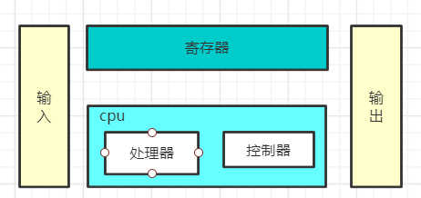
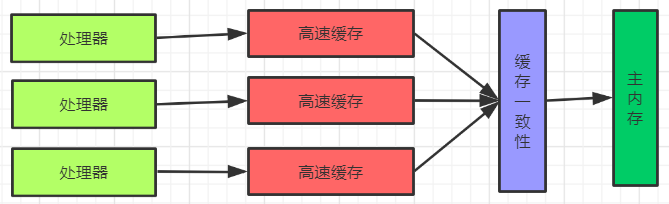
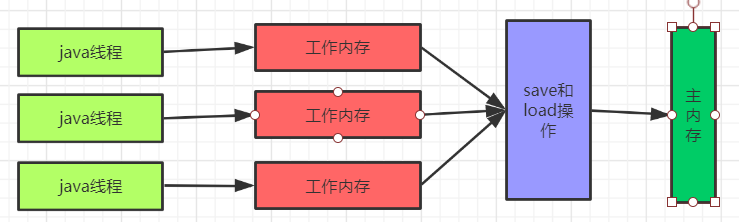
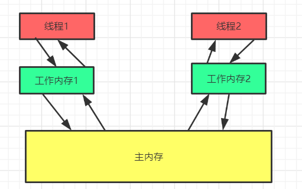

# 主要内容

`java`内存模型实际上是一个抽象的概念，是一套规范，而不是一个实际的东西，而`java`内存结构就是根据这一套规范来进行划分的。可以先看另一篇文章。

[jvm](https://gwei11.gitee.io/2020/04/23/java/jvm/jvm/#more)

对于`java`内存模型我们主要需要了解以下几个内容：

* 硬件内存架构
* 线程和`jvm`
* `java`内存模型
* `java`内存模型对并发编程的支持

<!--more-->

# 硬件内存架构

> 物理机遇到的并发问题与虚拟机中的情况有很多相似之处，物理机对并发的处理方案对虚拟机的实现也有相当大的参考意义

如上图所示，在计算机模型中主要是有五个部分来组成的，其中**处理器**和**控制器**合起来就是我们所示的`cpu`

运算器的运算速度都是很快的，但是我们的数据存储不可能所有数据都存放在寄存器中，所以数据的`io`操作都是很有必要 的，这样就不能充分利用`cpu`的运算能力，此时就需要**加上读写速度和处理器运算速度差不多的的高速缓存**来作为**内存和处理器之间**的缓冲。将运算需要使用的数据复制到缓存中，让运算能快速进行，当运算结束后再从缓存同步回内存之中，这样处理器就无须等待缓慢的内存读写了。

## 缓存一致性问题

上面加上了缓存可以解决内存的读写速度赶不上处理器的运算速度问题，但是又出现了另外一个问题。**缓存一致性问题**

因为 在多处理器中，每一个处理器都有自己的高速缓存，但是内存是只有一个。对于缓存一致性问题在硬件层面主要有两个解决方式

* 总线加锁
	* 所谓的总线加锁就每一次都会锁定一个`cpu`，只有这个锁定的`cpu`才可以执行，其余的`cpu`是不能执行的。这种方式会降低`cpu`的吞吐量。

* 使用缓存一致性协议，所谓使用缓存一致性协议也就是在缓存和主内存之间加上一个访问规则，通过这种规则来解决缓存一致性问题。

这里的**缓存一致性其实是一个协议**，是处理缓存一致性问题的一个协议(也可以任认为是处理缓存一致性问题的一个理论基础)。

# java内存模型(java memory mode)

## 什么是`java`内存模型(JMM规范)

**`java`内存模型其实也是一个理论上的东西，是一个规范，这个规范的主要目的是定义程序中各种变量的访问规则，也就是关注的是虚拟机中把变量值存储到内存和从内存中取出变量值这样的底层细节。**此处的变量和`java`编程中的变量是不同的，这里的变量包含了实例字段，静态字段和构成数组对象的元素，但是不包括局部变量和方法参数。（上面这段话是《深入理解java虚拟机》这本书中的）

`jvm`将内存组织结构主要划分为两个部分

* 主内存
* 工作内存

### 主内存

* 主要包含本地方法区和堆
* 所有变量都要存储在主内存中，这些变量对于所有线程都是共享的

### 工作内存

* 每一个线程都有自己独立工作的地方，也就是工作内存
* 工作内存中保存的是主内存中某些变量的拷贝，线程堆变量的所有操作都必须在工作内存中进行，不能直接操作主内存
* **如果是基本数据类型，那么直接分配到工作内存，如果是引用类型，引用的地址存在在工作空间中，但是具体的对象是存在在堆中(也就是主内存中)，是可以共享的**

看上图，之所以存在`java`内存模型一说是因为`java`虚拟机的工作机制。当有多个线程的时候，每一个线程可以操作的数据有两种类型

* 线程私有的数据，也就是这个数据就算改变了也不会影响其余线程，比如说局部变量就是线程私有的数据
* 线程共享的数据，这样的数据多个线程都可以访问，就会出现线程安全的问题

因为线程操作的数据有不同类型，所以在`java`中一个线程去操作数据的时候不是在主内存中直接操作，其实还有一个属于线程自己的内存(工作内存)，当操作线程私有的数据比较好理解，直接在工作内存中完成就可以咯，如果是操作共享的数据，那么就在主内存中拿一份数据到自己工作内存中操作，操作完了再将数据给到主内存中。

## 内存结构和内存模型的关系

上面说了什么是`java`的内存模型，知道`java`内存模型是一个规范，定义的是程序中变量的访问规则，那么这个内存模型和我们平时所有的内存结构有什么关系呢？先看一下`java`内存结构

### java内存结构

`java`中内存结构主要是有五个部分

* 程序计数器
* 堆
* 虚拟机栈
	* 存放方法运行时所需的数据，成为栈帧
* 本地方法栈
* 方法区
	* 存储运行时常量池、已被虚拟机加载的类信息、常量、静态变量，即时编译后的代码等

上面`java`的五个部分其实就是根据`JMM`规范(`java`内存模型)来划分的一个内存结构。

# 并发编程的三个特性

## 原子性

执行的操作不可分割，可以理解为就是一步操作，因为只有一步所以肯定是不能分割的

## 可见性

线程都是有自己的工作空间的，每一个线程都只能操作自己工作空间的数据，别的线程是看不到自己线程的工作空间的数据的

## 有序性

程序中代码的顺序不一定就是在`cpu`中执行的顺序，因为存在两种重排

* 编译重排序(编译期)
* 指令重排序(运行期)

# JMM规范是如何保证并发编程的三个特征的呢

## `JMM`和原子性

### 原子性案例1

`X = 10`这样一个操作具有原子性么？

* 如果`X`是私有数据，是分配到工作空间的，那么就是有原子性的，因为只有一个写的操作
* 如果`X`是共享的数据，就是在主内存中，这样就需要先在主内存中读取(复制)到工作空间中，修改完成后再将数据通过到主内存中，这样就是两步，也就是没有原子性

### 原子性案例2

`i++`这个操作具有原子性么？

`i++`这个操作其实是需要分为下面这几个步骤的

* 读取`i`的值
* 将`i`的值加一
* 将修改后的值赋值给`i`

可以看到每一步都是原子操作，但是这三个原子操作合在一起之后去不是原子操作了

### JMM如何保证原子性的

* 使用`Synchronized`关键字
* 使用`JUC`的`lock`和`unlock`关键字

## `JMM`和可见性

线程是不能操作主内存中的数据的，只能操作自己的工作空间的数据，所以需要数据时会先去工作空间找，如果找到了就会使用工作空间中的数据，找不到才会从主内存中找，但是如果一个线程在工作空间找到了，不过这个数据在别的线程中已经修改了，并且刷新到主内中了，由于当前线程的工作空间中有这个数据，没有在主内存中拿，这样当前线程拿到的就不是最新的数据。`JMM`是如何解决这个问题的呢？

### `JMM`如何保证可见性的

* `Volatile`关键字，使用这个关键字后，当线程需要使用这个关键字修饰的数据时，每一次都会从主内存中去找数据，而不是从工作空间中找。
* `JUC`  可以使用`JUC`的`lock`和`unlock`

## `JMM`和有序性

对于有序性问题可以使用下面两种方式来解决

* 使用`Volatile`关键字
* 使用`Synchronized`来加锁