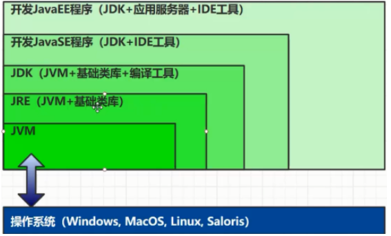
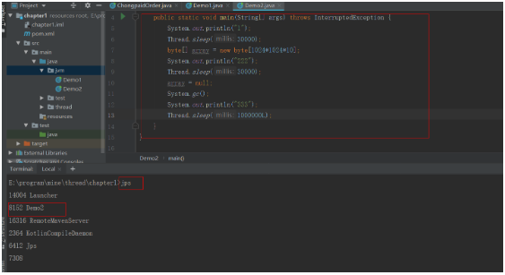
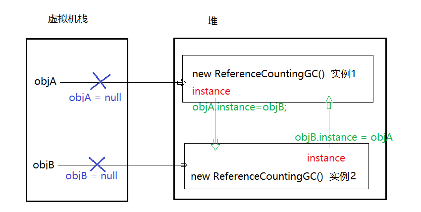
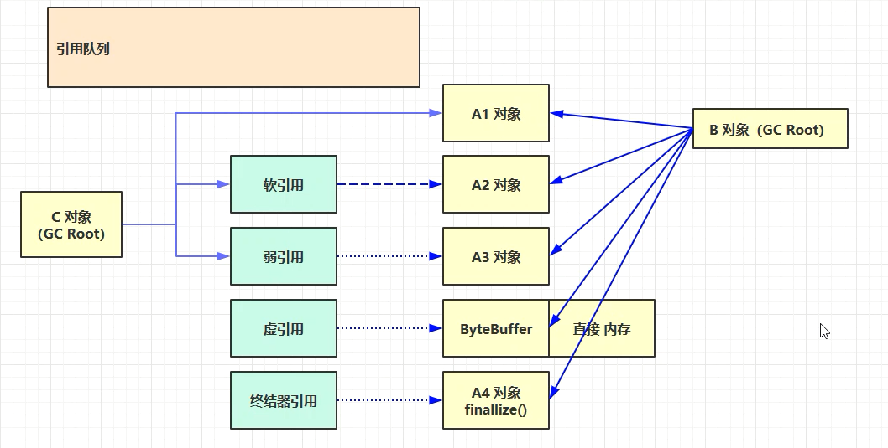
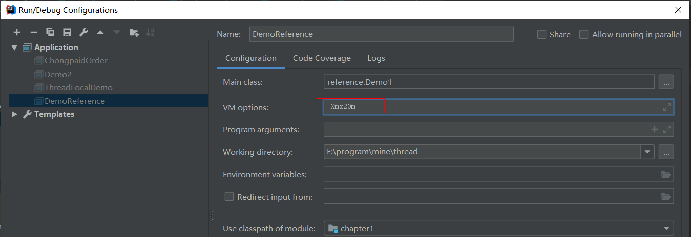
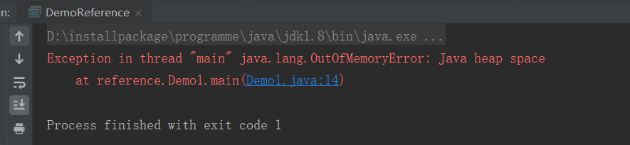
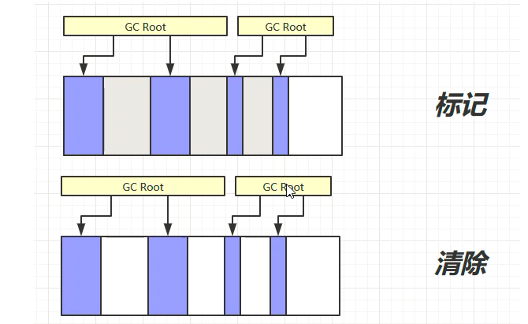
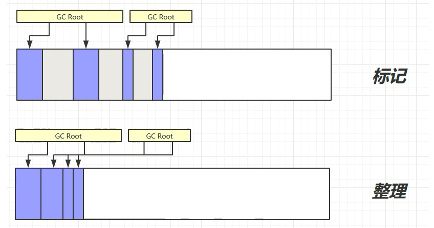
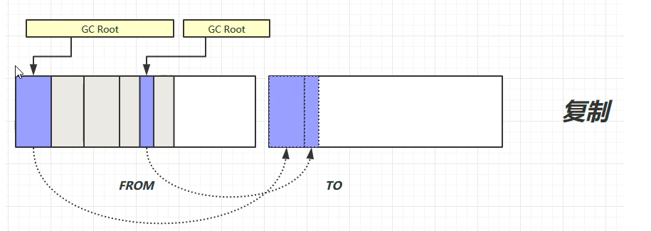
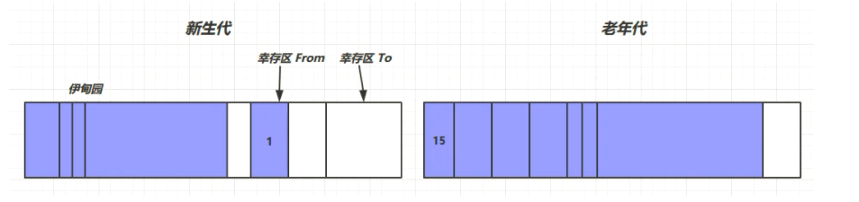

# 什么是jvm

`java Virtual Machine`也就是`java`程序运行的环境(`java`二进制字节码的运行环境)

## 使用jvm的优势

* 使用`java`的程序员都知道，`java`是一次编写，处处运行的，那么为什么可以做到一次编写，处处运行呢？

	[java是如何实现平台无关的](http://hollischuang.gitee.io/tobetopjavaer/#/basics/object-oriented/platform-independent)

* 自动内存管理，有垃圾回收功能

<!--more-->

## `jdk`、`jre`、`jvm`的区别




### 堆内存诊断工具

* `jps`工具
	* 查看当前系统中有哪些`java`进程
* `jmap`工具
	* 查看某一个时刻堆内存占用情形
* `jconsole`工具
	* 图形界面，多功能的检测工具，可以连续检测

#### jps

**注：**下面我所有的命令都是在`idea`的`terminal`窗口执行的，其实只要配置了jdk环境变量，就可以在任意位置开启`cmd`窗口来执行也是一样的。

该工具的作用是查看当前系统中有那些`java`进程。就拿上面的案例代码来看，该命令是在`idea`中`local`窗口输入的。



使用`jps`命令可以查看到当前程序的进程`id`是8152


# 垃圾回收

当我们思考`GC`(`Garbage Collection`)是需要思考三件事情：

1. 哪些内存需要回收
2. 什么时候回收
3. 如何回收

内存结构中的**程序计数器**，**虚拟机栈**，**本地方法栈**三个区域是随着线程而生的，栈中的栈帧随着方法进入和退出执行入栈和出栈操作，每一个栈帧中分配多少内存基本上是在类结构确定下来的时候就已经知道的(虽然在运行期间会由`JIT`编译器进行一些优化，不过大体上可以认为在编译期间就知道需要分配多少内存)，程序计数器是唯一个没有规定内存泄漏的区域，所以这几个区域是不用考虑内存回收的问题。`java`堆和方法区不一样，一个接口中多个实现类需要的内存可能不同，一个方法中的多个分支需要的内存也不一样，我们只有在程序处于运行的时候才知道需要创建哪些对象，这部分内存的分配和回收都是动态的，垃圾收集器所关注的就是这部分内存(**堆内存**)。

## 如何判断垃圾可以回收

### 引用计数法

给对象中添加一个引用计数器，每当有一个地方引用它时，计数器值就加1；当引用失效时，计数器值就减1；任何时刻计数器为0
的对象就是不可能再被使用的。

但是`java`虚拟机不是使用这种方式来判断的，因为这种方式比较难以解决的一个问题就是**循环引用**

```java
public class ReferenceCountingGC {
  public Object instance = null;
  public static final int _1MB = 1024*1024;
  // 该成员变量的作用是占用一点内存，可以在gc日志中判断对象是否被回收过
  private byte[] bigSize = new byte[2*_1MB];
  public static void testGC() {
    ReferenceCountingGC objA = new ReferenceCountingGC();
    ReferenceCountingGC objB = new ReferenceCountingGC();
    objA.instance = objB;
    objB.instance = objA;
    objA = null;
    objB = null;
    // 下面的代码执行后，如果是通过引用计数法来判断对象是否可以回收的话，这两个对象是不会被回收的
    System.gc();
  }
}
```



如上图所示，即使执行了`objA = null`和`objB=null`,但是实际上他们的实例还是存在者引用，如果按照引用计数法来判断话，这两个对象是不会被回收的，实际上这两个对象是被回收了。所以可以说明`java`虚拟机不是使用引用计数法来判断对象是否可回收的。

### 可达性分析算法

该算法的基本思路是通过一系列的称为`GC Root`的对象作为起始点，从这些节点开始向下搜索，搜索所走过的路径中称为引用链，当一个对象到`GC Root`没有任何引用链时(从图论的角度来看，就是从`GC Root`到这个对象不可达)证明这个对象是不可用的。

* `java`虚拟机中的垃圾回收器采用可达性分析来探索所有存活的对象
* 扫描堆中的对象，看是否能够沿着`GC Root`对象为起点的引用链找到该对象，如果找不到，表示可以回收。

#### 在`java`语法中，可作为`GC Root`的对象包含以下几种

* 虚拟机栈(栈帧中的本地变量表)中引用的对象
* 方法区中**类静态属性**引用的对象
* 方法区中常量引用的对象,比如字符串常量池中引用的对象
* 本地方法栈中`JNI`(也就是`native`方法)中引用的对象。
* `java`虚拟机内部的引用，如基本数据类型对应的`Class`对象
* 所有被同步锁（`synchronized`关键字）持有的对象

#### 不可达不一定死亡

即使是在可达性分析算法中不可达的对象，也不一定都是要被回收的，此时他们暂时处于缓刑阶段，要宣告一个对象死亡，至少需要经历**两次标记过程**

* 如果对象在进行可达性分析后发现没有与`GC Root`相连接的引用链，那么将会被第一次标记并且进行一次筛选，筛选的条件是此对象是否有必要执行`finalize()`方法，当对象没有覆盖`finalize()`方法时，或者`finalize()`方法已经被虚拟机调用过，虚拟机将这两种情形视为**“没有必要执行”**
* 如果该对象判断为有必要执行`finalize()`方法，那么该对象将中被放置在一个叫做`F-Queue`队列中，并且在稍后由一个虚拟机自动建立的，优先级低的`Finalizer`线程去执行它。`finalize()`方法是对象逃脱死亡命运的最后一次机会，稍后`GC`将对`F-Queue`中的对象进行第二次小规模的标记，如果对象在`finalize()`中成功拯救自己(只要重新与引用链上的任何一个对象建立关联即可，比如将自己(`this`关键字)赋值给某个类变量或对象的成员变量，那么在第二次标记的时候会被将它移除“**即将回收**”的集合)，如果对象在此时还没有逃脱，那就说明需要被回收了。

<font color="red">注意：这种自救方式并不被推荐，最好不要使用这个方法</font>

### 五种引用

* 强引用
* 软引用
* 弱引用
* 虚引用(存放直接内存地址，便于回收直接内存)
* 终结器引用

> * 软引用和弱引用可以联合引用队列来使用，也可以不结合引用队列来使用(之所以需要结合引用队列来使用，是引用软引用和弱引用自身也是需要占有一定的内存的，要想回收他们就需要在引用队列中找到他们才能回收)
> 	* 当发生GC时不一定就与回收软引用，只有当发生GC之后内存还是不足的时候才会回收软引用
> 	* 当发生GC的时候弱引用就会被回收掉
> * 虚引用和终结器引用必须结合引用队列来使用

四种引用强度(不包含终结器引用)从大到小分别是：**强引用->软引用->弱引用->虚引用**

**参考图**（下图中有两个`GC Root`， 实线表示强引用）



#### 强引用

强引用表示从`GC Root`出发可以直接达到的，比如`Oeject object = new Object()`这类引用就是强引用。只要强引用还在，垃圾回收器就不会回收掉被引用的对象。

比如上面的`A1`对象被`B`对象和`C`对象都是直接引用到(当然实际上只要有一个强引用就可以算是强引用)，所以是一个强引用。

#### 软引用

软引用用来描述一些还有用但是不是必须的对象，对于软引用关联着的对象，在系统中**将要发生内存溢出异常之前**，将会把这些对象列进回收范围之内进行第二次回收。如果这次回收还是没有足够的内存，才会抛出内存溢出异常，在`jdk1.2`之后，提供了`SoftReference`类来实现软引用。

比如上面的`A2`对象如果是从`C`对象的角度来看是一个软件用。（当然从B对象来看是强引用，所以垃圾回收是不会回收该对象的）

**软引用案例：**

```java
public class Demo1 {
    private static final int _4MB = 4 * 1024 * 1024;

    public static void main(String[] args) throws IOException {
        List<byte[]> list = new ArrayList<>();
        for (int i = 0; i < 5; i++) {
            list.add(new byte[_4MB]);
        }
        System.in.read();
    }
}
```

设置堆内存大小为`20M`



运行程序出现堆内存溢出错误：



将程序修改为软引用的形式来做：

```java
package reference;

import java.io.IOException;
import java.lang.ref.SoftReference;
import java.util.ArrayList;
import java.util.List;

public class Demo1 {
    private static final int _4MB = 4 * 1024 * 1024;

    public static void main(String[] args) throws IOException {
        soft();
    }

    public static void soft() {
        List<SoftReference<byte[]>> list = new ArrayList<>();
        for (int i = 0; i < 5; i++) {
            SoftReference<byte[]> reference = new SoftReference<>(new byte[_4MB]);
            System.out.println(reference.get());
            list.add(reference);
            System.out.println(list.size());
        }
        System.out.println("循环结束");
        for (SoftReference<byte[]> ref : list) {
            System.out.println(ref.get());
        }
    }
}
```

此时不会出现堆内存溢出错误而且`list`中前面四个都已经被回收掉了。当然除了配置堆内存大小外还可以配置显示gc回收的虚拟机运行参数；

```
-Xmx20m -XX:+PrintGCDetails -verbose:gc
```

#### 弱引用

弱引用也是用来描述非必须的对象的，但是它的强度比软引用更弱一些，被弱引用关联的软引用只能生存到下一次垃圾收集发生之前，当垃圾收集器工作时，**无论当前内存是否足够，都会回收掉被弱引用关联的对象**，在`jdk1.2`之后，提供了`WeakReference`类来实现弱引用。

#### 软弱引用与引用队列

软引用与若引用的区别在于他们的回收时机

* 软引用是只有当内存空间不足时才会被回收
* 弱引用是无论内存空间是否足够都是会被回收的

从上面的图可以看到，软引用与弱引用可以认为是间接引用，也就是根对象首先强引用一个软引用或弱引用，然后该软引用或弱引用再来引用一个对象，那么当这个对象（比如A2）当被回收时，`A2`所对应的软引用也是会占有一定的内存的，如果想要回收这个内存空间就需要`A2`对应的软引用进入到引用队列中，然后在引用队列中进行遍历的时候回收这个内存(对于弱引用也是同样的道理)。

#### 虚引用

**软弱引用可以配置引用队列使用，也可以不用配合引用队列来使用，但是虚引用就必须配合引用队列来使用**

虚引用也被称为幽灵引用或幻影引用，他是最弱的一种引用关系，一个对象是否与虚引用存在，完全不会对其生存时间构成影响，也无法通过虚引用来获取一个对象实例，为一个对象设置虚引用关联的唯一目的就是能在这个对象被收集器回收时收到一个系统通过，在`jdk1.2`之后，提供了`PhantomReference`来实现虚引用。

**使用案例：**

当我们使用`ByteBuffer`时是会创建一个直接内存，同时也会创建一个`Cleaner`的虚引用，当`ByteBuffer`被垃圾回收时，它所分配的直接内存是不会被回收的，因为直接内存是不受`java`虚拟机管理的，此时就需要使用的`Cleaner`的虚引用了，因为当`ByteBuffer`回收时，该虚引用就会进入到引用队列，引用队列里面会检测是否有`Cleaner`虚引用，如果有就会调用`clear`方法，该方法最终会调用`Unsafe.freeMemory()`来释放掉这一块直接内存。

#### 终结器引用

终结器引用也是需要配合引用队列来使用的。

每一个对象都有一个终极父类`Object`，`Object`类中有一个`finalize()`方法，如果我们重写了这个方法，那么这个方法的调用时机是什么呢?这就需要使用的终结器引用了。**当没有强引用来关联该对象的时候，虚拟机会帮我们创建终结器匀变速，并终结器就会进入到引用队列(此时该对象还没有被回收)。**有一个优先级很低的线程会检查引用队列中是否有终结器引用，如果有就会根据该终结器引用找到对应对象的`finalize()`方法。

<font color="red">注意：通过终结器引用来释放资源的方式效率很低，多以一般是不推荐使用finalize()方法了释放资源。</font>

## 垃圾回收算法

### 标记清除

* 速度快
* 会造成内存碎片



### 标记整理

* 速度慢
* 没有内存碎片



### 复制

* 没有内存碎片
* 需要占用双倍的内存空间



`jvm`中并不是只是使用某一种算法，而是在不同的情形下会使用不同的算法，也有可能结合起来使用。

## 分代垃圾回收



* 对象首先分配在**伊甸园**区域
* 新生代空间不足时，触发`minor gc`,伊甸园和`from`区存活的对象使用**复制算法**复制到`to`区，存活的对象年龄加1并且交换`from`区和`to`区
* `minor gc`会引发 `stop the world`,暂停其他用户的线程，等待垃圾回收结束，用户线程才恢复
* 当对象寿命超过阈值时，会将对象移入到老年代，最大寿命是15(使用4bit来存储该值，所以最大是15)
* 当老年代空间不足，会先尝试触发 `minor gc`，如果之后空间还是不足，那么会触发`full gc`,`SWT`的时间更长。