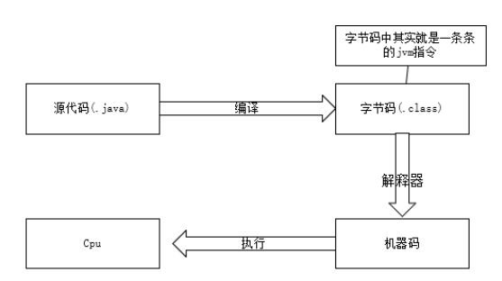
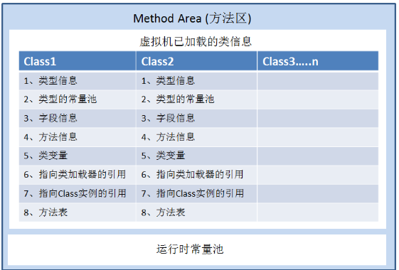
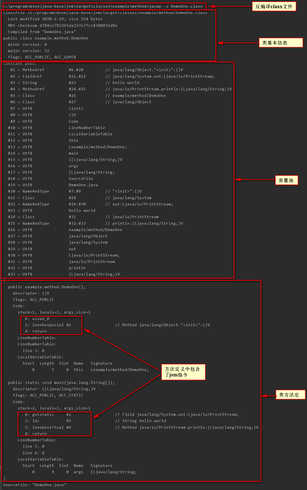
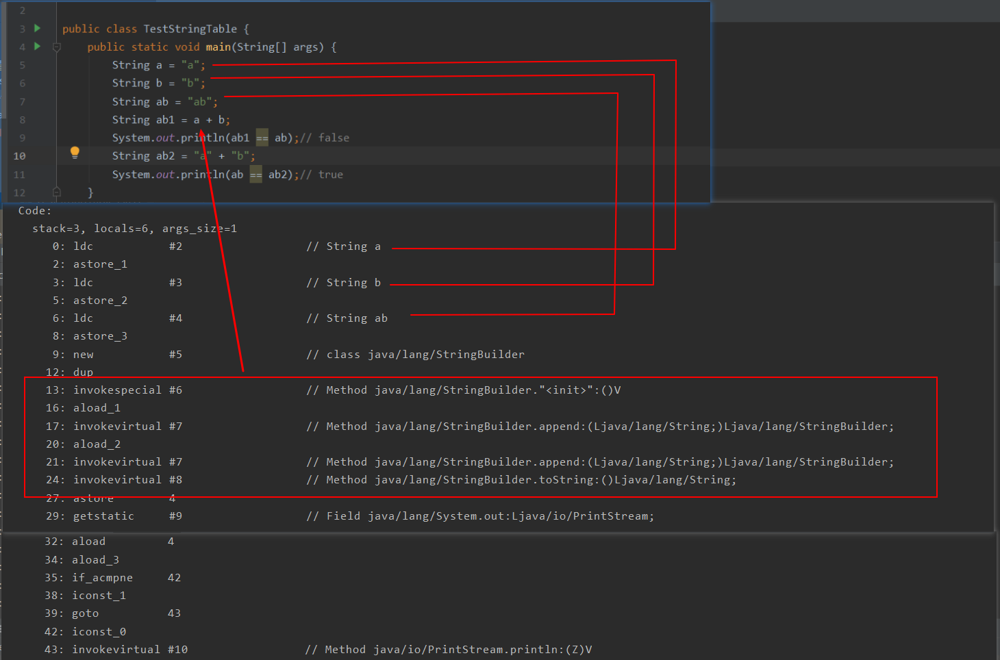
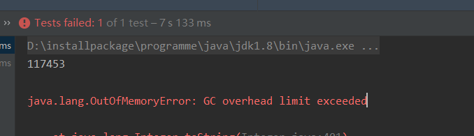
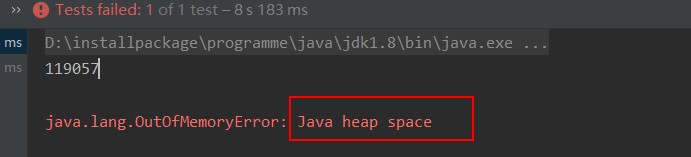
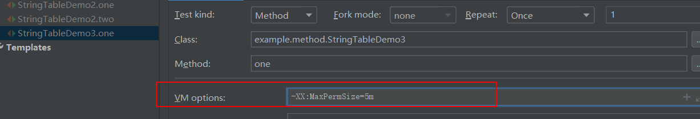
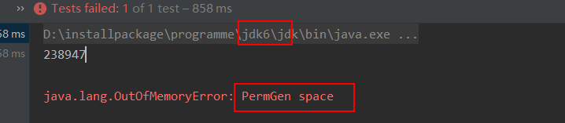

# jvm的内存结构

`java`内存结构主要划分为五大部分

* 线程私有的三个
	* 程序计数器
	* 虚拟机栈
	* 本地方法栈
* 线程共享的两个
	* **堆**
	* **方法区**


<!--more-->

## 程序计数器

`Program Counter Register`程序计数器(寄存器)



如上图所示：`java`源代码到生成对象是有一个过程的

1. `java`源文件首先需要经过编译器编译成字节码`.class`文件，字节码文件中其实就是一条条的`jvm`指令，这些指令是不能直接到`cpu`中执行的，所以需要第二步。
2. 第二步这些字节码的`jvm`指令会被解释器解释成**机器码**
3. 机器码可以直接被`cpu`识别并执行
4. 要知道指令不是只有一条，那么当执行完这一条指令后，如何知道下一条要执行的是什么指令呢？此时就需要 使用到**程序计数器**，**程序计数器的作用就是保存程序需要执行的下一条`jvm`指令.**
5. 程序计数器的物理实现是寄存器.

### 程序计数器的特点

* 线程私有
* 唯一一个不会存在内存溢出的区域
* 如果执行的是本地方法，则程序计数器中值为空
* 程序计数器的物理实现为寄存器

## 虚拟机栈

* 栈是**线程**运行时需要的内存空间
* 栈的组成元素叫做栈帧，用于存储**局部变量表、操作数栈、动态连接、方法出口**等信息
	* 每一个方法的运行所需要的内存就是一个栈帧
	* **局部变量表**存放了编译期可知的各种`Java`虚拟机基本数据类型（`boolean、byte、char、short、int、`
		`float、long、double`）、对象引用（`reference`类型，它并不等同于对象本身，可能是一个指向对象起始
		地址的引用指针，也可能是指向一个代表对象的句柄或者其他与此对象相关的位置）和`returnAddress`
		类型（指向了一条字节码指令的地址），其存储空间是以局部变量槽(`Slot`)来表示
		* `long`和`double`会占用两个变量槽
		* 其余类型会占用一个变量槽
		* 局部变量表的空间大小（变量槽的数量）在编译器就可以确定
* 每一个线程只能有一个活动栈帧，对应着当前线程正在执行的那个方法

所以方法的代码，局部变量那些都是保存在栈中。

### 问题解析

#### 垃圾回收是否涉及栈内存

栈内存涉及到的是方法调用，当方法调用完成后方法对应的栈帧就会自动出栈，所以也不存在垃圾回收的问题。

#### 栈内存是否分配的越大越好

当栈内存分配的越大，也就你意味着能够容纳的栈帧就越多，栈帧越多对应的是方法调用的层级可以更深，但是由于内存总容量是固定的，所以当栈内存越大的时候，同时可以运行的线程的数量就会减少(原因可以看上面栈内存的说明，要知道栈是线程运行时需要的内存空间)

#### 方法内的局部变量是否线程安全

考虑线程安全的问题需要考虑的一个变量是线程私有的，还是线程共享的，当是线程私有的时候就不会有线程安全的问题，当时线程共享的时候就会有线程安全的问题。

* 如果方法内的局部变量没有逃离方法的作用范围，就是线程安全的
* 如果局部变量引用了对象，并逃离了方法 的作用范围，就是线程不安全的

### 栈溢出

* 栈帧**过多**会导致栈内存溢出(也就是方法调用层级过多)
* 栈帧**过大**导致栈内存溢出
* 栈内存溢出会出现`java.lang.StackOverflowError`错误
* 在`idea`中我们可以自己设置栈的大小来进行测试， 设置参数 为 `-Xss256k`（`-Xss`固定，字面的数值自己设置）

## 本地方法栈

* 当`java`虚拟机 调用本地方法的时候需要提供的内存空间
* 带有`native`修饰的方法就是本地方法

## 堆

**堆内存就是用来存放对象实例的。**


* 通过`new`关键字创建的对象，都会使用堆内存(但是现在已经有技术可以避过这个问题，所以现在这句话也不绝对)
* 堆是线程共享的，堆中对象都需要考虑线程安全的问题
* 有垃圾回收机制

### 堆内存溢出

```java
package example.heap;
import java.util.ArrayList;
import java.util.List;
// -Xmx8m  可以使用-Xmx来修改堆内存大小
public class HeapOut {
    public static void main(String[] args) {
        int i = 0;
        try {
            List<String> list = new ArrayList<>();
            String a = "hello";
            while (true) {
                i++;
                list.add(a);
                a = a + a;
            }
        } catch (Throwable throwable) {
            throwable.printStackTrace();
            System.out.println(i);
        }
    }
}
```

**测试结果**


* 可以通过 `-Xmx8m`来将堆内存的大小设置为`8m`，这样再一次运行循环次数肯定会降低。

## 方法区

### 概述

* 方法区主要存储的是类结构的，也就是类的一些信息，比如下面的一些信息
	* 构造方法
	* 成员方法
	* 成员变量
	* 运行时常量池
* 方法区在虚拟机启动的时候就会创建
* 方法区在**逻辑上**是堆内存的一部分，但是实际上不一定是，比如对于`HotSpot`虚拟机在`jdk1.8`方法区使用**永久代**来实现，确实是堆空间的一部分，但是`jdk1.8`及以后使用的是**元空间**来实现，使用的是系统内存。
* 方法区也会导致`OutOfMemory`错误




### jdk1.6方法区的内存结构


### jdk1.8方法区的内存结构


### 方法区内存溢出

* `jdk1.8`之前会出现永久代内存溢出
	* 出现`java.lang.OutOfMemoryError:PermGen space`
	* 可以通过 `-XX:MaxPermsize=8m`  来设置方法区大小

* `jdk1.8`之后会导致元空间内存溢出
	* 出现`java.lang.OutOfMemoryError:Metaspace`
	* 可以通过`-XX:MetaspaceSize=8m`来设置方法区大小

### 二进制字节码

二进制字节码中主要包含了三个内容

* 类的基本信息,比如版本，类的访问修饰符等
* 常量池
* 类方法定义(类方法定义中包含了虚拟机指令)

可以通过反编译来查看主体是不是包含这三个部分

**源代码DemoOne.java**

```java
package example.method;
public class DemoOne {
    public static void main(String[] args) {
        System.out.println("hello world");
    }
}
```

**对DemoOne.class反编译**

```
javap -v 类名.class
```


**反编译后的内容**

****


### 常量池

从上图可以看出方法定义中包含了`jvm`指令，`jvm`指令后可以看到有`#1`、`#2`这样的内容，这些就需要到常量池找对应的信息，就可以得知需要执行的是什么代码。

**常量池**

> 常量池就是一张表，虚拟机指令根据这张常量表找到要执行的类名、方法名、参数类型、字面量等信息

**运行时常量池**

> 常量池是二进制字节码（*.class）文件中的,当该类被加载到内存中，它的常量池信息就会放入到运行时常量池中，并且把里面的符号地址转换为真实地址。

#### StringTable

`StringTable`也就是我们平时所说的串池，当我们定义一个**字符串常量**时，实际上有以下几步：注意这里说的是字符串常量才是这种操作

1. 在串池中查找该字符串
	1. 找到了直接返回该字符串
	2. 没有找到则创建一个字符串
		1. 将创建的**字符串常量**放入到串池中

**`StringTable`的特性**

* 常量池中的字符串仅仅是符号，第一次使用时才会变为对象
* 利用串池的机制，来避免重复创建字符串对象
* **字符串变量**的拼接原理是`StringBuilder`(jdk1.8)
* **字符串常量**的拼接原理是编译器优化
* 可以使用`intern`方法。主动将串池中还没有的字符串对象放入到串池
	* 对于jdk1.7及以后
		* `intern`方法会尝试将这个对象放入串池，如果有则不会放入，如果没有则放入串池，最终会将串池中的对象返回
	* 对于jdK1.6
		* `intern`方法会尝试将这个对象放入串池，如果有则不会放入，如果没有则**拷贝一份放入串池**，但是调用的这个对象是不会被放入到串池中，最终会将串池中的对象返回

#### 案例1



* 上面截图中 `String ab1 = a + b`在字节码层面实际上是使用的`StringBuilder`来拼接，最后使用`toString`方法，实际上是在堆中新建了一个字符串对象
* `String ab2 = "a" + "b"`,由于新增的都是常量，所以会在编译器直接拼接中`ab`,而`ab`在串池中已经存在，所以`ab2`这个`ab`会直接从串池中拿。


#### **案例2**

```java
package example.method;

import com.sun.xml.internal.ws.api.model.wsdl.WSDLOutput;
import org.junit.Test;
public class StringTableDemo2 {
    @Test
    public void one() {
        String s = new String("a") + new String("b");
        // intern方法会尝试将这个对象放入串池，如果有则不会放入，如果没有则放入串池，最终会将串池中的对象返回
        String s2 = s.intern();
        System.out.println(s == "ab"); // true
        System.out.println(s2 == "ab"); // true
    }

    @Test
    public void two() {
        String ab = "ab";
        String s = new String("a") + new String("b");
        // intern方法会尝试将这个对象放入串池，如果有则不会放入，如果没有则放入串池，最终会将串池中的对象返回
        String s2 = s.intern();
        System.out.println(s == ab); // false
        System.out.println(s2 == ab); // true
    }
}
```

**one方法分析**

* `new Sring("a")`实际上有两个操作
	* 将`"a"`字符串常量放入到`StringTable`中
	* 在堆中创建一个字符串对象`"a"`
* `new String("b")`同样的也是有两个操作
	* 将`"b"`字符串常量放入到`StringTable`中
	* 在堆中创建一个字符串对象`"b"`
* `String s2 = s.intern();`
	* `s`是值为`"ab"`的字符串对象，该字符串对象存在堆中，`StringTable`中并没有，所以`intern`方法会将`s`指向的对象放入到`StringTable`中，并且返回`StringTable`中的对象，因此`s`和`s2`都是指向`StringTable`中`"ab"`的对象，因此比较的结果都是`true`

**two方法分析**

* `two`方法与`one`方法不同之处在于先创建了`"ab"`字符串常量，所以`StringTable`中存在`"ab"`.
* `String s = new String("a") + new String("b");`这一句和`one`方法的解析是一样的，`s`一个指向堆内存中值为`"ab"`的对象
* `String s2 = s.intern();`由于`StringTable`中已经存在`"ab"`，所以`s`对象不会被放入到`StringTable`中，但是返回的依然是`StringTable`中的对象，所以比较结果一个是`false`,一个是`true`

#### **StringTable的位置**

* `jdk1.6`中`StringTable`存在于永久代中
* `jdk1.8`中`StringTable`存在于堆中

**验证jdk1.8**

```java
package example.method;
import org.junit.Test;
import java.util.ArrayList;
import java.util.List;
// 需要设置堆的大小  -Xmx10m
public class StringTableDemo3 {
    @Test
    public void one() {
        List<String> list = new ArrayList<>();
        int i = 0;
        try {
            for (int j = 0; j < 200000; j++) {
                i++;
                list.add(String.valueOf(j).intern());
            }
        } catch (Exception e) {
            e.printStackTrace();
        } finally {
            System.out.println(i);
        }
    }
}

```

由于堆空间很大，所以可以设置虚拟机运行参数来控制堆的大小

```
-Xmx10m
```



出现`GC overhead limit exceeded`，此时还需要添加一个参数来关闭这种限制

```
-XX:-UseGCOverheadLimit
```

此时再去执行会出现如下图所示的错误，可以看到是堆空间不足。



**验证jdk1.6**

首先通过虚拟机参数来控制永久代大小，下面是控制成`5m`

```
-XX:MaxPermSize=5m
```



然后运行上面的代码，可以看到报如下错误



##### StringTable性能调优

* `StringTable`底层使用的是`HashTable`来实现的
* 如果`StringTable`中字符串很多，可以通过 `-XX:StringTableSize=桶个数`
	* 桶个数越大，每一个桶里面装的内容越少，每一个桶里面查找的数据就快，所以我们可以将这个数变大一点
* 对于需要操作的数据有很多的重复性字符串，那么就可以考虑将这些字符串入池，这样可以减少内存占用

## 直接内存

在`java`中调用`native`方法时实际上执行的部分消耗的内存不是`java`内存，而是本机的内存，这样当我们调用`native`方法时其实存在两块内存之间的交互，也就是说当`native`方法执行完后需要将结果从本地内存复制到`java`内存中才可以使用，而所谓的直接内存是引入一种**基于通道与缓冲区**的`I/O`方式，它可以使用`native`函数库直接分配堆外内存，然后通过一个存储在`java`堆里面的`DirectByteBuffer`对象作为这块内存的引用进行操作，这样就可以避免在`java`堆内存和`native`堆中来回复制数据。

### 特点

* 常见于`NIO(NO-Blocking IO)`,也就是非阻塞的`IO`操作，用于数据缓冲区。
* 分配会回收成本比较高，但是读写性能高
* 不受`JVM`内存回收管理
* 对于直接内存的回收实际上使用的是`java`中`unsafe`对象的`freeMemory`方法来回收而不是通过垃圾回收操作的。

**java的io操作**


* 用户操作`java`程序
* `java`程序调用`native`方法间接调用系统方法操作磁盘中的文件
	* 系统读取文件时有系统缓冲区
	* `java`中定义的缓冲区从系统缓冲区中拿出数据

**使用直接内存操作**

