# 什么是jvm

`java Virtual Machine`也就是`java`程序运行的环境(`java`二进制字节码的运行环境)

## 使用jvm的优势

* 使用`java`的程序员都知道，`java`是一次编写，处处运行的，那么为什么可以做到一次编写，处处运行呢？

	[java是如何实现平台无关的](http://hollischuang.gitee.io/tobetopjavaer/#/basics/object-oriented/platform-independent)

* 自动内存管理，有垃圾回收功能

<!--more-->

## `jdk`、`jre`、`jvm`的区别

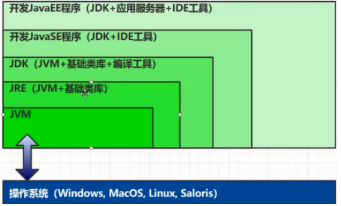


# jvm的内存结构

`java`内存结构主要划分为五大部分

* 程序计数器
* 虚拟机栈
* 本地方法栈
* 堆
* 方法区


## 程序计数器

`Program Counter Register`程序计数器(寄存器)

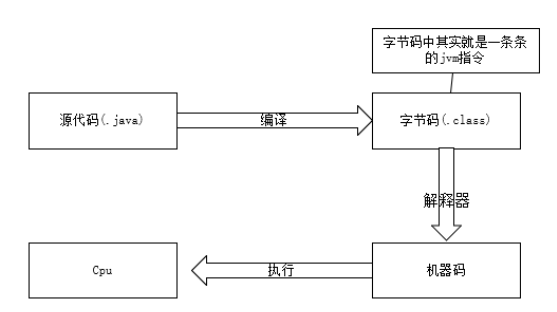

如上图所示：`java`源代码到生成对象是有一个过程的

1. `java`源文件首先需要经过编译器编译成字节码`.class`文件，字节码文件中其实就是一条条的`jvm`指令，这些指令是不能直接到`cpu`中执行的，所以需要第二步。
2. 第二步这些字节码的`jvm`指令会被解释器解释成**机器码**
3. 机器码可以直接被`cpu`识别并执行
4. 要知道指令不是只有一条，那么当执行完这一条指令后，如何知道下一条要执行的是什么指令呢？此时就需要 使用到**程序计数器**，**程序计数器的作用就是保存程序需要执行的下一条`jvm`指令.**
5. 程序计数器的物理实现是寄存器.

### 程序计数器的特点

* 线程私有
* 唯一一个不会存在内存溢出的区域

## 虚拟机栈

* 栈是**线程**运行时需要的内存空间
* 栈的组成元素叫做栈帧
	* 每一个方法的运行所需要的内存就是一个栈帧
* 每一个线程只能有一个活动栈帧，对应着当前线程正在执行的那个方法

所以方法的代码，局部变量那些都是保存在栈中。

### 问题解析

#### 垃圾回收是否涉及栈内存

栈内存涉及到的是方法调用，当方法调用完成后方法对应的栈帧就会自动出栈，所以也不存在垃圾回收的问题。

#### 栈内存是否分配的越大越好

当栈内存分配的越大，也就你意味着能够容纳的栈帧就越多，栈帧越多对应的是方法调用的层级可以更深，但是由于内存总容量是固定的，所以当栈内存越大的时候，同时可以运行的线程的数量就会减少(原因可以看上面栈内存的说明，要知道栈是线程运行时需要的内存空间)

#### 方法内的局部变量是否线程安全

考虑线程安全的问题需要考虑的一个变量是线程私有的，还是线程共享的，当是线程私有的时候就不会有线程安全的问题，当时线程共享的时候就会有线程安全的问题。

* 如果方法内的局部变量没有逃离方法的作用范围，就是线程安全的
* 如果局部变量引用了对象，并逃离了方法 的作用范围，就是线程不安全的

### 栈溢出

* 栈帧**过多**会导致栈内存溢出(也就是方法调用层级过多)
* 栈帧**过大**导致栈内存溢出
* 栈内存溢出会出现`java.lang.StackOverflowError`错误
* 在`idea`中我们可以自己设置栈的大小来进行测试， 设置参数 为 `-Xss256k`（`-Xss`固定，字面的数值自己设置）

## 本地方法栈

* 当`java`虚拟机 调用本地方法的时候需要提供的内存空间
* 带有`native`修饰的方法就是本地方法

## 堆

* 通过`new`关键字创建的对象，都会使用堆内存(但是现在已经有技术可以避过这个问题，所以现在这句话也不绝对)
* 堆是线程共享的，堆中对象都需要考虑线程安全的问题
* 有垃圾回收机制

### 堆内存溢出

```java
package example.heap;
import java.util.ArrayList;
import java.util.List;
// -Xmx8m  可以使用-Xmx来修改堆内存大小
public class HeapOut {
    public static void main(String[] args) {
        int i = 0;
        try {
            List<String> list = new ArrayList<>();
            String a = "hello";
            while (true) {
                i++;
                list.add(a);
                a = a + a;
            }
        } catch (Throwable throwable) {
            throwable.printStackTrace();
            System.out.println(i);
        }
    }
}
```

**测试结果**


* 可以通过 `-Xmx8m`来将堆内存的大小设置为`8m`，这样再一次运行循环次数肯定会降低。

### 堆内存诊断工具

* `jps`工具
	* 查看当前系统中有哪些`java`进程
* `jmap`工具
	* 查看某一个时刻堆内存占用情形
* `jconsole`工具
	* 图形界面，多功能的检测工具，可以连续检测

#### jps

**注：**下面我所有的命令都是在`idea`的`terminal`窗口执行的，其实只要配置了jdk环境变量，就可以在任意位置开启`cmd`窗口来执行也是一样的。

该工具的作用是查看当前系统中有那些`java`进程。就拿上面的案例代码来看，该命令是在`idea`中`local`窗口输入的。

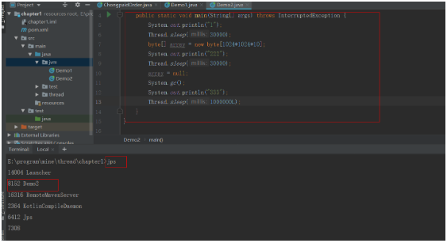

使用`jps`命令可以查看到当前程序的进程`id`是8152


## 方法区

### 概述

* 方法区主要存储的是类结构的，也就是类的一些信息，比如下面的一些信息
	* 构造方法
	* 成员方法
	* 成员变量
	* 运行时常量池
* 方法区在虚拟机启动的时候就会创建
* 方法区在**逻辑上**是堆内存的一部分，但是实际上不一定是，比如对于`HotSpot`虚拟机在`jdk1.8`方法区使用**永久代**来实现，确实是堆空间的一部分，但是`jdk1.8`及以后使用的是**元空间**来实现，使用的是系统内存。
* 方法区也会导致`OutOfMemory`错误

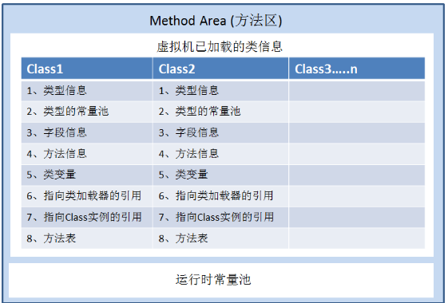


### jdk1.6方法区的内存结构


### jdk1.8方法区的内存结构


### 方法区内存溢出

* `jdk1.8`之前会出现永久代内存溢出
	* 出现`java.lang.OutOfMemoryError:PermGen space`
	* 可以通过 `-XX:MaxPermsize=8m`  来设置方法区大小

* `jdk1.8`之后会导致元空间内存溢出
	* 出现`java.lang.OutOfMemoryError:Metaspace`
	* 可以通过`-XX:MetaspaceSize=8m`来设置方法区大小

### 二进制字节码

二进制字节码中主要包含了三个内容

* 类的基本信息
* 常量池
* 类方法定义(类方法定义中包含了虚拟机指令)

可以通过反编译来查看主体是不是包含这三个部分

**源代码DemoOne.java**

```java
package example.method;
public class DemoOne {
    public static void main(String[] args) {
        System.out.println("hello world");
    }
}
```

**对DemoOne.class反编译**

```
javap -v 类名.class
```

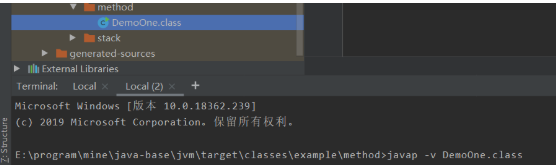

**反编译后的内容**

**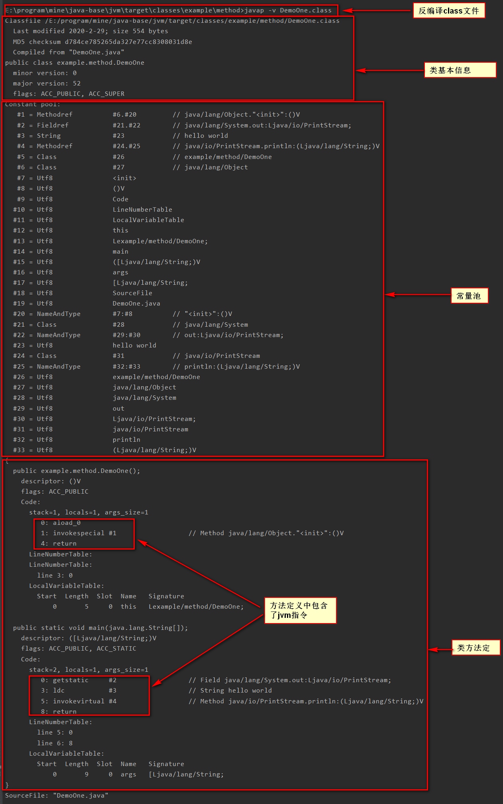**


### 常量池

从上图可以看出方法定义中包含了`jvm`指令，`jvm`指令后可以看到有`#1`、`#2`这样的内容，这些就需要到常量池找对应的信息，就可以得知需要执行的是什么代码。

**常量池**

> 常量池就是一张表，虚拟机指令根据这张常量表找到要执行的类名、方法名、参数类型、字面量等信息

**运行时常量池**

> 常量池是二进制字节码（*.class）文件中的,当该类被加载到内存中，它的常量池信息就会放入到运行时常量池中，并且把里面的符号地址转换为真实地址。

#### StringTable

`StringTable`也就是我们平时所说的串池，当我们定义一个**字符串常量**时，实际上有以下几步：注意这里说的是字符串常量才是这种操作

1. 在串池中查找该字符串
	1. 找到了直接返回该字符串
	2. 没有找到则创建一个字符串
		1. 将创建的**字符串常量**放入到串池中

**`StringTable`的特性**

* 常量池中的字符串仅仅是符号，第一次使用时才会变为对象
* 利用串池的机制，来避免重复创建字符串对象
* **字符串变量**的拼接原理是`StringBuilder`(jdk1.8)
* **字符串常量**的拼接原理是编译器优化
* 可以使用`intern`方法。主动将串池中还没有的字符串对象放入到串池
	* 对于jdk1.7及以后
		* `intern`方法会尝试将这个对象放入串池，如果有则不会放入，如果没有则放入串池，最终会将串池中的对象返回
	* 对于jdK1.6
		* `intern`方法会尝试将这个对象放入串池，如果有则不会放入，如果没有则**拷贝一份放入串池**，但是调用的这个对象是不会被放入到串池中，最终会将串池中的对象返回

#### 案例1

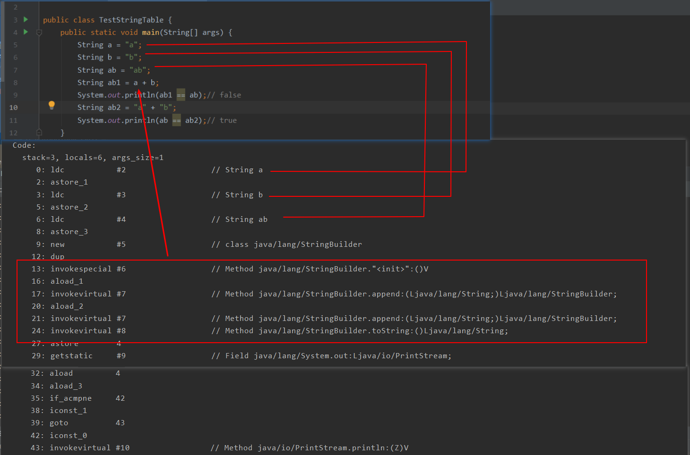

* 上面截图中 `String ab1 = a + b`在字节码层面实际上是使用的`StringBuilder`来拼接，最后使用`toString`方法，实际上是在堆中新建了一个字符串对象
* `String ab2 = "a" + "b"`,由于新增的都是常量，所以会在编译器直接拼接中`ab`,而`ab`在串池中已经存在，所以`ab2`这个`ab`会直接从串池中拿。


#### **案例2**

```java
package example.method;

import com.sun.xml.internal.ws.api.model.wsdl.WSDLOutput;
import org.junit.Test;
public class StringTableDemo2 {
    @Test
    public void one() {
        String s = new String("a") + new String("b");
        // intern方法会尝试将这个对象放入串池，如果有则不会放入，如果没有则放入串池，最终会将串池中的对象返回
        String s2 = s.intern();
        System.out.println(s == "ab"); // true
        System.out.println(s2 == "ab"); // true
    }

    @Test
    public void two() {
        String ab = "ab";
        String s = new String("a") + new String("b");
        // intern方法会尝试将这个对象放入串池，如果有则不会放入，如果没有则放入串池，最终会将串池中的对象返回
        String s2 = s.intern();
        System.out.println(s == ab); // false
        System.out.println(s2 == ab); // true
    }
}
```

**one方法分析**

* `new Sring("a")`实际上有两个操作
	* 将`"a"`字符串常量放入到`StringTable`中
	* 在堆中创建一个字符串对象`"a"`
* `new String("b")`同样的也是有两个操作
	* 将`"b"`字符串常量放入到`StringTable`中
	* 在堆中创建一个字符串对象`"b"`
* `String s2 = s.intern();`
	* `s`是值为`"ab"`的字符串对象，该字符串对象存在堆中，`StringTable`中并没有，所以`intern`方法会将`s`指向的对象放入到`StringTable`中，并且返回`StringTable`中的对象，因此`s`和`s2`都是指向`StringTable`中`"ab"`的对象，因此比较的结果都是`true`

**two方法分析**

* `two`方法与`one`方法不同之处在于先创建了`"ab"`字符串常量，所以`StringTable`中存在`"ab"`.
* `String s = new String("a") + new String("b");`这一句和`one`方法的解析是一样的，`s`一个指向堆内存中值为`"ab"`的对象
* `String s2 = s.intern();`由于`StringTable`中已经存在`"ab"`，所以`s`对象不会被放入到`StringTable`中，但是返回的依然是`StringTable`中的对象，所以比较结果一个是`false`,一个是`true`

#### **StringTable的位置**

* `jdk1.6`中`StringTable`存在于永久代中
* `jdk1.8`中`StringTable`存在于堆中

**验证jdk1.8**

```java
package example.method;
import org.junit.Test;
import java.util.ArrayList;
import java.util.List;
// 需要设置堆的大小  -Xmx10m
public class StringTableDemo3 {
    @Test
    public void one() {
        List<String> list = new ArrayList<>();
        int i = 0;
        try {
            for (int j = 0; j < 200000; j++) {
                i++;
                list.add(String.valueOf(j).intern());
            }
        } catch (Exception e) {
            e.printStackTrace();
        } finally {
            System.out.println(i);
        }
    }
}

```

由于堆空间很大，所以可以设置虚拟机运行参数来控制堆的大小

```
-Xmx10m
```

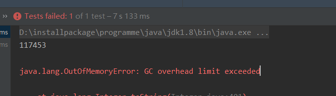

出现`GC overhead limit exceeded`，此时还需要添加一个参数来关闭这种限制

```
-XX:-UseGCOverheadLimit
```

此时再去执行会出现如下图所示的错误，可以看到是堆空间不足。

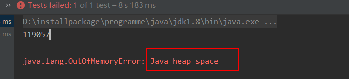

**验证jdk1.6**

首先通过虚拟机参数来控制永久代大小，下面是控制成`5m`

```
-XX:MaxPermSize=5m
```

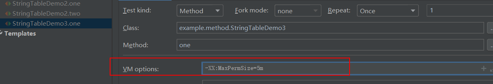

然后运行上面的代码，可以看到报如下错误

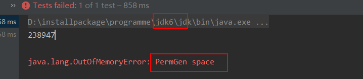

##### StringTable性能调优

* `StringTable`底层使用的是`HashTable`来实现的
* 如果`StringTable`中字符串很多，可以通过 `-XX:StringTableSize=桶个数`
	* 桶个数越大，每一个桶里面装的内容越少，每一个桶里面查找的数据就快，所以我们可以将这个数变大一点
* 对于需要操作的数据有很多的重复性字符串，那么就可以考虑将这些字符串入池，这样可以减少内存占用

## 直接内存

在`java`中调用`native`方法时实际上执行的部分消耗的内存不是`java`内存，而是本机的内存，这样当我们调用`native`方法时其实存在两块内存之间的交互，也就是说当`native`方法执行完后需要将结果从本地内存复制到`java`内存中才可以使用，而所谓的直接内存是引入一种**基于通道与缓冲区**的`I/O`方式，它可以使用`native`函数库直接分配堆外内存，然后通过一个存储在`java`堆里面的`DirectByteBuffer`对象作为这块内存的引用进行操作，这样就可以避免在`java`堆内存和`native`堆中来回复制数据。

### 特点

* 常见于`NIO(NO-Blocking IO)`,也就是非阻塞的`IO`操作，用于数据缓冲区。
* 分配会回收成本比较高，但是读写性能高
* 不受`JVM`内存回收管理
* 对于直接内存的回收实际上使用的是`java`中`unsafe`对象的`freeMemory`方法来回收而不是通过垃圾回收操作的。

**java的io操作**


* 用户操作`java`程序
* `java`程序调用`native`方法间接调用系统方法操作磁盘中的文件
	* 系统读取文件时有系统缓冲区
	* `java`中定义的缓冲区从系统缓冲区中拿出数据

**使用直接内存操作**


# 垃圾回收

当我们思考`GC`(`Garbage Collection`)是需要思考三件事情：

1. 哪些内存需要回收
2. 什么时候回收
3. 如何回收

内存结构中的**程序计数器**，**虚拟机栈**，**本地方法栈**三个区域是随着线程而生的，栈中的栈帧随着方法进入和退出执行入栈和出栈操作，每一个栈帧中分配多少内存基本上是在类结构确定下来的时候就已经知道的(虽然在运行期间会由`JIT`编译器进行一些优化，不过大体上可以认为在编译期间就知道需要分配多少内存)，程序计数器是唯一个没有规定内存泄漏的区域，所以这几个区域是不用考虑内存回收的问题。`java`堆和方法区不一样，一个接口中多个实现类需要的内存可能不同，一个方法中的多个分支需要的内存也不一样，我们只有在程序处于运行的时候才知道需要创建哪些对象，这部分内存的分配和回收都是动态的，垃圾收集器所关注的就是这部分内存(**堆内存**)。

## 如何判断垃圾可以回收

### 引用计数法

给对象中添加一个引用计数器，每当有一个地方引用它时，计数器值就加1；当引用失效时，计数器值就减1；任何时刻计数器为0
的对象就是不可能再被使用的。

但是`java`虚拟机不是使用这种方式来判断的，因为这种方式比较难以解决的一个问题就是**循环引用**

```java
public class ReferenceCountingGC {
  public Object instance = null;
  public static final int _1MB = 1024*1024;
  // 该成员变量的作用是占用一点内存，可以在gc日志中判断对象是否被回收过
  private byte[] bigSize = new byte[2*_1MB];
  public static void testGC() {
    ReferenceCountingGC objA = new ReferenceCountingGC();
    ReferenceCountingGC objB = new ReferenceCountingGC();
    objA.instance = objB;
    objB.instance = objA;
    objA = null;
    objB = null;
    // 下面的代码执行后，如果是通过引用计数法来判断对象是否可以回收的话，这两个对象是不会被回收的
    System.gc();
  }
}
```

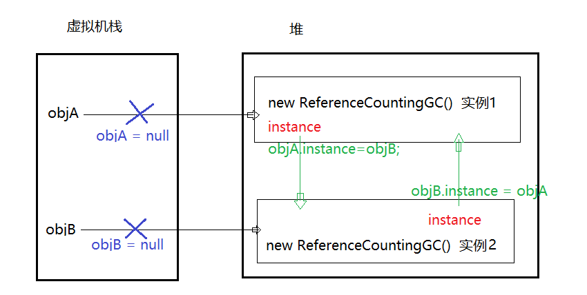

如上图所示，即使执行了`objA = null`和`objB=null`,但是实际上他们的实例还是存在者引用，如果按照引用计数法来判断话，这两个对象是不会被回收的，实际上这两个对象是被回收了。所以可以说明`java`虚拟机不是使用引用计数法来判断对象是否可回收的。

### 可达性分析算法

该算法的基本思路是通过一系列的称为`GC Root`的对象作为起始点，从这些节点开始向下搜索，搜索所走过的路径中称为引用链，当一个对象到`GC Root`没有任何引用链时(从图论的角度来看，就是从`GC Root`到这个对象不可达)证明这个对象是不可用的。

* `java`虚拟机中的垃圾回收器采用可达性分析来探索所有存活的对象
* 扫描堆中的对象，看是否能够沿着`GC Root`对象为起点的引用链找到该对象，如果找不到，表示可以回收。

在`java`语法中，可作为`GC Root`的对象包含以下几种：

* 虚拟机栈(栈帧中的本地变量表)中引用的对象
* 方法区中类静态属性引用的对象
* 方法区中常量引用的对象
* 本地方法栈中`JNI`(也就是`native`方法)中引用的对象。

#### 不可达不一定死亡

即使是在可达性分析算法中不可达的对象，也不一定都是要被回收的，此时他们暂时处于缓刑阶段，要宣告一个对象死亡，至少需要经历**两次标记过程**

* 如果对象在进行可达性分析后发现没有与`GC Root`相连接的引用链，那么将会被第一次标记并且进行一次筛选，筛选的条件是此对象是否有必要执行`finalize()`方法，当对象没有覆盖`finalize()`方法时，或者`finalize()`方法已经被虚拟机调用过，虚拟机将这两种情形视为**“没有必要执行”**
* 如果该对象判断为有必要执行`finalize()`方法，那么该对象将中被放置在一个叫做`F-Queue`队列中，并且在稍后由一个虚拟机自动建立的，优先级低的`Finalizer`线程去执行它。`finalize()`方法是对象逃脱死亡命运的最后一次机会，稍后`GC`将对`F-Queue`中的对象进行第二次小规模的标记，如果对象在`finalize()`中成功拯救自己(只要重新与引用链上的任何一个对象建立关联即可，比如将自己(`this`关键字)赋值给某个类变量或对象的成员变量，那么在第二次标记的时候会被将它移除“**即将回收**”的集合)，如果对象在此时还没有逃脱，那就说明需要被回收了。

<font color="red">注意：这种自救方式并不被推荐，最好不要使用这个方法</font>

### 五种引用

* 强引用
* 软引用
* 弱引用
* 虚引用(存放直接内存地址，便于回收直接内存)
* 终结器引用

> * 软引用和弱引用可以联合引用队列来使用，也可以不结合引用队列来使用(之所以需要结合引用队列来使用，是引用软引用和弱引用自身也是需要占有一定的内存的，要想回收他们就需要在引用队列中找到他们才能回收)
> 	* 当发生GC时不一定就与回收软引用，只有当发生GC之后内存还是不足的时候才会回收软引用
> 	* 当发生GC的时候弱引用就会被回收掉
> * 虚引用和终结器引用必须结合引用队列来使用

四种引用强度(不包含终结器引用)从大到小分别是：**强引用->软引用->弱引用->虚引用**

**参考图**（下图中有两个`GC Root`， 实线表示强引用）

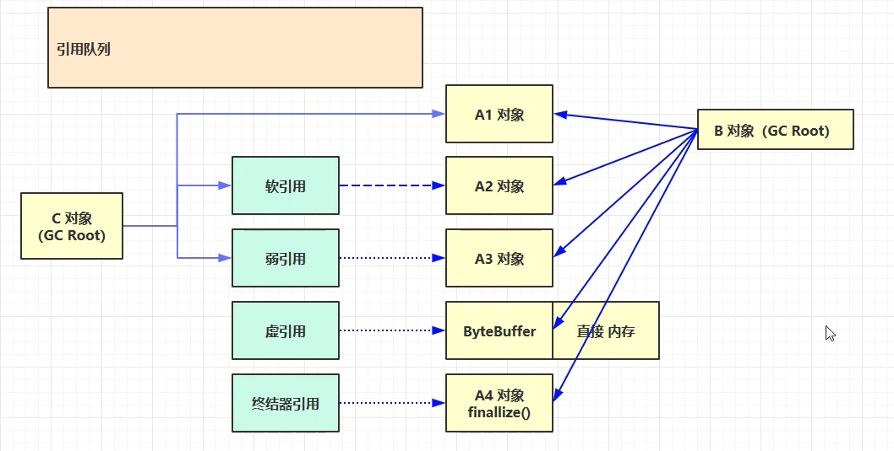

#### 强引用

强引用表示从`GC Root`出发可以直接达到的，比如`Oeject object = new Object()`这类引用就是强引用。只要强引用还在，垃圾回收器就不会回收掉被引用的对象。

比如上面的`A1`对象被`B`对象和`C`对象都是直接引用到(当然实际上只要有一个强引用就可以算是强引用)，所以是一个强引用。

#### 软引用

软引用用来描述一些还有用但是不是必须的对象，对于软引用关联着的对象，在系统中**将要发生内存溢出异常之前**，将会把这些对象列进回收范围之内进行第二次回收。如果这次回收还是没有足够的内存，才会抛出内存溢出异常，在`jdk1.2`之后，提供了`SoftReference`类来实现软引用。

比如上面的`A2`对象如果是从`C`对象的角度来看是一个软件用。（当然从B对象来看是强引用，所以垃圾回收是不会回收该对象的）

**软引用案例：**

```java
public class Demo1 {
    private static final int _4MB = 4 * 1024 * 1024;

    public static void main(String[] args) throws IOException {
        List<byte[]> list = new ArrayList<>();
        for (int i = 0; i < 5; i++) {
            list.add(new byte[_4MB]);
        }
        System.in.read();
    }
}
```

设置堆内存大小为`20M`

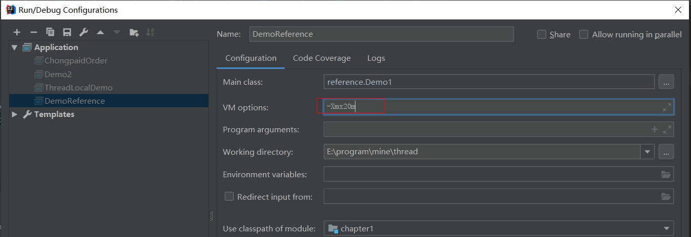

运行程序出现堆内存溢出错误：

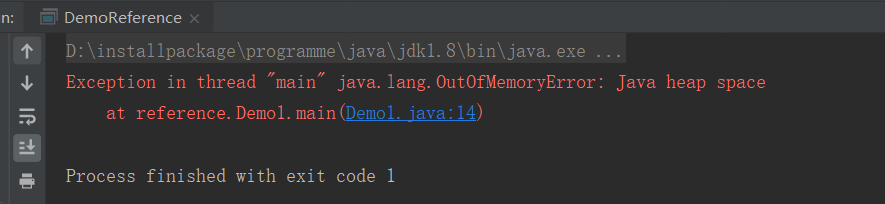

将程序修改为软引用的形式来做：

```java
package reference;

import java.io.IOException;
import java.lang.ref.SoftReference;
import java.util.ArrayList;
import java.util.List;

public class Demo1 {
    private static final int _4MB = 4 * 1024 * 1024;

    public static void main(String[] args) throws IOException {
        soft();
    }

    public static void soft() {
        List<SoftReference<byte[]>> list = new ArrayList<>();
        for (int i = 0; i < 5; i++) {
            SoftReference<byte[]> reference = new SoftReference<>(new byte[_4MB]);
            System.out.println(reference.get());
            list.add(reference);
            System.out.println(list.size());
        }
        System.out.println("循环结束");
        for (SoftReference<byte[]> ref : list) {
            System.out.println(ref.get());
        }
    }
}
```

此时不会出现堆内存溢出错误而且`list`中前面四个都已经被回收掉了。当然除了配置堆内存大小外还可以配置显示gc回收的虚拟机运行参数；

```
-Xmx20m -XX:+PrintGCDetails -verbose:gc
```

#### 弱引用

弱引用也是用来描述非必须的对象的，但是它的强度比软引用更弱一些，被弱引用关联的软引用只能生存到下一次垃圾收集发生之前，当垃圾收集器工作时，**无论当前内存是否足够，都会回收掉被弱引用关联的对象**，在`jdk1.2`之后，提供了`WeakReference`类来实现弱引用。

#### 软弱引用与引用队列

软引用与若引用的区别在于他们的回收时机

* 软引用是只有当内存空间不足时才会被回收
* 弱引用是无论内存空间是否足够都是会被回收的

从上面的图可以看到，软引用与弱引用可以认为是间接引用，也就是根对象首先强引用一个软引用或弱引用，然后该软引用或弱引用再来引用一个对象，那么当这个对象（比如A2）当被回收时，`A2`所对应的软引用也是会占有一定的内存的，如果想要回收这个内存空间就需要`A2`对应的软引用进入到引用队列中，然后在引用队列中进行遍历的时候回收这个内存(对于弱引用也是同样的道理)。

#### 虚引用

**软弱引用可以配置引用队列使用，也可以不用配合引用队列来使用，但是虚引用就必须配合引用队列来使用**

虚引用也被称为幽灵引用或幻影引用，他是最弱的一种引用关系，一个对象是否与虚引用存在，完全不会对其生存时间构成影响，也无法通过虚引用来获取一个对象实例，为一个对象设置虚引用关联的唯一目的就是能在这个对象被收集器回收时收到一个系统通过，在`jdk1.2`之后，提供了`PhantomReference`来实现虚引用。

**使用案例：**

当我们使用`ByteBuffer`时是会创建一个直接内存，同时也会创建一个`Cleaner`的虚引用，当`ByteBuffer`被垃圾回收时，它所分配的直接内存是不会被回收的，因为直接内存是不受`java`虚拟机管理的，此时就需要使用的`Cleaner`的虚引用了，因为当`ByteBuffer`回收时，该虚引用就会进入到引用队列，引用队列里面会检测是否有`Cleaner`虚引用，如果有就会调用`clear`方法，该方法最终会调用`Unsafe.freeMemory()`来释放掉这一块直接内存。

#### 终结器引用

终结器引用也是需要配合引用队列来使用的。

每一个对象都有一个终极父类`Object`，`Object`类中有一个`finalize()`方法，如果我们重写了这个方法，那么这个方法的调用时机是什么呢?这就需要使用的终结器引用了。**当没有强引用来关联该对象的时候，虚拟机会帮我们创建终结器匀变速，并终结器就会进入到引用队列(此时该对象还没有被回收)。**有一个优先级很低的线程会检查引用队列中是否有终结器引用，如果有就会根据该终结器引用找到对应对象的`finalize()`方法。

<font color="red">注意：通过终结器引用来释放资源的方式效率很低，多以一般是不推荐使用finalize()方法了释放资源。</font>

## 垃圾回收算法

### 标记清除

* 速度快
* 会造成内存碎片

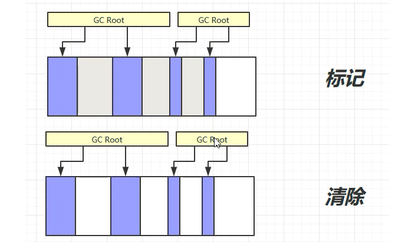

### 标记整理

* 速度慢
* 没有内存碎片

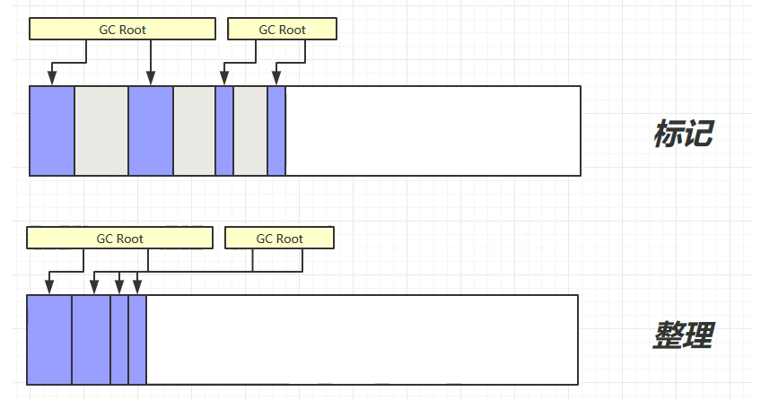

### 复制

* 没有内存碎片
* 需要占用双倍的内存空间

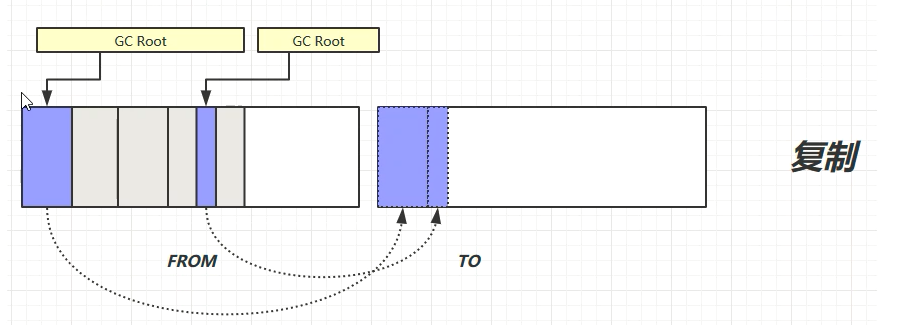

`jvm`中并不是只是使用某一种算法，而是在不同的情形下会使用不同的算法，也有可能结合起来使用。

## 分代垃圾回收

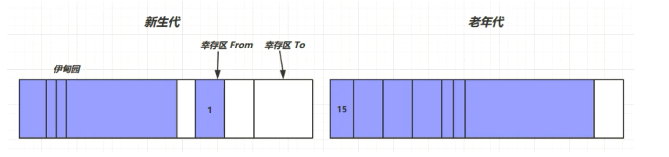

* 对象首先分配在**伊甸园**区域
* 新生代空间不足时，触发`minor gc`,伊甸园和`from`区存活的对象使用**复制算法**复制到`to`区，存活的对象年龄加1并且交换`from`区和`to`区
* `minor gc`会引发 `stop the world`,暂停其他用户的线程，等待垃圾回收结束，用户线程才恢复
* 当对象寿命超过阈值时，会将对象移入到老年代，最大寿命是15(使用4bit来存储该值，所以最大是15)
* 当老年代空间不足，会先尝试触发 `minor gc`，如果之后空间还是不足，那么会触发`full gc`,`SWT`的时间更长。