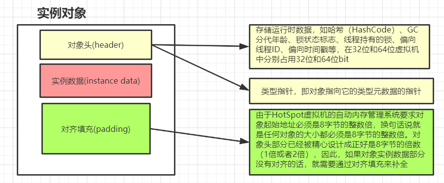

# 对象是如何创建出来的

一个对象的创建肯定主要有以下几步

1. 划分内存
2. 将分配的内存空间初始化为0值(不包括对象头)
3. 对对象进行设置，比如将这个对象和类进行关联等

<!--more-->

## 划分内存的方式

上面说创建对象的第一步就是划分内存，划分内存的主要方式有两种

* 指针碰撞
	* 假设可用内存都是连接在一起的(也就是一整块的)，那么当需要使用内存空间时只需要将指针移动一下位置就可以划分出一块内存
* 空闲列表
	* 如果内存空间不是整齐的，那么剩余的内存肯定是有一张表来记录的，这就是空间列表的模式

# 对象的内存布局

这里指定是`HotSpot`虚拟机中的对象的内存布局。

一个对象在堆中包含三个部分

* 对象头
	* 第一类是用于存储对象自身的运行时数据，如哈希码（`HashCode`）、`GC`分代年龄、锁状态标志、线程持有的锁、偏向线程`ID`、偏向时间戳等。
		* 在32位和64位的虚拟机中分别是32和64个`bit`
		* 对象头里的信息是与对象自身定义的数据无关的额外存储成本
		* 比如在32个比特存储空间中的25个比特用于存储对象哈希码，4个比特用于存储对象分代年龄，2个比特用于存储锁标志位，1个比特固定为0
	* 对象头的第二部分是存储类型指针，即**对象指向它的类型元数据的指针**。
* 实例数据
* 填充的数据

