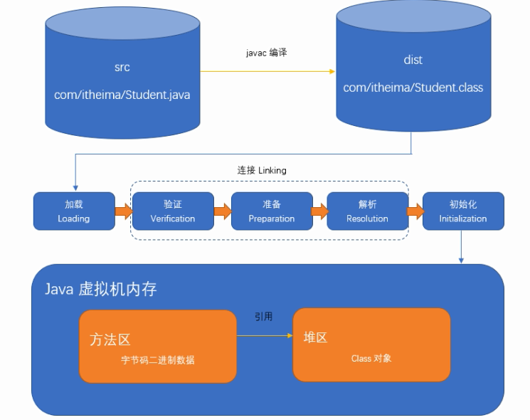
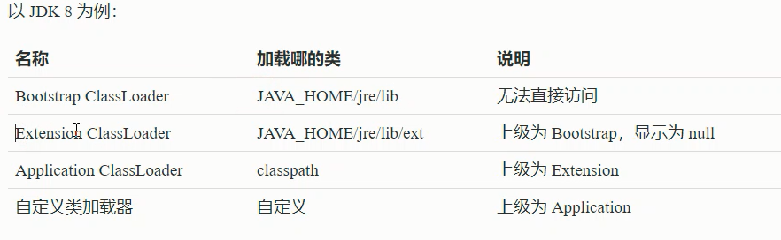
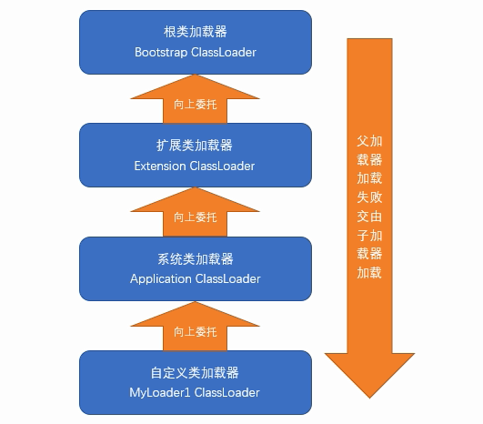
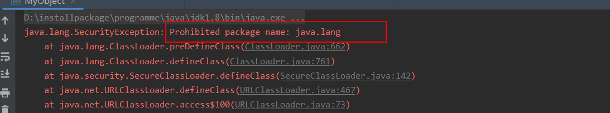
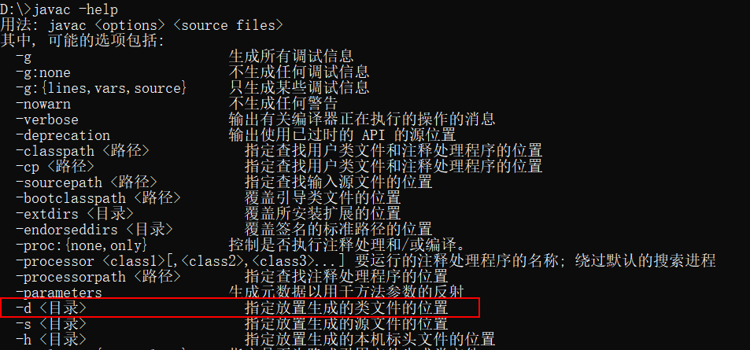
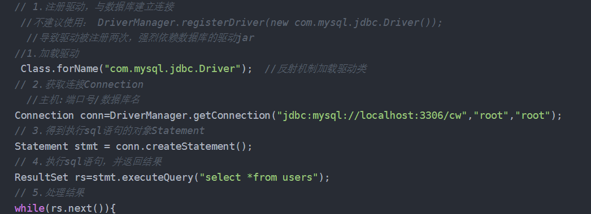
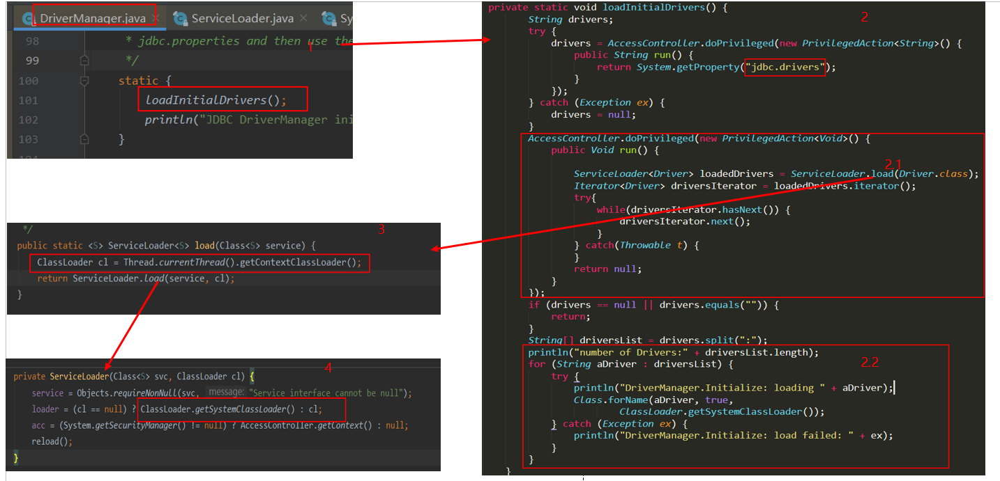
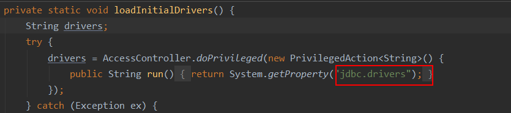
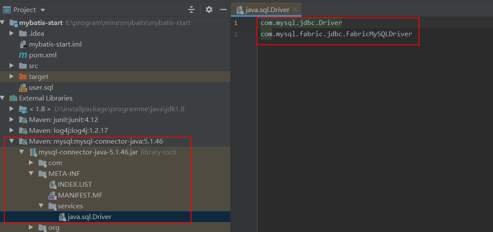

# 类加载

* 将`java`源代码经过编译器编译器`class`字节码文件

	* `java`文件和`class`文件都是在本次磁盘中

* 将字节码文件加载进内存，并且在内存中创建对象的`class`对象，这个过程称之为类的加载

	一个类的生命周期从类被加载、连接和初始化开始，只有在虚拟机内存中，我们的`java`程序才可以使用它。




<!--more-->

# 类加载器

类的加载是由类加载器完成的，类加载器可以分为两种

* 第一种是`java`虚拟机自带的类加载器
	* 根类加载器(`Bootstrap`)
	* 扩展类加载器(`Extension`)
	* 系统了加载器
* 第二种是用户自定义的类加载器
	* 自定义类加载器是`java.lang.ClassLoader`的子类实例



## 根类加载器

* 根类加载器是最底层的类加载器，是虚拟机的一部分，没有父类，也没有继承`java.lang.ClassLoader`
* 主要负责`<JAVA_HOME>/jre/lib`下的核心类库
* 处于安全考虑，根类加载器只能加载`java`、`javax`、`sun`开头的类

## 扩展类加载器

* 扩展类加载器是指由原`SUN`公司实现的`sun.misc.Launcher`类
* 该类加载器是由`java`语言编写，父类加载器是根类加载器
* 负责加载`<JAVA_HOME>/jre/lib/ext`目录下的类库或者系统变量`“java.ext.dirs”`指定的目录下的类库。

## 系统类加载器

* 系统类加载器也称之为应用类加载器，也是纯`java`类
* 系统类加载器的父类加载器是扩展类加载器
* 负责加载`classpath`环境变量或系统属性`java.class.path`所指定的目录中加载类
* 应用类加载器是用户自定义的类加载器的默认父加载器，一般情形下，该类加载器是程序中默认的类加载器，可以通过`ClassLoader.getSystemClassLoader()`直接获取


# 双亲委派机制

* 除了虚拟机自带的根类加载器之外，其余的类家在重庆都有自己唯一的父加载器
* 当需要使用类加载器加载一个类时，该`classLoder`会先委托自己的父家在重庆去加载这个类，如果父类加载器可以加载，则由父类加载器去加载。否则才是`classLoader`自己去加载这个类
* 双亲委派机制的父子关系和面向对象程序设计中的继承关系是不一样的，而是通过使用组合模式来复用父类加载器。



## 双亲委派模式的好处

* 可以避免类的重复加载，当父类加载器已经加载了该类时，就没有必要让子`ClassLoader`再去加载一次
* 考虑到安全因素，`java`核心`api`中定义的类型不会被随意替换
	* 比如自己定义了一个`java.lang.Object`的类，通过双亲委托模式传递到启动类加载器，启动类加载器在核心`api`中发现了这个名字的类，发现已经被加载，这样就不会重新加载，而是直接返回已经加载过的`Object.class`，这样就可以防止核心`api`被随意篡改。

**测试代码**

```java
package java.lang;

public class MyObject {
    public static void main(String[] args) {
        System.out.println(111);
    }
}
```

上面的代码的包名是`java.lang`，由于`java`的核心`api`的包名也是这个，所以运行上面的成出现下面的错误




# ClassLoader

`ClassLoader`中主要看这个方法

## loadClass

```java
protected Class<?> loadClass(String name, boolean resolve)
        throws ClassNotFoundException
    {
        synchronized (getClassLoadingLock(name)) {
            // 首先检查该类是否已经被加载过
            Class<?> c = findLoadedClass(name);
          // 还没加载的类才会继续加载
            if (c == null) {
                long t0 = System.nanoTime();
                try {
                  // 如果有父类加载器就让父类去加载
                    if (parent != null) {
                        c = parent.loadClass(name, false);
                    } else {
                      // 没有父类就使用根类加载器去加载
                        c = findBootstrapClassOrNull(name);
                    }
                } catch (ClassNotFoundException e) {
                    // ClassNotFoundException thrown if class not found
                    // from the non-null parent class loader
                }
                if (c == null) {
               		// 如果父类加载器或根类加载器都没有加载到，就使用自己的类加载器去加载
                    long t1 = System.nanoTime();
                    c = findClass(name)
                    // this is the defining class loader; record the stats
                    sun.misc.PerfCounter.getParentDelegationTime().addTime(t1 - t0);
                    sun.misc.PerfCounter.getFindClassTime().addElapsedTimeFrom(t1);
                    sun.misc.PerfCounter.getFindClasses().increment();
                }
            }
            if (resolve) {
                resolveClass(c);
            }
            return c;
        }
    }
```

* `laodClass`方法中体现了双亲委托模式的逻辑
	* 首先让父类加载器加载
	* 父类加载器没有加载到就让根类加载器加载
	* 父类或根类加载器都没有加载到的时候就使用自己的类加载器加载

## findClass

```java
protected Class<?> findClass(String name) throws ClassNotFoundException {
        throw new ClassNotFoundException(name);
    }
```

`findClass`默认是一个错误的空实现，**这也是我们自定义类加载器时需要重写的方法。**


## defineCLass

```java
protected final Class<?> defineClass(String name, byte[] b, int off, int len,
                                         ProtectionDomain protectionDomain)
        throws ClassFormatError {}
```

该方法是用来将`byte[]`字节解析成虚拟机能够识别的`class`对象，`defineClass`通常和`findClass`方法一起使用，在自定义类加载器时，会直接覆盖`CLassLoader`的`findCLass`方法获取想要加载类的字节码，然后调用`defineCLass`方法生成`Class`对象。

## resolveCLass

连接指定的类，类加载器可以使用此方法来连接类。

# URLClassLoader

在`java.net`包中。`jdk`提供了一个类加载器`URLClassLoader`，该类扩展了`ClassLoader`，能够从本地或网络

上指定的位置加载类，我们也可以使用该类作为自定义的类加载器使用。

其构造器中只要需要传入`URL`地址

```java
public URLClassLoader(URL[] urls) {}// 使用默认的父类构造器

public URLClassLoader(URL[] urls, ClassLoader parent) {} // 也可以自己指定构造器
```


**测试案例**

```java
package example.loader;

import org.junit.Test;

import java.io.File;
import java.net.URI;
import java.net.URL;
import java.net.URLClassLoader;
public class TestURLClassLoader {
    // 加载本地的类
    @Test
    public void testOne () throws Exception {
        File file = new File("d:/");
        URI uri = file.toURI();
        URL url = uri.toURL();
        URLClassLoader urlClassLoader = new URLClassLoader(new URL[]{url});
        Class<?> aClass = urlClassLoader.loadClass("example.TestClassLoader");
        aClass.newInstance();
    }

    // 加载网络上的类
    @Test
    public void testTwo () throws Exception {
        URL url = new URL("http://localhost:8080/examples/");
        URLClassLoader urlClassLoader = new URLClassLoader(new URL[]{url});
        Class<?> aClass = urlClassLoader.loadClass("example.TestClassLoader");
        aClass.newInstance();
    }
}
```

**加载本地的类**

在我的本地`d`盘根目录中有一个 `TestClassLoader.java`文件，文件内容如下：

```java
package example;
public class TestClassLoader {
	public TestClassLoader () {
		System.out.println("new Instance");
	}
}
```

此时使用`javac`命令来编译一下：

`javac -d . TestClassLoader.java`




* `-d`选项是指定编译到哪里去的位置
* `.`点是指当前目录

执行加载本地的类的代码会输出  `new Instance`


# 自定义类加载器

上面已经说过，想要自定义类加载器，有如下几个固定步骤

* 自定义的类需要继承`ClassLoader`抽象类
* 重写`findCLass`方法

```java
package example.loader;
import java.io.*;
public class MyClassLoader extends ClassLoader {
    // 被加载的类所在的目录
    private String directory;
    public MyClassLoader(String directory) {
        this.directory = directory;
    }
    public MyClassLoader(ClassLoader parent, String directory) {
        super(parent);
        this.directory = directory;
    }
    /**
     * 自定义类加载器需要重写该方法
     *
     * @param name
     * @return
     * @throws ClassNotFoundException
     */
    @Override
    protected Class<?> findClass(String name) throws ClassNotFoundException {
        InputStream in = null;
        ByteArrayOutputStream baos = null;
        try {
            //    将类名转换为目录
            String file = directory + File.separator + name.replace(".", File.separator) + ".class";
            // 构建输入流
            in = new FileInputStream(file);
            // 构建字节输出流
            baos = new ByteArrayOutputStream();
            // 定义缓冲区
            byte buf[] = new byte[1024];
            int len = -1;
            while ((len = in.read(buf)) != -1) {
                // 往输出流中输入数据
                baos.write(buf, 0, len);
            }
            //读取到的字节码二进制数据
            byte data[] = baos.toByteArray();
            return defineClass(name, data, 0, data.length);
        } catch (IOException e) {
            throw new RuntimeException(e);
        } finally {
            if (in != null) {
                try {
                    in.close();
                } catch (IOException e) {
                    e.printStackTrace();
                }
            }
            if (baos != null) {
                try {
                    baos.close();
                } catch (IOException e) {
                    e.printStackTrace();
                }
            }
        }
    }
  // main方法测试
    public static void main(String[] args) throws Exception {
        MyClassLoader myClassLoader = new MyClassLoader("d:/");
        Class<?> aClass = myClassLoader.loadClass("example.TestClassLoader");
        System.out.println(aClass.newInstance());
    }
}
```

# 热部署类加载器

**所谓的热部署就是让同一个`class`可以被不同的类加载器加载即可。**

当我们使用`loadClass`方法加载类时，会采用双亲委托模式。

* 如果一个类已经被加载，加一次加载该类时就会从缓存中取，不会重新加载
* 如果同一个`class`被同一个类加载器加载多次，则会报错

而`ClassLoader`中实现委托机制的代码主要在`loadClass`方法，而真正实现加载的则是`findClass`方法，所以我们只需要不调用`loadClass`方法而直接调用`findClass`就可以实现同一个类被不同的类加载器加载。

**案例代码**

```java
package example.loader;
import org.junit.Test;
public class ClassLoaderDemo2 {

    @Test
    public void one() throws Exception {
        MyClassLoader classLoader = new MyClassLoader("D:/");
        MyClassLoader classLoader1 = new MyClassLoader(classLoader,"D:/");
        Class<?> aClass = classLoader.loadClass("example.TestClassLoader");
        Class<?> aClass1 = classLoader1.loadClass("example.TestClassLoader");
        System.out.println(aClass.hashCode()); // 1364335809
        System.out.println(aClass1.hashCode());// 1364335809
    }

    @Test
    public void two() throws Exception {
        MyClassLoader classLoader = new MyClassLoader("D:/");
        MyClassLoader classLoader1 = new MyClassLoader(classLoader,"D:/");
        Class<?> aClass = classLoader.findClass("example.TestClassLoader");
        Class<?> aClass1 = classLoader1.findClass("example.TestClassLoader");
        System.out.println(aClass.hashCode()); // 233530418
        System.out.println(aClass1.hashCode()); // 683287027
    }

}
```

这里使用了上面自定义类加载器的代码。

* 第一个测试案例中两个`class`的`hashCode`是一致的，说明类加载器的双亲委托机制起了作用
* 第二个测试案例中虽然第一个类加载器也是第二类加载器的父类加载器，但是两个类的`hashCode`并不是一样的，这说明，这两个类加载器都起了作用，这是因为这里没有使用`loadClass`方法，所以双亲委托机制的代码就没有起到作用。


# 线程上下文类加载器

对于使用`JDBC`的时候我们都知道，第一步就是要注册驱动,对于`mysql`而言如下所示：

```java
Class.forName("com.mysql.jdbc.Driver");
```



但是实际上即使我们没有写这样的一句代码，其余的代码也是可以正常执行的。那来看一下`DriverManager`类的代码：



在第2步里面有两种方式来注册该驱动

**来看2.1中实现类加载的方式**

`2.1`的代码跟到第4步的时候可以看到下面这样的一段代码

```java
public static <S> ServiceLoader<S> load(Class<S> service) {
        ClassLoader cl = Thread.currentThread().getContextClassLoader();
        return ServiceLoader.load(service, cl);
    }
```

可以看到 `Thread.currentThread().getContextClassLoader()`，也就是获取**线程上下文类类加载器**，在线程启动的时候应用类加载器会默认赋值给当前线程，所以`getContextClassLoader`方法默认情况下获取的也是应用类加载器。


**看2.2的代码**

```java
for (String aDriver : driversList) {
            try {
                println("DriverManager.Initialize: loading " + aDriver);
                Class.forName(aDriver, true,
                        ClassLoader.getSystemClassLoader());
            } catch (Exception ex) {
                println("DriverManager.Initialize: load failed: " + ex);
            }
        }
```

这里面使用到了`Class.forName(aDriver, true,  ClassLoader.getSystemClassLoader())`

对于`ClassLoader.getSystemClassLoader()`方法获取的是**系统应用类加载器**，所以这里其实是破坏了双亲委托模式，因为`DriverManager`是启动项加载器来加载的(也就是根类加载器)，而在`DriverManager`中使用系统类加载器去加载数据库驱动包的类。

还有一个点需要注意，在2.2代码中使用到了`aDriver`这个变量，该变量来源



也就是从`jdbc.drivers`文件中去加载，其余这里是使用到了`SPI`机制

## SPI机制

> `SPI` ，全称为 `Service Provider Interface`，是一种服务发现机制。它通过在`ClassPath`路径下的`META-INF/services`文件夹查找文件，自动加载文件里所定义的类.

可以看一下`Mysql`驱动包里面确实有有这样的一个文件



对于使用`SPI`机制使用到的类是  `ServiceLoader`。