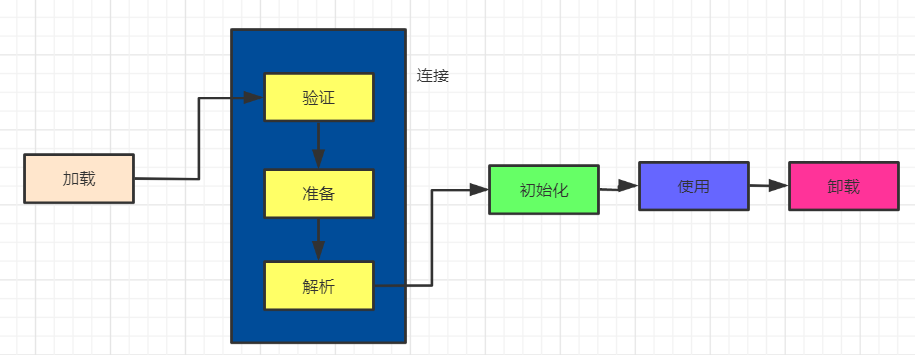

# 类加载机制

> Java虚拟机把描述类的数据从Class文件加载到内存，并对数据进行校验、转换解析和初始化，最终形成可以被虚拟机直接使用的Java类型，这个过程被称作虚拟机的类加载机制

<!--more-->

# 类加载过程

一个类型从被加载到虚拟机内存中开始，到卸载出内存为止会经历如下几个过程。

* 加载
* 验证
* 准备
* 解析
* 初始化
* 使用
* 卸载

需要注意的是**加载->验证->准备->初始化->卸载**这五个操作的顺序是固定的，但是解析操作可以在初始化之前也可以在初始化之后，比如对于动态代理技术就是解析操作在初始化之后实现的

如上图所示，验证，准备和解析三个阶段合起来叫做**连接**阶段。

## 加载

需要注意的是**加载**和**类加载**这两个概念，**加载**是**类加载**的第一个阶段

在加载阶段，虚拟机需要完成三件事

* 通过一个类的全限定名来获取定义此类的二进制字节流。
* 将这个字节流所代表的静态存储结构转化为方法区的运行时数据结构
* 在内存中生成一个代表这个类的java.lang.Class对象，作为方法区这个类的各种数据的访问入口

## 验证

验证目的是确保`Class`文件的字节流中包含的信息符合《Java虚拟机规范》的全部约束要求，保证这些信息被当作代码运行后不会危害虚拟机自身的安全。

验证包含以下几个部分

### 文件格式验证

验证字节流是否符合`Class`文件格式的规范，并且能被当前版本的虚拟机处理。

### 元数据验证

对字节码描述的信息进行语义分析，以保证其描述的信息符合《Java语言规范》的要求。主要包含以下几点：

* 除了`Object`类外应该都有父类
* 这个类的父类是否继承了不允许被继承的类（被`final`修饰的类）
* 如果这个类不是抽象类，是否实现了其父类或接口之中要求实现的所有方法
* 。。。

### 字节码验证

主要目的是通过数据流分析和控制流分析，确定程序语义是合法的、符合逻辑的。在第二阶段对元数据信息中的数据类型校验完毕以后，这阶段就要对类的方法体（`Class`文件中的`Code`属性）进行校验分析，保证被校验类的方法在运行时不会做出危害
虚拟机安全的行为。

### 符号引用验证

最后一个阶段的校验行为发生在虚拟机将符号引用转化为直接引用的时候，这个转化动作将在连接的第三阶段——解析阶段中发生。

## 准备

准备阶段是正式为类中定义的变量（即静态变量，被`static`修饰的变量）分配内存并设置类变量**初始值**的阶段。

需要注意上面所示的初始值是指变量的默认值。

|   类型    |   默认值   |
| :-------: | :--------: |
|    int    |     0      |
|   long    |     0L     |
|   short   | （short）0 |
|   char    |  ‘\u0000’  |
|   byte    | （byte）0  |
|  boolean  |   false    |
|   float   |    0.0f    |
|  double   |    0.0d    |
| reference |    null    |

如果是定义成final类型，那么准备阶段的赋值就不不是默认值了，而是我们给的是什么值就是什么值

## 解析

解析阶段是`Java`虚拟机将常量池内的符号引用替换为直接引用的过程。

解析动作主要针对以下七种类型进行解析

1. 类或接口
2. 字段
3. 类方法
4. 接口方法
5. 方法类型
6. 方法句柄
7. 调用点限定符

## 初始化

之前介绍的几个类加载的动作里，除了在**加载**阶段用户应用程序可以通过自定义类加载器的方式局部参与外，其余动作都完全由`Java`虚拟机来主导控制。直到初始化阶段，`Java`虚拟机才真正开始执行类中编写的`Java`程序代码。

### 什么时候会初始化

当执行下面的操作的时候如果一个类还没有执行初始化的操作，则需要先初始化

* 使用`new`关键字`new`一个对象
* 读取或设置一个类型的静态字段，但是如果是`final`类型的除外
* 调用一个类型的静态方法
* 使用`java.lang.reflect`包的方法对一个类型进行反射调用的时候
* 当初始化的时候，如果一个父类还没有初始化，则需要先初始化父类
* 虚拟机启动时，会先初始化主类(`main`方法所在的类)
* 当一个接口中定义了`JDK 8`新加入的默认方法（被default关键字修饰的接口方法）时，如果有这个接口的实现类发生了初始化，那该接口要在其之前被初始化

