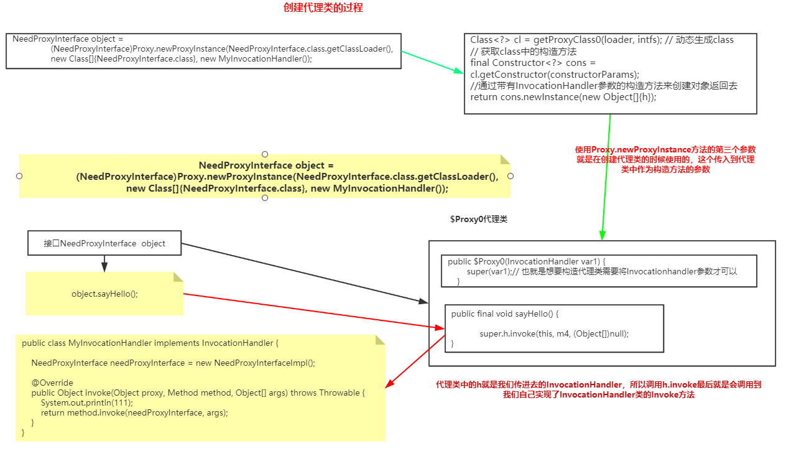
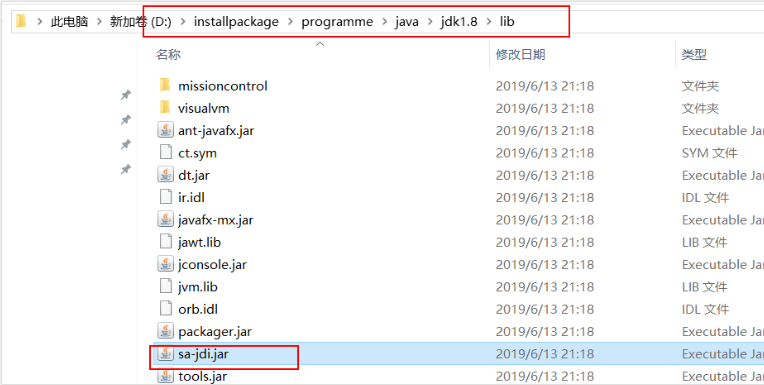
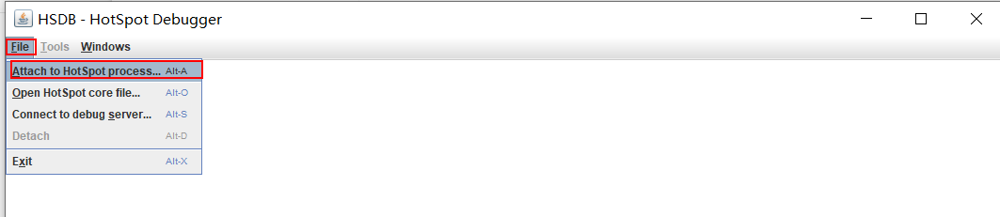
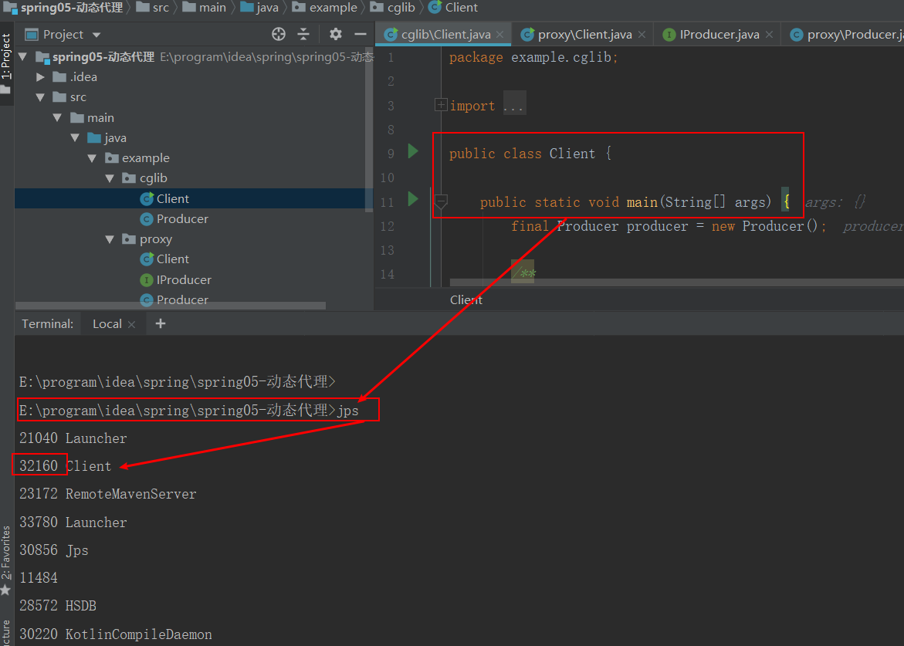
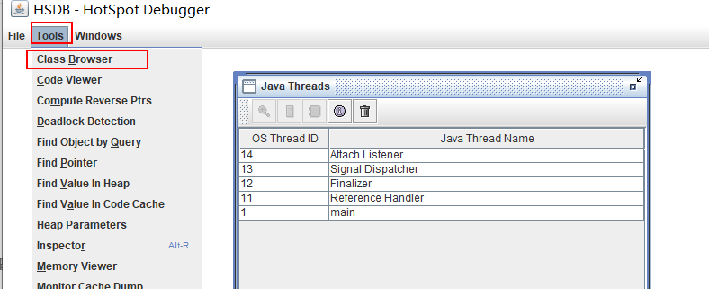
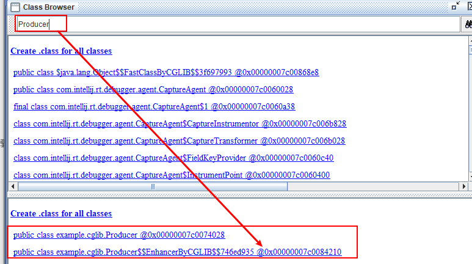
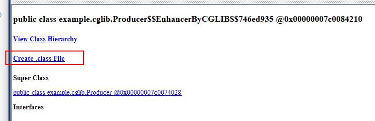
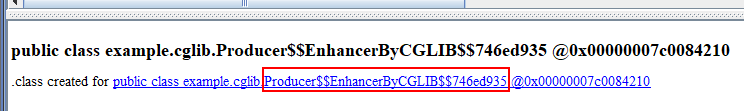

# 示例代码

[动态代理示例代码](https://gitee.com/Gwei11/code/tree/master/javabase/proxy/proxy-demo)

# 概念理解

所谓的代理模式简单理解就是对原有的功能增强的一种模式。代理模式有三个角色：	

* 接口(`Subject`)   
*  委托类(`RealSubject`),该类也是真正实现功能的类	
* 代理类(`ProxySubject`)这个代理类对我们的委托类进行增强处理 

<!--more-->

# 动态代理分类

## jdk动态代理

`jdk`动态代理的的核心是主要是有两个类

* `Proxy`类的`newProxyInstance`方法
* `InvocationHandler` 接口

### `jdk`动态代理案例

* 一个接口
* 该接口的实现类
* 一个实现了`InvocationHandler` 接口的处理类

**接口**

```java
package com.dynamicProxy;
public interface NeedProxyInterface {
    void sayHello();
    int add(int a, int b);
}
```

**实现类**

```java
package com.dynamicProxy;
public class NeedProxyInterfaceImpl implements NeedProxyInterface {

    public void sayHello() {
        System.out.println("hello");
    }

    public int add(int a, int b) {
        return a + b;
    }
}
```

**实现了`InvocationHandler` 接口的处理类**

```java
package com.dynamicProxy;
import java.lang.reflect.InvocationHandler;
import java.lang.reflect.Method;
public class MyInvocationHandler implements InvocationHandler {
    NeedProxyInterface needProxyInterface = new NeedProxyInterfaceImpl();
    @Override
    public Object invoke(Object proxy, Method method, Object[] args) throws Throwable {
        System.out.println(111);
        return method.invoke(needProxyInterface, args);
    }
}
```

**测试代码**

```java
package com.dynamicProxy;
import java.lang.reflect.Proxy;
public class DynamicProxyMain {
    public static void main(String[] args) {
        NeedProxyInterface object =
               (NeedProxyInterface)Proxy.newProxyInstance(NeedProxyInterface.class.getClassLoader(),
                new Class[]{NeedProxyInterface.class}, new MyInvocationHandler());
        object.sayHello();
    }
}
```

我们可以根据下面介绍的使用方式使用`HSDL`工具生成代理类文件，生成的文件内容如下：

**代理类**

```java
package com.sun.proxy;

import com.dynamicProxy.NeedProxyInterface;
import java.lang.reflect.InvocationHandler;
import java.lang.reflect.Method;
import java.lang.reflect.Proxy;
import java.lang.reflect.UndeclaredThrowableException;

public final class $Proxy0 extends Proxy implements NeedProxyInterface {
    private static Method m1;
    private static Method m4;
    private static Method m2;
    private static Method m3;
    private static Method m0;

    public $Proxy0(InvocationHandler var1) {
        super(var1);
    }

    static {
        try {
            m1 = Class.forName("java.lang.Object").getMethod("equals", Class.forName("java.lang.Object"));
            m4 = Class.forName("com.dynamicProxy.NeedProxyInterface").getMethod("sayHello");
            m2 = Class.forName("java.lang.Object").getMethod("toString");
            m3 = Class.forName("com.dynamicProxy.NeedProxyInterface").getMethod("add", Integer.TYPE, Integer.TYPE);
            m0 = Class.forName("java.lang.Object").getMethod("hashCode");
        } catch (NoSuchMethodException var2) {
            throw new NoSuchMethodError(var2.getMessage());
        } catch (ClassNotFoundException var3) {
            throw new NoClassDefFoundError(var3.getMessage());
        }
    }

    public final int add(int var1, int var2) {
        try {
            return (Integer)super.h.invoke(this, m3, new Object[]{var1, var2});
        } catch (RuntimeException | Error var4) {
            throw var4;
        } catch (Throwable var5) {
            throw new UndeclaredThrowableException(var5);
        }
    }

    public final boolean equals(Object var1) {
        try {
            return (Boolean)super.h.invoke(this, m1, new Object[]{var1});
        } catch (RuntimeException | Error var3) {
            throw var3;
        } catch (Throwable var4) {
            throw new UndeclaredThrowableException(var4);
        }
    }
    
    public final String toString() {
        try {
            return (String)super.h.invoke(this, m2, (Object[])null);
        } catch (RuntimeException | Error var2) {
            throw var2;
        } catch (Throwable var3) {
            throw new UndeclaredThrowableException(var3);
        }
    }

    public final int hashCode() {
        try {
            return (Integer)super.h.invoke(this, m0, (Object[])null);
        } catch (RuntimeException | Error var2) {
            throw var2;
        } catch (Throwable var3) {
            throw new UndeclaredThrowableException(var3);
        }
    }

    public final void sayHello() {
        try {
            super.h.invoke(this, m4, (Object[])null);
        } catch (RuntimeException | Error var2) {
            throw var2;
        } catch (Throwable var3) {
            throw new UndeclaredThrowableException(var3);
        }
    }
}
```


### 原理图




其实我们之所以不懂代理，是因为这个代理类生成后是在内存中的，如果我们能看到这样的一个类的代码就不会觉得难，所以可以使用上面所说的`HSDL`工具将代理类下载下来就比较容易看懂。


# 使用HSDL工具查看代理类代码

## 找到`jdk`当中的`sa-jdi.jar`的位置

比如在我的电脑上这个`jar`包的位置




## 执行命令

执行如下所示的命令

```java
D:\>java -classpath "D:\installpackage\programme\java\jdk1.8\lib\sa-jdi.jar" sun.jvm.hotspot.HSDB
```

执行完成之后会出现一个窗口



## 运行jsp命令找到进程ID



将这里找到的进程ID输入到上面第一步的位置，然后进行如下截图所示操作：






如上图所示，因为案例中`cglib`代理的是`Producer`，所以这里我们搜索`Producer`，可以看到下面有一个类就是`Producer`，还有一个是`cglib`的代理类，我们点击那个`cglib`的代理类



点击之后会出现上图所示界面，点击`create.class file`即可



我们可以根据这个代理类的名称来找到生成的这个代理类在哪里（**默认的位置和我们运行cmd的路径有关，比如上面我是在D盘根目录中运行的cmd命令，所以创建的代理类的位置就是在D盘根目录然后加上这个类的包路径**）。


# 直接使用jdk累生成代理类代码

还有一种方式可以直接使用`jdk`生成类的方式来生成代理类并且使用输出流输出到本地，然后使用反编译工具来查看即可。比如还是上面的那个接口，现在想要生成代理类。

```java
byte[] bytes = ProxyGenerator.generateProxyClass("$Proxy0", new Class[]{NeedProxyInterface.class});
FileOutputStream os = new FileOutputStream("D://$Proxy0.class");
os.write(bytes);
os.close();
```

这样就可以在D盘看到`$Proxy0.class`文件，`$Proxy0`这个是我们自己取的代理类的名字。

再使用反编译工具查看发现和我们使用`HSDL`查看的工具类时一样的。