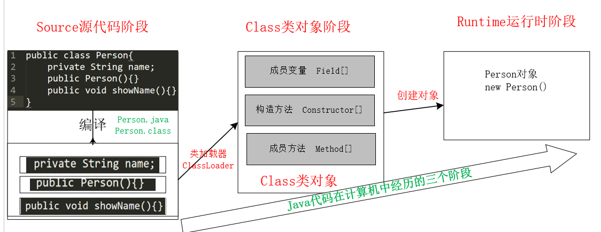
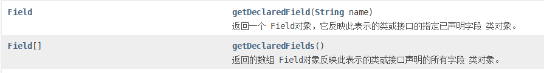
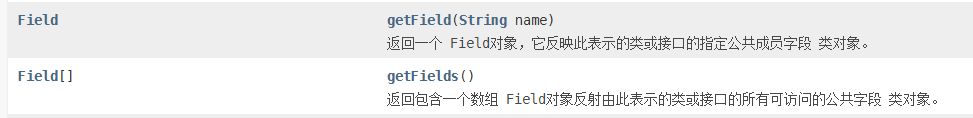
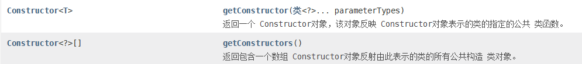
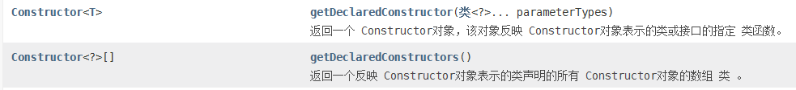
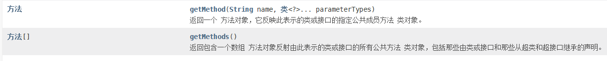
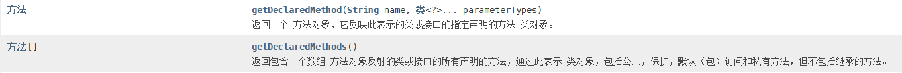

# 什么是反射

将类的各个组成部分封装成其他的对象，就是反射机制

[示例代码地址](https://gitee.com/Gwei11/Java/tree/master/code/java-base/reflect)

# java代码在计算机中经历的三个阶段



<!--more-->

## source源代码阶段

* 我们编写的都是`.java`文件
* 经过`java`编译器编译后编程了`.class`文件，`.java`和 `.class`都是在计算机硬盘中的文件

## Class类对象阶段

* `.class`可以文件可以经过类加载器加载进内存，并且在内存中创建一个`Class`类对象来表示这个 `.class`文件的一些共有的特性
* `.class`字节码文件中含有**成员变量**、**构造方法**以及**成员方法**，而且每一种可能有多个，所以将 每一种类型的数据都定义了一种类型来对应，并且在`Class`类对象中使用对应的数组来存储
	* 成员变量------>`Filed`
	* 构造方法------->`Constructor`
	* 成员方法-------->`Method`

## Runtime运行时阶段

在内存中使用`Class`类对象来表示一个字节码文件后，我们就可以使用这个 `Class`类对象来创建对象，这就是**运行时状态**表现出来的。


# 获取Class类对象

从上面的图可以 知道，要想使用反射，首先要获取的就是`Class`类对象，而`java`代码在计算机中三个阶段，在每一个阶段都有对应的获取方式。

## Class.forName（源代码阶段）

在源代码阶段，`class`字节码文件还是在硬盘中，没有被加载进内存，所以此时想要获取`Class`类对象，可以通过`Class.forName("完整类路径")`方式获取

```java
package example.classobject;

public class ClassObject {
    public static void main(String[] args) throws ClassNotFoundException {
        // 第二种方式
        Class<?> aClass = Class.forName("example.classobject.ClassObject");
    }
}
```

## 类名.class（Class类对象阶段）

如果是已经加载进入内存了，那么就可以通过`类名.class`属性来获取

```java
package example.classobject;

public class ClassObject {
    public static void main(String[] args) throws ClassNotFoundException {
        // 第一种方式
        Class<?> aClass = Class.forName("example.classobject.ClassObject");
        // 第二种方式
        Class<ClassObject> testOneClass = ClassObject.class;
        System.out.println(aClass == testOneClass); // true
    }
}
```

## 对象.getClass（运行时阶段）

如果已经有了对象，那么就可以通过`对象.getClass`获取 

```java
package example.classobject;

public class ClassObject {
    public static void main(String[] args) throws ClassNotFoundException {
        // 第一种方式
        Class<?> aClass = Class.forName("example.classobject.ClassObject");
      	// 第二种方式
        Class<ClassObject> testOneClass = ClassObject.class;
        System.out.println(aClass == testOneClass); // true
        // 第三种方式
        ClassObject classObject = new ClassObject();
        Class<? extends ClassObject> aClass1 = classObject.getClass();
        System.out.println(aClass1 == aClass);
    }
}
```

# Class对象的功能

上面给出了三种获取`Class`对象的方法，既然已经获取了`Class`对象，那么接下来的就是要使用`Class`对象了，下面列举的是`Class`对象常用的一些方法。

下面的三组方法都有分为带有`Declared`的和不带有的，区别在于：

* 带有`Declared`可以不用考虑修饰符权限问题
* 不带有`Declared`只能操作`public`修饰符修饰的内容

## 获取成员变量

带有`Declared`的，不考虑修饰符所有的成员变量都可以获取



不带`Declared`的，字段修饰符必须是`public`的才能获取




### 成员变量的作用

上面的四个方法是获取成员变量，那我们获取了成员变量之后一般都是有两个操作

* 设置值（下面只是列举一个方法，其余方法可以查看`api`）

	```java
	void set(Object obj, Object value);
	```

* 获取值

	```java
	Object get(Object obj);
	```

## 获取构造方法





### 构造方法的作用

构造器的主要作用就是为了**创建对象**，主要是使用`Constructor`对象的`newInstance`方法，具体用法看上面给的案例地址。

## 获取成员方法





### 成员方法的作用

上面的几个方法是为了获取成员方法，获取成员方法的作用其实就是为了**可以执行方法**，此时需要使用`Method`类中的`invoke`方法，该方法第一个参数是一个实际需要执行的对象，第二个参数是一个可变参数列表。

