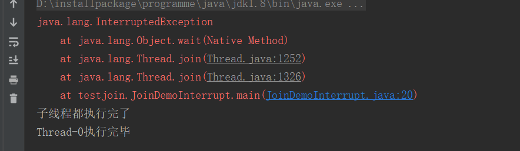

# join的使用

## 正常情形

`join`的目的是让调用线程等待被调用的线程执行完成之后再继续。

* 对于`join`方法需要注意的是谁等待谁
	* 调用`join`方法所在的线程需要等待调用`join`方法的对象线程执行完毕
* 下面代码案例中`thread.join()`和`thread2.join()`都是在`main`线程中调用的，所以是`main`线程要等其他线程，那么这里的其他线程是哪个线程呢？就是调用`join`的`thread`和`thread2`线程

<!--more-->

```java
package testjoin;

public class JoinDemo implements Runnable {

    public static void main(String[] args) {
        JoinDemo joinDemo = new JoinDemo();
        Thread thread = new Thread(joinDemo);
        Thread thread2 = new Thread(joinDemo);
        thread.start();
        thread2.start();
        try {
            thread.join();
            thread2.join();
        } catch (InterruptedException e) {
            e.printStackTrace();
        }
        System.out.println("子线程都执行完了");

    }

    @Override
    public void run() {
        try {
            Thread.sleep(1000);
        } catch (InterruptedException e) {
            e.printStackTrace();
        }
        System.out.println(Thread.currentThread().getName() + "执行完毕");
    }
}
```

上面是正常的情形，也就是说`main`线程确实是等到另外两个线程执行完毕之后才执行的。

## 中断情形

下面演示的是在子线程中中断了主线程，这样虽然主线程中调用了子线程的`join`方法，但是也有可能是主线程先执行完。

```java
package testjoin;

public class JoinDemoInterrupt{

    public static void main(String[] args) {
        // 获取主线程的引用
        Thread threadMain = Thread.currentThread();
        Thread thread = new Thread(() -> {
            try {
                // 中断主线程
                threadMain.interrupt();
                Thread.sleep(1000);
            } catch (InterruptedException e) {
                e.printStackTrace();
            }
            System.out.println(Thread.currentThread().getName() + "执行完毕");
        });
        thread.start();
        try {
            thread.join();
        } catch (InterruptedException e) {
            e.printStackTrace();
        }
        System.out.println("子线程都执行完了");
    }
}
```

执行结果



从上面截图可以看到实际上是主线程先执行完的。

## 解决方案

上面中断的情形显然是不对，那么应该如何解决呢？其实在主线程被中断之后，应该通知子线程，通知子线程的方式就是中断子线程。所以代码也很简单，就是在上面的点啊基础上加一行代码即可。

```java
package testjoin;
public class JoinDemoInterrupt{

    public static void main(String[] args) {
        // 获取主线程的引用
        Thread threadMain = Thread.currentThread();
        Thread thread = new Thread(() -> {
            try {
                // 中断主线程
                threadMain.interrupt();
                Thread.sleep(1000);
            } catch (InterruptedException e) {
                e.printStackTrace();
            }
            System.out.println(Thread.currentThread().getName() + "执行完毕");
        });
        thread.start();
        try {
            thread.join();
        } catch (InterruptedException e) {
            // 中断子线程
            thread.interrupt();
            e.printStackTrace();
        }
        System.out.println("子线程都执行完了");
    }
}
```

上面的代码就加一一句`thread.interrupt();`这是中断子线程，但是需要注意的是不代表加上这一句话之后，子线程一定会先执行完。因为当调用`join`的线程被中断之后实际上是已经不会继续等其他线程执行完了。

# join的原理

我们来看一下`join`方法

```java
public final synchronized void join(long millis)
    throws InterruptedException {
        long base = System.currentTimeMillis();
        long now = 0;

        if (millis < 0) {
            throw new IllegalArgumentException("timeout value is negative");
        }

        if (millis == 0) {
            while (isAlive()) {
                wait(0);
            }
        } else {
            while (isAlive()) {
                long delay = millis - now;
                if (delay <= 0) {
                    break;
                }
                wait(delay);
                now = System.currentTimeMillis() - base;
            }
        }
    }
```

上面是`join`方法的源码，可以看出来实际上底层调用的就是`wait`，但是我们调用`wait`的时候是需要`notify`或者`notifyAll`方法来唤醒的，但是这里没有看到任何的`notify`方法的身影啊。其实这是因为每一个线程执行完成之后都会调用当前线程的`notify`方法。这是线程底层做的事情。

# join的替代方式

上面说每一个线程执行完成后都会调用当前线程的`notify`方法，那么我们是不是就可以使用`wait`方法来替换`join`方法呢？请看下面代码

```java
package testjoin;

public class JoinDemoInterrupt{

    public static void main(String[] args) {
        // 获取主线程的引用
        Thread threadMain = Thread.currentThread();
        Thread thread = new Thread(() -> {
            try {
                Thread.sleep(1000);
            } catch (InterruptedException e) {
                e.printStackTrace();
            }
            System.out.println(Thread.currentThread().getName() + "执行完毕");
        });
        thread.start();
        try {
            //thread.join();
            synchronized (thread) {
                thread.wait();
            }
        } catch (InterruptedException e) {
            e.printStackTrace();
        }
        System.out.println("子线程都执行完了");
    }
}
```

执行结果和正常情形的执行结果是一样的。我们所做的就是将`thread.join()`方法替换为了

```java
synchronized (thread) {
  thread.wait();
}
```

* 这里使用了`synchronized`是因为`wait`方法必须在同步代码块中使用
* 这里的锁对象`thread`就是子线程的名称，这里需要注意的是替换后要想达到一样的效果这里的锁对象就必须是被等待线程的引用，因为上面说每一个线程执行完成后都会调用当前线程的`notify`方法，`wait`和`notify`必须是在同一个锁上面才会生效。