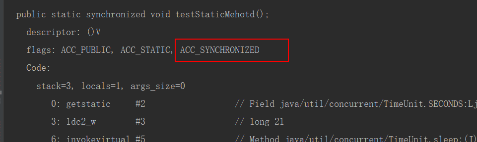
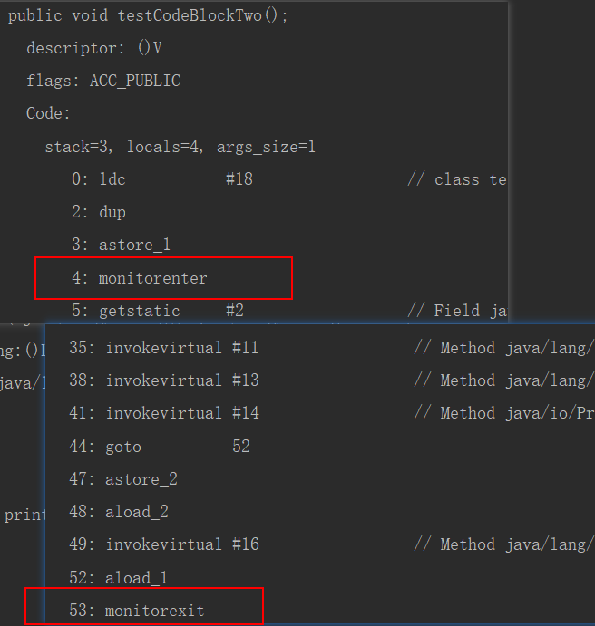

对于`synchronized`我们都知道是同步代码的作用，使用了`synchronized`关键字后，就是对其修饰的方法或代码块进行加锁，这样就能保证同一时间只能有一个线程访问到被其修饰的方法或代码块。

`synchronized`可以修饰的情形有以下几种

* 静态方法
* 成员方法
* 代码块

<!--more-->

# 修饰静态方法

假设现在有一个静态方法如下：

```java
public static synchronized void testStaticMehotd() {
  try {
    TimeUnit.SECONDS.sleep(2L);
    System.out.println(Thread.currentThread().getName() + " is runing");
  } catch (InterruptedException var1) {
    var1.printStackTrace();
  }
}
```

使用`javap`命令将这个类反编译后看一下这个方法的二进制命令




# 修饰代码块

```java
public void testCodeBlockTwo() {
  Class var1 = SynchronizedTwo.class;
  synchronized(SynchronizedTwo.class) {
    try {
      TimeUnit.SECONDS.sleep(2L);
      System.out.println(Thread.currentThread().getName() + " is runing");
    } catch (InterruptedException var4) {
      var4.printStackTrace();
    }

  }
}
```

同样使用`javap`命令来反编译看一下



# 对方法和代码块加锁的不同机制

其实经过上面两个截图能说看，`synchronized`对方法加锁和对代码块就锁的机制是不同的。

* 对代码块使用`synchronized`加锁是使用了`Monitorenter`和`Monitorexit`指令来实现的
* 对方法加锁使用`ACC_SYNCHRONIZED`标识符来实现的

