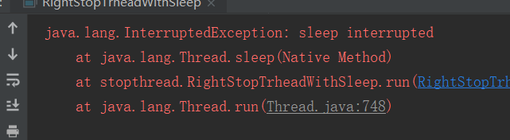
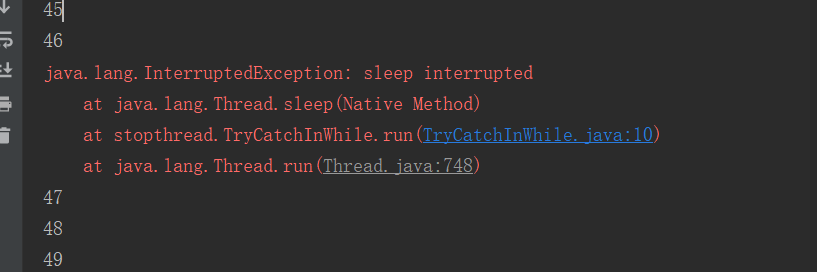
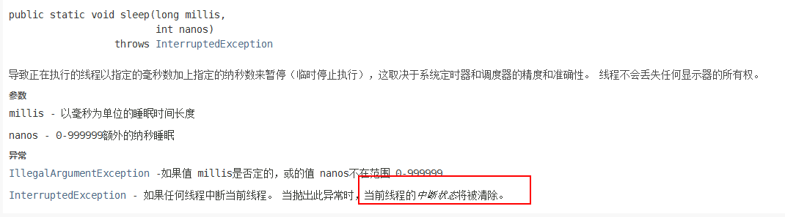
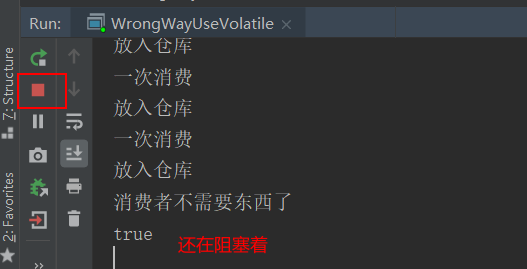
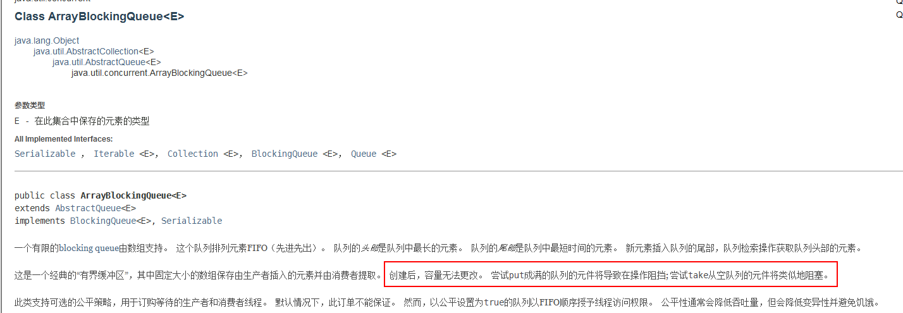

# run方法和start方法

对于创建过线程的同学都知道，在`Thread`类中有两个方法需要区分

* `run`方法

* `start`方法

先来看一段代码

```java
package createthread;

public class StartAndRunMethod {
    public static void main(String[] args) {
        Runnable runnable = ()->{
            System.out.println(Thread.currentThread().getName());
        };
        // 直接调用run方法
        runnable.run();
        new Thread(runnable).start();
    }
}
```

打印的结果如下

```java
main
Thread-0
```

<!--more-->

从上面的结果中可以看到

* 如果是直接调用`run`方法那么其实不是启动一个新的线程，而是一个普通的方法调用，因为打印的线程的名字是`main`
* 使用`start`方法才是启动一个新的线程

## start方法

现在来看一下`start`方法的源码

```java
public synchronized void start() {
  // 第一件事是判断线程状态
        if (threadStatus != 0)
            throw new IllegalThreadStateException();
// 第二件事情是将线程加入线程组  
        group.add(this);

        boolean started = false;
        try {
        // 第三件事情就是调用start0方法  
            start0();
            started = true;
        } finally {
            try {
                if (!started) {
                    group.threadStartFailed(this);
                }
            } catch (Throwable ignore) {
            }
        }
    }
```

从上面的代码可以看到`start`方法主要做了三件事

* 在启动一个线程之前会先判断一个线程状态[线程的六种状态](https://www.personalstudy.ltd/2020/04/25/java/%E5%A4%9A%E7%BA%BF%E7%A8%8B/%E6%9F%A5%E7%9C%8B%E7%BA%BF%E7%A8%8B%E7%8A%B6%E6%80%81/),这也是为什么执行两次`start`方法在第二次执行的时候会抛出`IllegalThreadStateException`

异常的原因，从这段代码就可以看出来。是因为当执行一次`start`方法后，线程的状态已经不是0了，所以再一次执行就会抛出这个错误。

<font color="green">综合可知，线程的正确启动方式是使用start方法，并且只能使用一次</font>

# 如何正确停止线程

先给一个总结性原理

**停止线程应该使用`interrupt`来通知，而不是强制停止**

> 其实这种一种规范，因为很多时候我们并不清楚别人的线程在做什么事情，如果我们强行终止掉另外一个线程，可能会出现一个问题，所以我们要做的应该是给那个需要停止的线程发出一个信号，告诉它应该停止了，给它留下一些时间来处理一些收尾的工作，具体的停止操作应该是由它自己来控制。

## 普通情形下停止线程

```java
package stopthread;
public class RightStopTrheadWithoutSleep implements Runnable{
    @Override
    public void run() {
        int i = 0;
      // Thread.currentThread().isInterrupted()方法返回的是该线程是否被中断的标识
        while((i < Integer.MAX_VALUE / 2) && !Thread.currentThread().isInterrupted()){
            if (i % 10000 == 0) {
                System.out.println(i + "是10000的倍数");
            }
            i++;
        }
    }
    public static void main(String[] args) {
        Thread thread = new Thread(new RightStopTrheadWithoutSleep());
        thread.start();
      // 这里休眠一秒是为了让thread线程执行一秒钟
        try {
            Thread.sleep(1000);
        } catch (InterruptedException e) {
            e.printStackTrace();
        }
      // 中断thread线程
        thread.interrupt();
    }
}
```

如上面的代码所示，在主线中使用`interrupt`方法来中断`thread`线程，如果在`thread`线程中没有使用`Thread.currentThread().isInterrupted()`,那么程序是没有任何影响的，之前已经说过，`interrupt`的作用只是一个提醒，具体的中断还是要在线程内部自己去判断。

## 阻塞情形下停止线程

```java
package stopthread;

public class RightStopTrheadWithSleep implements Runnable {
    @Override
    public void run() {
        int i = 0;
        try {
            while ((i < 1000) && !Thread.currentThread().isInterrupted()) {
                System.out.println(i++);
            }
            Thread.sleep(1000);
        } catch (InterruptedException e) {
            e.printStackTrace();
        }
    }
    public static void main(String[] args) {
        Thread thread = new Thread(new RightStopTrheadWithSleep());
        thread.start();
        try {
            Thread.sleep(500);
        } catch (InterruptedException e) {
            e.printStackTrace();
        }
        thread.interrupt();
    }
}
```

如上面代码所示，在`thread`线程中执行完了循环之后就让线程开始`sleep`1秒钟，在`thread`线程在休息的时候，主线程中使用`interrupt`方法中断了`thread`线程，这样就会出现下图所示的异常




## 线程每次迭代后都阻塞

上面的代码休眠方法是在`while`循环我外面执行的，如果将休眠的代码放入到`while`循环内部执行，那么就是会出现线程每次迭代都阻塞的情形。

```java
package stopthread;

public class RightStopTrheadWithSleepEveryLoop implements Runnable {
    @Override
    public void run() {
        int i = 0;
        try {
          // 每次循环都中断和单次中断的区别就在于使用需要使用线程状态那个条件
            while (i < 1000) {
                System.out.println(i++);
                Thread.sleep(10);
            }
        } catch (InterruptedException e) {
            e.printStackTrace();
        }
    }
    public static void main(String[] args) {
        Thread thread = new Thread(new RightStopTrheadWithSleepEveryLoop());
        thread.start();
        try {
            Thread.sleep(500);
        } catch (InterruptedException e) {
            e.printStackTrace();
        }
        thread.interrupt();
    }
}
```

上面的代码和单次阻塞下的代码基本是相同的，只有两个地方不同

* 将`sleep`方法放入到`while`循环当中
* 在`while`循环当中不需要使用`Thead.currentThread.isInterrupt()`方法，因为每一次循环都中断的话，其实判断条件就是那个异常，只要出现了异常，自然就表示线程被中断了。

# 线程不能被中断的情形

## `try-catch`在`while`里面

```java
package stopthread;
public class TryCatchInWhile implements Runnable {
    @Override
    public void run() {
        int i = 0;
        while (i < 200 && !Thread.currentThread().isInterrupted()) {
            try {
                System.out.println(i++);
                Thread.sleep(10);
            } catch (InterruptedException e) {
                e.printStackTrace();
            }
        }
    }

    public static void main(String[] args) {
        Thread thread = new Thread(new TryCatchInWhile());
        thread.start();
        try {
            Thread.sleep(500);
        } catch (InterruptedException e) {
            e.printStackTrace();
        }
        thread.interrupt();
    }
}
```

运行结果



可以看到虽然出现了异常，但是代码还是会继续执行，为什么我们加上了`Thread.currentThread().isInterrupted()`这个方法来判断线程是否被中断的条件还是不行呢?这是因为使用了`sleep`方法导致的




## 使用volatile定义的属性作为标识位

很多时候还会使用`volatile`定义的属性来作为标识位，通过这个标识位来停止一个线程，使用这种方式在某些情形下是可以停止线程，但是在某些情形下不能停止线程。

### 能被停止的情形

对于在线程内部不会在清除中断标识位的操作就可以使用`volatile`的形式来作为退出线程的判断

```java
package stopthread;
public class RightWayUseVolatile {
    public static void main(String[] args) {
        Thread thread = new Thread(new ThreadOne());
        thread.start();
        try {
            Thread.sleep(1000);
            ThreadOne.flag = true;
        } catch (InterruptedException e) {
            e.printStackTrace();
        }
    }
}

class ThreadOne implements Runnable {

    public static volatile boolean flag = false;
    @Override
    public void run() {
        while(true && !flag) {
            System.out.println("线程一直执行执行，除非被中断");
        }
    }
}
```

上面的示例代码可以正确退出线程。在主线程中修改了使用`volatile`修饰的 标识符，使用`volatile`关键字修饰的变量具有可见性，所以可以让`thread`线程看到该变量的变化，这样就可以退出线程。

### 不能被停止的情形

上面已经演示过了可以正确使用`volatile`停止线程的情形，但是在某些情形下是不能正确停止线程的，比如下面消费者和生产者的案例

```java
package stopthread;
import java.util.concurrent.ArrayBlockingQueue;
import java.util.concurrent.BlockingQueue;
public class WrongWayUseVolatile {
    public static void main(String[] args) throws InterruptedException {
        // 这是一个阻塞队列
        ArrayBlockingQueue queue = new ArrayBlockingQueue(10);
        Producer producer = new Producer(queue);
        Thread producerThread = new Thread(producer);
        producerThread.start();
        Thread.sleep(1000);
        Consumer consumer = new Consumer(queue);
        while (consumer.needMoreNums()) {
            consumer.queue.take();
            System.out.println("一次消费");
            Thread.sleep(100);
        }
        System.out.println("消费者不需要东西了");
        producer.canceled=true;
        System.out.println(producer.canceled);
    }
}
class Producer implements Runnable {
    public volatile boolean canceled = false;
    BlockingQueue queue;
    public Producer(BlockingQueue queue) {
        this.queue = queue;
    }
    @Override
    public void run() {
        int num = 0;
        try {
            while(num<=100000 && !canceled) {
                if (num%100==0) {
                    //当超过queue的容量的时候执行put就会阻塞
                    queue.put(num);
                    System.out.println("放入仓库");
                }
            }
        } catch (InterruptedException e) {
            e.printStackTrace();
        } finally {
            System.out.println("生产者线程结束");
        }
    }
}
class Consumer {
    BlockingQueue queue;

    public Consumer(BlockingQueue queue) {
        this.queue = queue;
    }

    public boolean needMoreNums() {
        if(Math.random()>0.95) {
            return false;
        }
        return true;
    }
}
```

执行结果



上面的代码就是使用了一个阻塞队列。



上面的示例代码，消费者代码执行完成之后改变了消费者中使用`volatile`定义的变量，但是由于生产者还在处于阻塞状态，所以并没有执行到`while`循环的判断条件处，这样生产者线程依然是在阻塞中。

### 修复(使用interrupt)

上面演示了不能被正确停止的形式，那么正确的停止方式是什么呢？其实就是使用`interrupt`方法，上面在`main`线程值是修改`volatile`修饰的变量值，现在换成调用需要被中断线程的`interrupt`方法，并且在需要被中断的线程中响应这个中断事件，然后在`while`条件中加上`Thread.currentThread.isInterrupt()`方法来判断当前线程是否被中断即可。

你可能有一个疑问，上面使用`volatile`在生产者中之所以没有起作用，是因为线程被阻塞了，那么使用`interrupt`的时候，线程不也是会被阻塞么？当线程阻塞的时候为什么还会走到`while`判断呢？这是因为在消费者线程即使是在阻塞的状态也是可以接收线程中断的信号的，并且会抛出异常，这样去就可以进行下一次循环，而且这个阻塞队列也不会消除中断标识，所以在`while`判断中可以使用线程中断标识。

# 对于线程中方法正确调用姿势

## 抛出是首选

如果在一个线程中(也就是`run`方法)需要去调用另外一个方法A,那么在方法A中应该如何处理`InterruptException`呢。我们知道异常的处理方式有两种，一种是`try-catch`,还有一种是`throws`,正确的姿势是使用`throw`来抛出异常，让方法调用方来处理异常。

## 恢复中断

当然有可能是不想抛出或者是没有办法抛出，那么此时就需要捕获异常，并且在`catch`块中再一次恢复中断，怎么恢复中断呢，其实就是调用`Thread.currentThread.inerrupt()`方法即可。