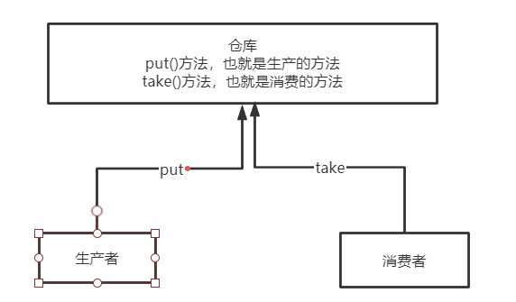
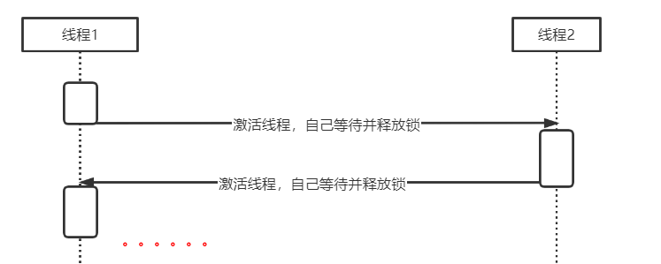

# 创建线程的方式有几种？

如果是从本质上来看是两种

* 继承`Thread`类
* 实现`Runnable`接口

但是只是从创建方式来看，可能会有多种，比如除了上面所说的，还有

* 通过线程池的方式来创建
* 通过`Callback`的方式来创建

<!--more-->

# 通过`Runnable`方式和继承`Thread`方式那种方式更好

使用实现`Runnable`接口方式更好

* `java`中是单继承，但是是多实现的，如果继承了`Thread`类那么就不能继承其余的类
* 从代码架构层面来说，使用`Runnable`形式可以解耦


# 一个线程能两次执行`start`方法么，`why`

一个线程不能执行两次`start`方法，可以先看一下`start`方法的源码

```java
public synchronized void start() {
  // 第一个关注点，调用start方法之前会先判断标识
        if (threadStatus != 0)
            throw new IllegalThreadStateException();
        group.add(this);

        boolean started = false;
        try {
            start0();
          // 第二个关注点，调用之后会修改标识
            started = true;
        } finally {
            try {
                if (!started) {
                    group.threadStartFailed(this);
                }
            } catch (Throwable ignore) {
            }
        }
    }
```

从上面的代码中可以看出，在`start`方法中有两个地方需要注意

* 调用`start`方法之前会先判断标识
* 调用之后会修改标识

所以调用一次之后，标识已经被修改了，那么再一次调用就会抛出`IllegalThreadStateException`异常，其实这是和线程的六个状态有关。


# 会写生产者和消费者模式



原理图如上图所示，主要就是有三个类

* 仓库
	* 提供`put`方法，也就是往仓库中添加东西的方法，该方法需要同步
	* 提供`take`方法，也就是从仓库往外拿的方法，该方法需要同步
* 生产者类
	* 调用仓库的`put`方法即可
* 消费者类
	* 调用仓库的`take`方法即可

其中一种代码如下：

```java
package consumerandproducer;
import java.util.Date;
import java.util.LinkedList;
public class TestConsumerAndProducer {

    public static void main(String[] args) {
        MyList myList = new MyList();
        new Thread(new Producer(myList)).start();
        new Thread(new Consumer(myList)).start();

    }
}

class Producer implements Runnable {

    private MyList myList;

    public Producer(MyList myList) {
        this.myList = myList;
    }

    @Override
    public void run() {
        for (int i = 0; i < 100; i++) {
            myList.put();
        }
    }
}

class Consumer implements Runnable {

    private MyList myList;

    public Consumer(MyList myList) {
        this.myList = myList;
    }

    @Override
    public void run() {
        for (int i = 0; i < 100; i++) {
            myList.take();
        }
    }
}

class MyList {
    private final int MAX_SIZE = 10;
    private LinkedList<Date> list = new LinkedList<Date>();

    // 生产者往里面添加数据(锁住的是当前对象)
    public synchronized void put() {
        // 已经满了，就不能继续添加
        while (list.size() == MAX_SIZE) {
            try {
                wait();
            } catch (InterruptedException e) {
                e.printStackTrace();
            }
        }
        // 否则就可以继续添加
        list.add(new Date());
        System.out.println("已经有了" + list.size() + "个产品");
        // 通知消费者线程
        notify();
    }

    // 消费者往外面拿数据
    public synchronized void take() {
        // 没有数据了就要阻塞
        while (list.size() == 0) {
            try {
                wait();
            } catch (InterruptedException e) {
                e.printStackTrace();
            }
        }
        // 还有数据就可以消费
        list.poll();
        System.out.println(Thread.currentThread().getName() + "消费了一个产品，还剩下" + list.size() );
        // 通知生产者线程
        notify();
    }
}
```


# 使用两个线程从0到100交替打印

## 普通版

```java
package demo;

import java.util.concurrent.TimeUnit;

public class DemoOne {

    private static int count = 0;

    private static final Object lock = new Object();

    public static void main(String[] args) {
        DemoOne one = new DemoOne();
        new Thread(one.new OddNumber()).start();
        try {
            TimeUnit.SECONDS.sleep(1);
        } catch (InterruptedException e) {
            e.printStackTrace();
        }
        new Thread(one.new EvenNumber()).start();
    }

    // 奇数线程
    class OddNumber implements Runnable {
        @Override
        public void run() {
            while (count < 100) {
                synchronized (lock) {
                    if (count % 2 == 0) {
                        System.out.println(count++);
                    }
                }
            }
        }
    }

    // 偶数线程
    class EvenNumber implements Runnable {
        @Override
        public void run() {
            while (count < 100) {
                synchronized (lock) {
                    if (count % 2 == 1) {
                        System.out.println(count++);
                    }
                }
            }
        }
    }
}
```

上面这种方式可以达到目的，但是效率不够高，为什么呢？因为每一次一个线程执行一次循环后，并不是立即切换到另外一个线程，可能还会继续循环多次，只是因为条件不满足，所以没有打印数据而已，更有效的方式是执行一次之后就立即切换到另外一个线程来执行。这就需要用到线程间通信的方式了，也即是`wait`和`notify`版。

## `wait`和`notify`版

```java
package demo;

public class DemoTwo {

    private static int count = 0;

    private static final Object lock = new Object();

    public static void main(String[] args) {
        TunringRun run = new TunringRun();
        new Thread(run).start();
        new Thread(run).start();
    }

    static class TunringRun implements Runnable {
        @Override
        public void run() {
            // 只要获取到锁就执行
            while (count < 100) {
                synchronized (lock) {
                    System.out.println(count++);
                    lock.notify();
                    if (count < 100) {
                        try {
                            lock.wait();
                        } catch (InterruptedException e) {
                            e.printStackTrace();
                        }
                    }
                }
            }
        }
    }
}
```

这种方式的执行顺序如图所示



# 为什么`wait`需要在同步代码块中使用而`sleep`不用

因为`wait`和`notify`是有使用顺序的要求的，`wait`必须是在的`notify`之前执行，所以如果没有将`wait`放入的同步代码块中执行，那么就有可能`notify`先执行，再执行`wait`的时候就会陷入一直等待的情形。

`sleep`主要是对自己这个线程有影响，没有涉及的线程间通信，所以不需要。


# wait/notify和sleep有什么异同

## 相同点

* `wait`和`sleep`都会阻塞
* 他们都可以响应中断

## 不同

* 所在类不同
* `wait`可以不用传参数，但是`sleep`一定需要参数
* `wait`必须使用在同步代码块中，但是`sleep`不需要
* `wait`会释放锁，但是`sleep`不会释放锁


# join期间，线程处于什么状态