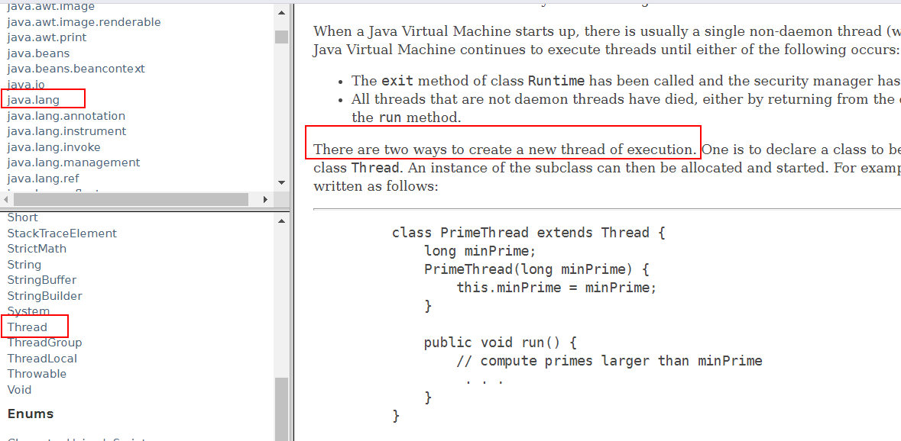

# 线程到底有几种创建方式

如果在网上搜一下线程创建的方式，结果可能如下：


<!--more-->

有的说是三种，有的说是四种，还有的两种或者六种，那么到底是几种呢，我们看一下`oracle`的`javase`文档就知道了。

[官方文档](https://docs.oracle.com/javase/8/docs/api/index.html)



现在通过官方文档知道到底是有几种了吧？答案就是**两种**，那么到底是哪两种呢？

* 通过继承`Thread`来来创建线程
* 通过实现`Runnable`接口来创建线程

```java
package createthread;

public class TwoWayToCreateThread {
    public static void main(String[] args) {
        One one = new One();
        one.start();
        Two two = new Two();
        new Thread(new Two()).start();
    }
}
class One extends Thread{
    @Override
    public void run() {
        System.out.println("通过继承Threa来创建线程");
    }
}
class Two implements Runnable{
    @Override
    public void run() {
        System.out.println("通过实现Runnable接口的方式来实现一个线程");
    }
}
```

## 创建线程的本质

上面写了线程创建的两种方式，线程创建中其实都是执行`run`方法，只不过使用继承`Thread`类的时候是执行`Thread`类中`run`方法，如果是实现`Runnable`接口，则是执行`Runnable`接口中的`run`方法。

<font color="red">注:无论是使用Thread还是Runnable，启动线程都是使用需要Thread，所以其实都是调用Thread类的run方法</font>

看一下`Thread`的`run`方法

```java
private Runnable target;

@Override
public void run() {
  if (target != null) {
    target.run();
  }
}
```

所以如果是使用`Runnable`的形式实际上是将我们实现`Runnable`的类传到`Thread`类中，然后调用`run`方法的时候就是调用我们的`run`方法。如果是继承`Thread`类的话我们自己的类也会重写`run`方法，子类重写父类的方法，只会调用子类的方法，所以`Thread`类中`run`方法就不会执行。


## 两种方式同时使用

上面说有两种方式可以创建线程，那么如果我们将两种方式一起使用，会是怎么个情形呢？请看下面代码：

```java
package createthread;

public class UseTwoWayTogather {

    public static void main(String[] args) {
        new Thread(new Runnable() {
            @Override
            public void run() {
                System.out.println("使用实现Runnable的方式来创建线程");
            }
        }){
            @Override
            public void run() {
                System.out.println("使用继承Thread的方式来创建线程");
            }
        }.start();
    }
}
```

上面通过匿名内部类的方式将两种创建线程的方式同时使用，那么打印的结果会是什么呢？

结果是： **使用继承Thread的方式来创建线程**？**why**

上面已经说了创建线程的本质是执行`Thread`类中`run`，如果两种方式同时使用，那么子类中重写了父类方法，父类方法就不会继续执行，所以此时执行的是子类的`run`方法，这样`Thread`类中的`run`方法就不会执行，所以也就不会是通过实现`Runnable`的方式来创建线程。


