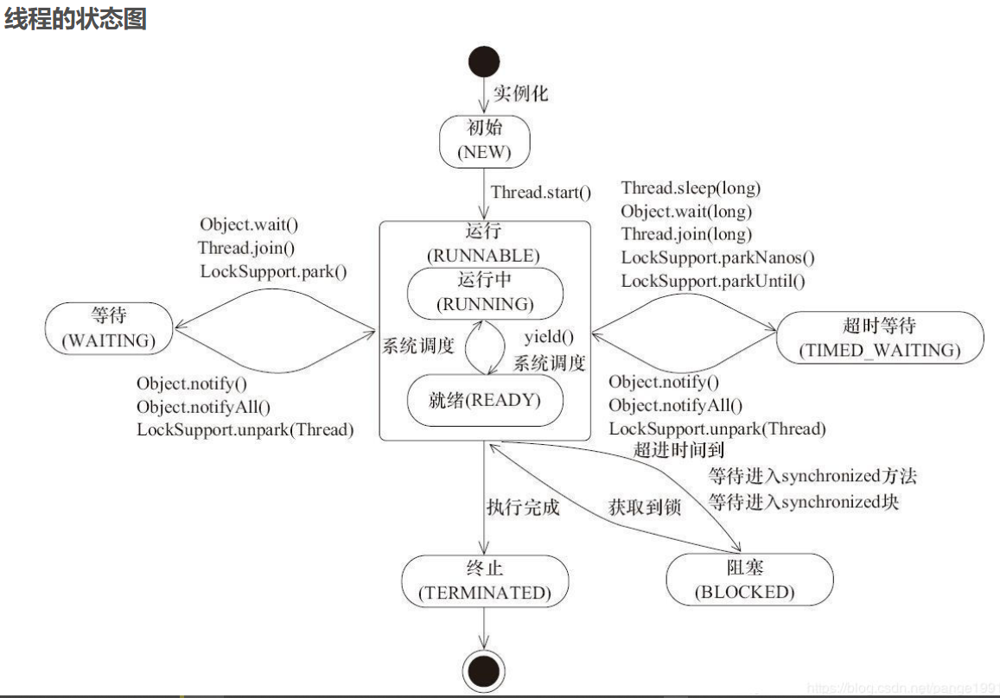
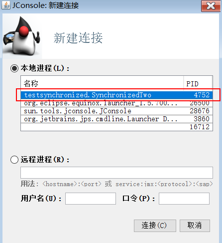
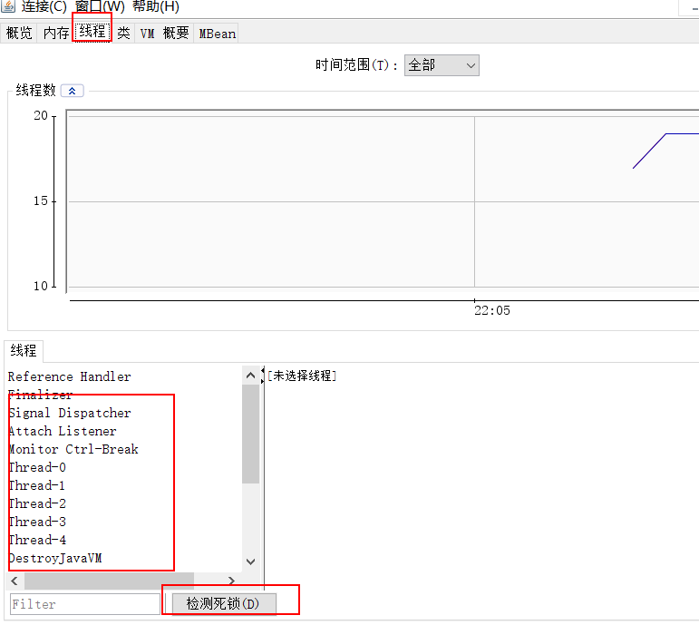
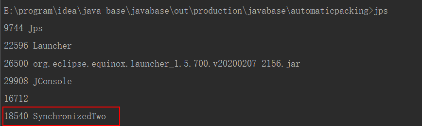
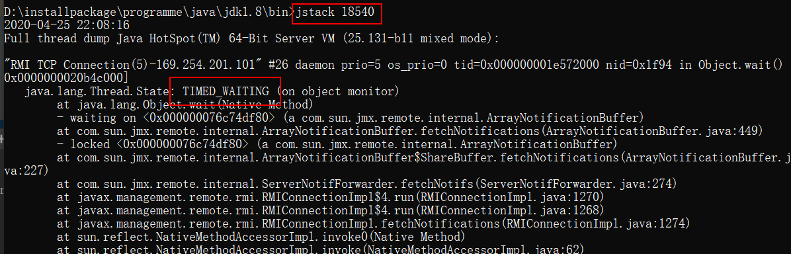

这里主要是介绍`jdk`自带的工具来查看线程状态

# 线程的六种状态

1. `new`
	1. 比如使用`new Thread()`方式创建一个线程
2. `runnable`
	1. 对于`runnable`有两种理解
		1. 一种是正在运行的，也就是拿到了`cpu`执行权
		2. 一种是可运行的，也就是在调用线程的`start()`方法后，就表示可运行，但是想要真正的运行还需要拿到`cpu`的执行权
3. `blocked`
	1. 从`runnable`状态去获取锁失败的时候就会是`blocked`状态
4. `waiting`
5. `timed waiting`
6. `TERMINATED`

<!--more-->

## 线程不同状态间切换

不同状态间切换需要记住两点

1. `new`状态和`runnable`状态是一定会经历的，并且是最先经历的两个阶段
2. 其余的四个状态都是和`runnable`状态来进行交互的

**在网上找了一个线程状态切换图**

## 图解说明

上面的图其实还不是很正确,因为从**等待状态可以直接进入阻塞状态**，因为上面图中显示从waiting到Runnable的方式有notify或notifyAll等方法，但是如果是多个线程在等待同一个锁，那么当没有获取到锁的线程就会陷入到阻塞状态(也可以认为依然是等待状态)，当然上面的图对于一个线程来说是正确的。还有一点就是到终止状态的不仅仅是执行完成，如果是出现了异常也可以直接从其余的状态进入到终止状态。

# 使用jconsole查看线程状态

`jconsole`在`jdk`的`bin`目录下，我们直接打开

找到我们自己的线程进行连接

如上图所示，可以看到线程，当点击某一个线程的时候可以看到线程的状态，还可以检测死锁。

# 使用jstack查看线程状态

## 使用jps查找pid

## 打开jstack

`jstack`也是在`jdk`的`bin`目录下，不过我们可以直接打开`cmd`来执行(前提条件是配置了`java`环境变量)

如图所示可以通过`jstack`命令可以看到线程的状态。