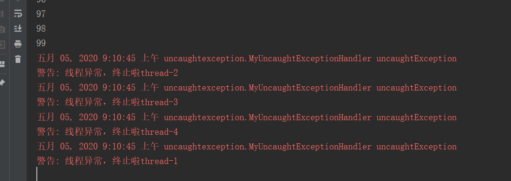

# 子线程异常不影响父线程

```java
package uncaughtexception;

public class UncaughtExceptionDemo implements Runnable {
    public static void main(String[] args) {

        new Thread(new UncaughtExceptionDemo()).start();
        for (int i = 0; i < 100; i++) {
            System.out.println(i);
        }
    }

    @Override
    public void run() {
        throw new RuntimeException();
    }
}
```

如上面代码所示，有两个线程，在子线程中抛出了异常，但是不会影响到父线程的业务，正常来讲，当出现异常时我们需要处理，不能直接略过去。

<!--more-->

# 父线程不能捕获子线程异常

上面的案例说子线程出现了异常，父线程没有受到印象，那我们在父线程中去捕获异常不就行了么？看下面的代码。

```java
package uncaughtexception;

public class CaughtChildThreadExceptionInParent implements Runnable {

    public static void main(String[] args) {
        try {
            new Thread(new UncaughtExceptionDemo(), "thread-1").start();
            new Thread(new UncaughtExceptionDemo(), "thread-2").start();
            new Thread(new UncaughtExceptionDemo(), "thread-3").start();
            new Thread(new UncaughtExceptionDemo(), "thread-4").start();
        } catch (RuntimeException e) {
            System.out.println("捕获到了运行时异常");
        }
        for (int i = 0; i < 100; i++) {
            System.out.println(i);
        }
    }

    @Override
    public void run() {
        throw new RuntimeException();
    }
}
```

上面的代码中在父线程中使用了`try-catch`来捕获`RuntimeException`异常(因为子线程中抛出的就是`RuntimeException`异常)但是当你运行的时候就会发现异常并没有捕获到，因为

* `RuntimeException`异常时发生到子线程当中
* `try-catch`只能捕获当前线程发生的异常，所以父线程是不会捕获到子线程异常的

# 解决办法

## 子线程中捕获(不推荐)

```java
package uncaughtexception;

public class CaughtChildThreadExceptionInParent implements Runnable {

    public static void main(String[] args) {
        new Thread(new CaughtChildThreadExceptionInParent(), "thread-1").start();
        new Thread(new CaughtChildThreadExceptionInParent(), "thread-2").start();
        new Thread(new CaughtChildThreadExceptionInParent(), "thread-3").start();
        new Thread(new CaughtChildThreadExceptionInParent(), "thread-4").start();

        for (int i = 0; i < 100; i++) {
            System.out.println(i);
        }
    }

    @Override
    public void run() {
        try {
            throw new RuntimeException();
        } catch (RuntimeException e) {
            System.out.println("捕获到了运行时异常");
        }
    }
}
```

直接结果


使用这种方式确实可以捕获到异常，但是每一个线程中都要写捕获异常的代码，显然这种方式是不优雅的。下线提供一种更优雅的方式

## 全局异常

`Thread`类中提供了一个`UncaughtExceptionHandler`接口，这个接口专门用来处理线程的异常的。

使用步骤：

* 自己定义一个类实现`UncaughtExceptionHandler`
* 在需要使用的线程类中设置异常处理器

### 自定义类实现`UncaughtExceptionHandler`

```java
package uncaughtexception;

import java.util.logging.Level;
import java.util.logging.Logger;

public class MyUncaughtExceptionHandler implements Thread.UncaughtExceptionHandler{
    @Override
    public void uncaughtException(Thread t, Throwable e) {
        Logger logger = Logger.getAnonymousLogger();
        logger.log(Level.WARNING, "线程异常，终止啦" + t.getName());
    }
}
```

### 使用自定义异常处理类

```java
package uncaughtexception;

public class UseMyUncaughtExceptionHandler implements Runnable {
    public static void main(String[] args) {
      // 使用我们自己定义的异常处理器
        Thread.setDefaultUncaughtExceptionHandler(new MyUncaughtExceptionHandler());
        new Thread(new UseMyUncaughtExceptionHandler(), "thread-1").start();
        new Thread(new UseMyUncaughtExceptionHandler(), "thread-2").start();
        new Thread(new UseMyUncaughtExceptionHandler(), "thread-3").start();
        new Thread(new UseMyUncaughtExceptionHandler(), "thread-4").start();

        for (int i = 0; i < 100; i++) {
            System.out.println(i);
        }
    }

    @Override
    public void run() {
        throw new RuntimeException();
    }
}
```

这个代码和上面的代码的不同只有一个地方，就是`Thread.setDefaultUncaughtExceptionHandler(new MyUncaughtExceptionHandler());`

执行结果



可以看到，虽然我们自己在线程中没有捕获异常，但是设置了全局异常处理器后，在异常处理器类中可以捕获到未捕获的异常，我们要处理的逻辑可以在异常处理器类中进行处理。