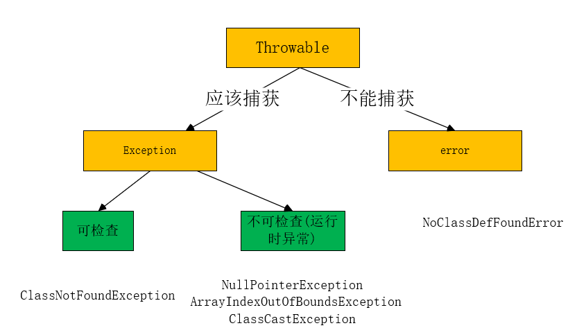

# Throwable

`Throwable`是`Exception`和`error`的父类。而`Exception`和`error`的作用不同，这里的两个不同的子类体现的是异常中分类的思想。



如上图所示，`Exception`和`Error`的分类依据是对于会出现问题带代码我们是否应该捕获。

<!--more-->

# 应该捕获(Exception)

对于`Exception`我们是应该捕获的，不过`Exception`中也可以进行分类，分类的一句是是否能检查，也就是该异常是在编译器就知道还是在运行时才能知道。

## checked

对于在编译期就可以知道的异常就是可检查的异常，比如`ClassNotFoundException`

## unchecked

对于在编译期不知道，在运行时可能会出现的异常就是运行时异常，比如

* `NullPointerException`
* `ArrayIndexOutOfBoundException`
* `ClassCastException`


# 不能捕获(Error)

对于有些错误出现了我们是不能处理的，很多都是`jvm`虚拟机自身出了问题，对于这样的问题即使我们能捕获也是处理不了的，所以这些不可捕获的类别就通过`Error`来定义。比如说下面的几个错误

* `OutOfMemoryError`
* `StackOverFlowError`
* `NoClassDefFoundError`

# throw和throws

```java
package example;

public class TestThrow {
    public static void main(String[] args) {
        one();
    }
    public static void one() throws ArithmeticException{
        try {
            int i = 1 / 0;
        } catch (ArithmeticException e) {
            throw new ArithmeticException("by / zero");
        }
    }
}
```

## Throw

* 作用在方法内，表示抛出具体异常，由方法体内的语句处理。
* 具体向外抛出的动作，所以它抛出的是一个异常实体类。若执行了`Throw`一定是抛出了某种异常。

## Throws

* 作用在方法的声明上，表示如果抛出异常，则由该方法的调用者来进行异常处理。
* 主要的声明这个方法会抛出会抛出某种类型的异常，让它的使用者知道捕获异常的类型。出现异常是一种可能性，但不一定会发生异常。


# ClassNotFoundException和NoClassDefFoundError

* 对于`ClassNotFoundException`是一个检查异常，比如下面的代码

```java
package example.classobject;
import org.junit.Test;
public class ClassObject {
    @Test
    public void testException () throws ClassNotFoundException {
        Class.forName("oracle.jdbc.driver.OracleDriver");
    }
}
```

上面的代码去加载`mysql`数据库驱动，如果没有加载到就会出现**类没有找到的异常**

* `NoClassDefFoundError`是`Error`，这里说明是可以代码可以通过编译，但是实际运行的是在发现找不到编译后的`class`就会出现这个错误.

