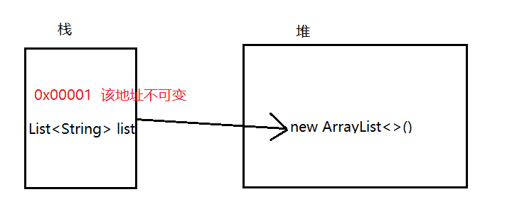
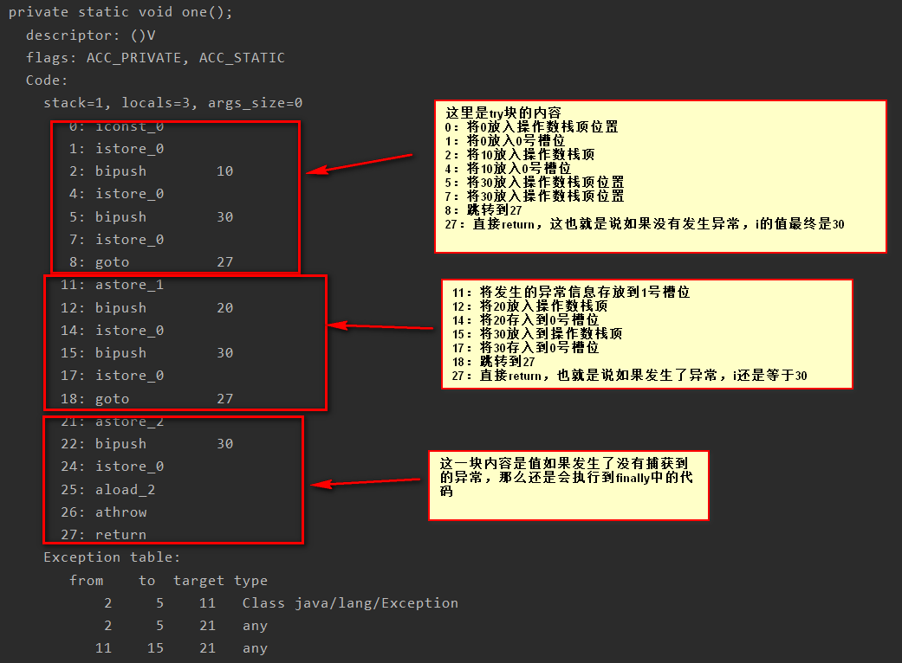
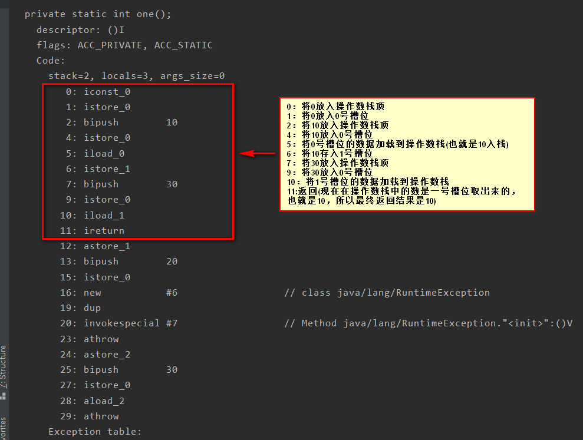
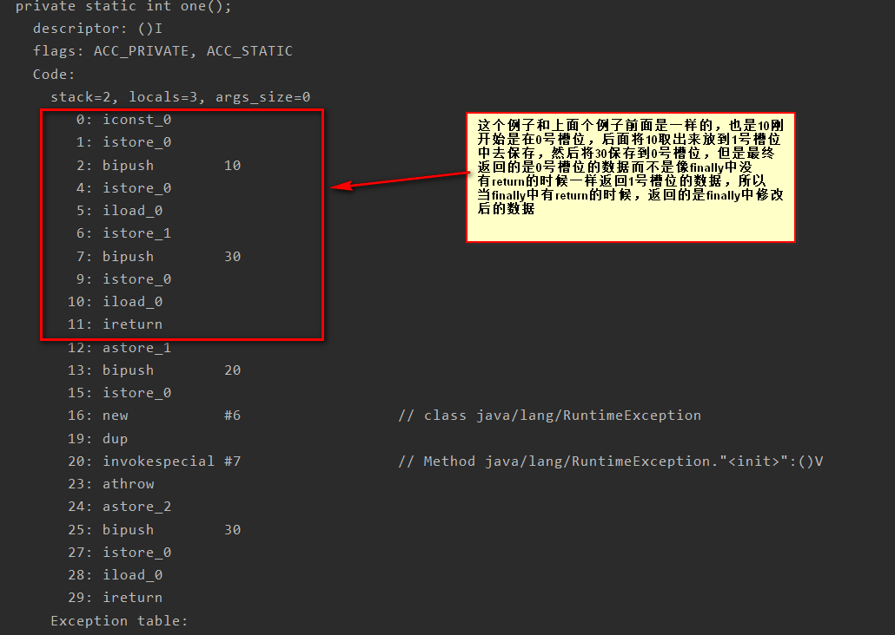
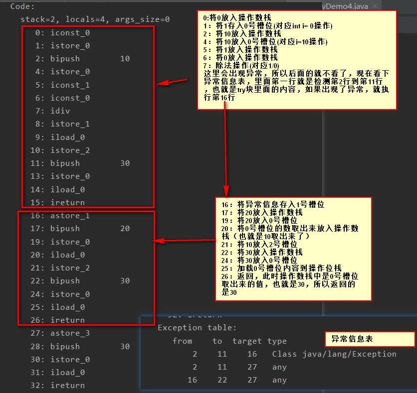
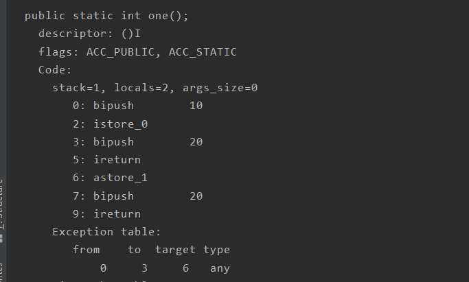
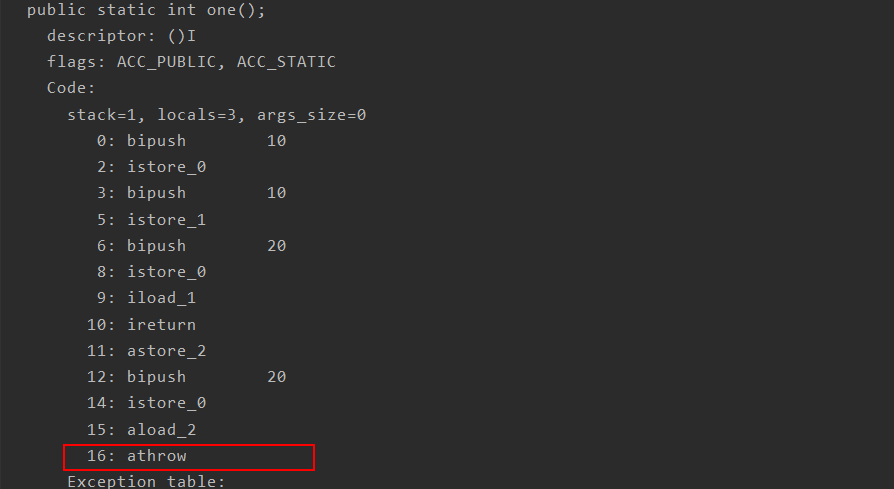

要想区分这几个关键字的不同之处，就需要弄清楚每一个关键字的本来含义，也就是说为什么想要设置这样的一个关键字，只能搞清楚了一个关键字的本来含义才能明白他们的本质区别。

<!--more-->

# final

从作用上来看，`final`是可以用来修饰类，方法，变量。并且都有不同的含义。

## 修饰Class

被`final`修饰的类是不可以被继承的，也就是该类不可扩展，不可变了。

## 修饰方法

对于被`final`修饰的方法是不可以被重写的，也就是该方法不可变了。

## 修饰变量

对于被`final`修饰的变量是不可以被改变的。这也是说不可变。

### 引用与非引用

```java
package example.testfinal;
import java.util.ArrayList;
import java.util.List;
public class FinalDemo {
    public static void main(String[] args) {
        final int i = 6;
        final String a;
        //i = 10; 错误
        final List<String> list = new ArrayList<>();
        list.add("10");
        list.add("20");
        //list = new ArrayList<>(); 错误
        a = "hello";
        //a = "world"; 错误
    }
}
```

可以看到上面的代码，无论是什么类型，只要是被`final`修饰就`只能赋值一次`。但是对于引用类型和非引用类型还是有一点区别的，可以看到非引用类型就是变量的值不可变。而引用类型如图所示：



不可变指的是栈中的变量保存的指向堆中的地址是不可变的，但是堆中的对象可以变，就像上面的代码中写的一样，`list`依然可以添加元素。

## 共同点

从上面的描述中可以都可以看到一个共同的字眼，就是不可变。其实这也是`final`关键字的本来含义，就是只有是被`final`修饰的内容是不想被改变的。要知道我们不是一个人在开发，既然很多人要协作，那么有些不想被别人改变的内容就可以通过`final`关键字来修饰，这样别人就知道这些变量或方法或类是不想被改变的。


# finally

`finally`是`java`为了保证重点代码一定被执行，通常是用来进行释放资源的操作。但是`java7`之后推荐使用`try-with-resource`来释放资源。	

## finally的本质

上面说`finally`的作用是保证重点代码都可以被执行，那么是如何保证的呢。

```java
package example.testpackage;
public class FinallyDemo4 {
    public static void main(String[] args) {
        one();
    }
    private static void one() {
        int i = 0;
        try {
            i = 10;
        } catch (Exception e) {
            i = 20;
        } finally {
            i = 30;
        }
    }
}
```

现在使用反编译命令  `javap -p -v -l FinallyDemo4.class`来看一下反编译之后的字节码文件。



通过分析编译后的字节码可知，之所以说`finally`中的代码一定会被执行到，是因为其实是将`finally`中的代码既拷贝到了`try`当中，也拷贝到了`catch`当中，所以无论代码有没有发生异常，`finally`中的代码都会执行到。

## try-with-resources

**`jdk7`之前**

平时我们经常会使用的输入流和输出流的，这两个流使用完成之后都是需要进行关闭，一般的操作如下面的代码

```java
package example.testpackage;

import java.io.*;

public class CloseResource {
    public static void main(String[] args) {
        InputStream inputStream = null;
        OutputStream outputStream = null;
        try {
            inputStream = new FileInputStream("D:/axis.log");
            outputStream = new FileOutputStream("E:/axis.log");
            // 缓冲区
            byte[] bytes = new byte[1024];
            int len = 0;
            while ((len = inputStream.read(bytes)) != -1) {
                outputStream.write(bytes, 0, len);
            }
        } catch (FileNotFoundException e) {
            e.printStackTrace();
        } catch (IOException e) {
            e.printStackTrace();
        } finally {
            if (inputStream != null) {
                try {
                    inputStream.close();
                } catch (IOException e) {
                    e.printStackTrace();

                }
            }
            if (outputStream != null) {
                try {
                    outputStream.close();
                } catch (IOException e) {
                    e.printStackTrace();
                }
            }
        }
    }
}
```

可以看到上面有很多与业务代码无关的代码。

**`jdk7`及以后**

```java
public class CloseResource {
    public static void main(String[] args) {
        withResource();
    }

    private static void withResource() {
        try(InputStream inputStream = new FileInputStream("D:/axis.log");
        OutputStream outputStream = new FileOutputStream("E:/axis.log")){
            // 缓冲区
            byte[] bytes = new byte[1024];
            int len = 0;
            while ((len = inputStream.read(bytes)) != -1) {
                outputStream.write(bytes, 0, len);
            }
        } catch (FileNotFoundException e) {
            e.printStackTrace();
        } catch (IOException e) {
            e.printStackTrace();
        }
    }
}
```

使用`try-with-resource`代码会简单很多，做法也很简单，就是将需要关闭的资源定义在`try()`的括号中。


## finally不执行

虽然说`finally`的目的是为了让重要的代码 **一定**可以执行到，但是这里的一定也不是绝对的，比如下面的代码

```java
package example.testpackage;

public class FinallyDemo {

    public static void main(String[] args) {
        try {
            System.out.println("try块");
            System.exit(1);
        } finally {
            System.out.println("finally");
        }
    }
}
```

如果在`try`块里面执行了 `System.exit(1)`之后，在`finally`中的内容就不会执行了，因为执行了`System.exit(1)`实际上是已经退出了`jvm`虚拟机。

## 多个位置的return的问题

注意：如果在`finally`中写了`return`会吞掉异常。

### 只有try中有return

```java
package example.testpackage;
public class FinallyDemo4 {
    public static void main(String[] args) {
        System.out.println(one());
    }
    private static int one() {
        int i = 0;
        try {
            i = 10;
            return i;
        } catch (Exception e) {
            i = 20;
            throw new RuntimeException();
        } finally {
            i = 30;
        }
    }
}
```

上面的代码中只有在`try`中有`return`，但是在`finally`中修改了`i`的值，那么返回的结果是什么呢？看一下反编译后的字节码文件 `javap -p -v -l FinallyDemo4.class`




通过分析编译后的字节码可以返回的结果是10，也就是说虽然`finally`中修改了变量的值，但是返回的还是`try`块中的值。

### try和finally中都有return

```java
package example.testpackage;

public class FinallyDemo4 {
    public static void main(String[] args) {
        System.out.println(one());
    }
    private static int one() {
        int i = 0;
        try {
            i = 10;
            return i;
        } catch (Exception e) {
            i = 20;
            throw new RuntimeException();
        } finally {
            i = 30;
            return i;
        }
    }
}
```

看下编译后的字节码文件



由上面的分析可知，当`try`和`finally`中都有`return`的时候，最终返回的是`finally`中修改的值。

### try和catch和finally中都有

```java
package example.testpackage;

public class FinallyDemo4 {
    public static void main(String[] args) {
        System.out.println(one());
    }
    private static int one() {
        int i = 0;
        try {
            i = 10;
            int b = 1 / 0;
            return i;
        } catch (Exception e) {
            i = 20;
            return i;
        } finally {
            i = 30;
            return i;
        }
    }
}
```

看上面的代码，三个块中都有`return`，并且发生了异常，此时来看下编译后的字节码



通过上面的分析可知，最终返回的是30

## finally中使用return吞掉异常

```java
package example.testpackage;

public class FinallyDemo3 {
    public static void main(String[] args) {
        int i = one();
        System.out.println(i);
    }
    private static int one() {
        try {
            int a = 1 /0;
            return 10;
        } finally {
            return 20;
        }
    }
}
```

上面的代码会输出的结果是20，而且也不会有异常信息。看一下编译后的字节码中`one`方法的信息



现在去掉`finally`中的`return`，再反编译看一下



可以看到最后是用`athrow`的，**所以我们写代码是最好是不要在`finally`中写`return`语句。**


# finalize

在`java`垃圾回收中，使用的可达性分析算法来判断一个垃圾是不是可以被回收，但是即使在可达性分析中该对象是不可达的，也不会立即被回收。此时他们暂时处于缓刑阶段，要宣告一个对象死亡，至少需要经历**两次标记过程**

* 如果对象在进行可达性分析后发现没有与`GC Root`相连接的引用链，那么将会被第一次标记并且进行一次筛选，筛选的条件是此对象是否有必要执行`finalize()`方法，当对象没有覆盖`finalize()`方法时，或者`finalize()`方法已经被虚拟机调用过，虚拟机将这两种情形视为**“没有必要执行”**
* 如果该对象判断为有必要执行`finalize()`方法，那么该对象将中被放置在一个叫做`F-Queue`队列中，并且在稍后由一个虚拟机自动建立的，优先级低的`Finalizer`线程去执行它。`finalize()`方法是对象逃脱死亡命运的最后一次机会，稍后`GC`将对`F-Queue`中的对象进行第二次小规模的标记，如果对象在`finalize()`中成功拯救自己(只要重新与引用链上的任何一个对象建立关联即可，比如将自己(`this`关键字)赋值给某个类变量或对象的成员变量，那么在第二次标记的时候会被将它移除“**即将回收**”的集合)，如果对象在此时还没有逃脱，那就说明需要被回收了。

所以`finalize`可以用于对象自救，但是这种方式最好不要使用，效率很低。