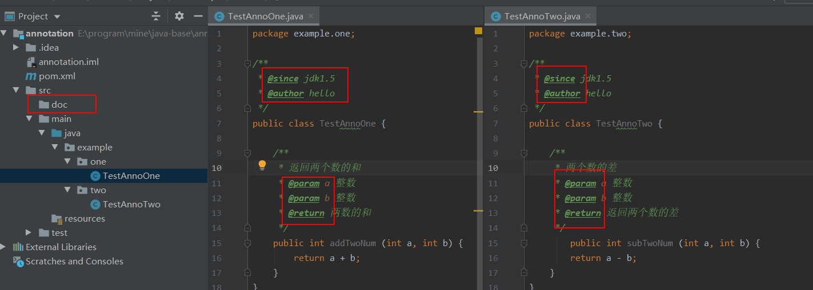
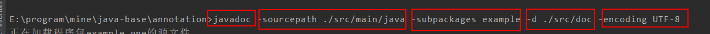
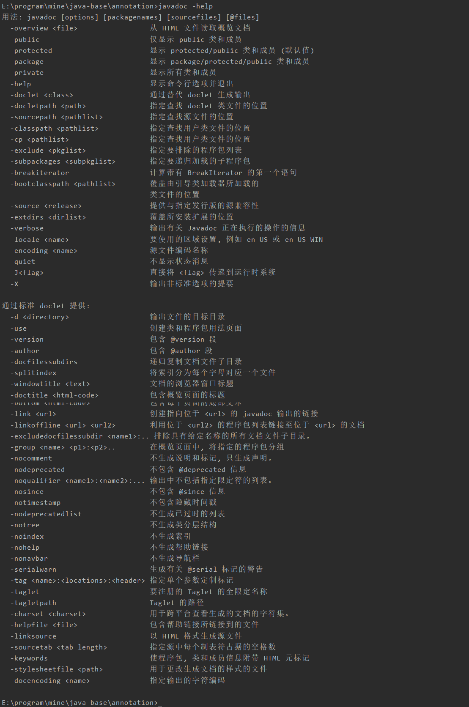
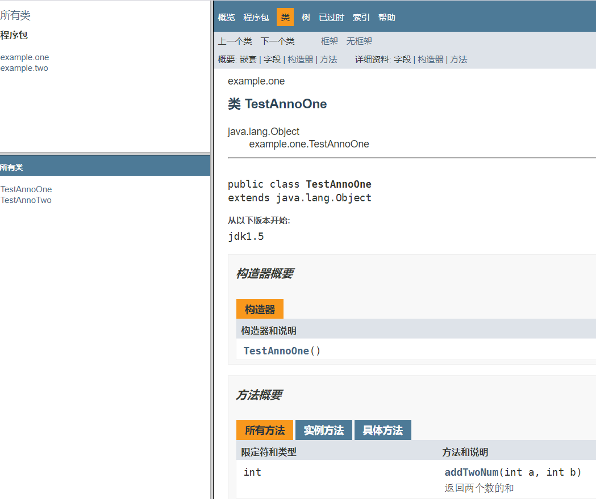

# 概念

注解(`Annotation`)也可以叫做元数据。是一种代码级别的说明。它是`jdk1.5`及以后引入的一个特性，与类，接口和枚举是在同一个层次，他可以声明在**包、类、字段、方法、局部变量、方法参数**等的前面，用来对这些元素进行说明，注释。

<!--more-->


# 作用分类

## 编译检查

通过代码里的标识的注解让编译器能够实现基本的编译检查(比如说`OVerride`注解)

## 编写文档

通过代码里的标识的注解可以生成文档(`doc`文档)

**案例**

比如现在包结构和代码示例如下：



现在想要生成`doc`文档到`doc目录`下，使用如下命令：



```java
javadoc -sourcepath ./src/main/java -subpackages example -d ./src/doc -encoding UTF-8
```

上面命令的意思是将**源文件位置在**`./src/main/java`(这里使用了相对路径)并且**子包**为`example`里面的所有内容使用`utf-8`编码格式生成`doc`文档并且输出到`./src/doc`目录中

### 参数查看

具体参数可以使用 `javadoc -help`来查看



生成中的结果如图所示



可以看到和我们平时看到的`java api`是一样一样的。

## 代码分析

通过代码里标识的注解对代码进行分析(使用反射)

# jdk中预定义的注解

## @Override

检测该注解标注的方法是否是继承自父类的方法，作用就是编译检查

## @Deprecated

标注的方法代表是已经过时的方法

## @SuppressWarning

* 如果是放在类上就是压制类中所有的警告
* 如果是放在方法上就是压制该方法上的警告

# 自定义注解

## 注解格式

注解格式包含两部分

* 元注解
* `public @interface 注解名称{}`

注解本质上是一个接口，并且该接口继承了`Annotation`抽象类。

## 注解的属性

所谓注解的属性也就是接口中的**抽象方法**。

为什么称为属性，请看使用案例：

**注解代码:**

```java
package example.one;
public @interface AnnoOne {
    int age();
    String name();
    String address() default "中国";
}
```

**使用注解代码**

```java
package example.one;
@AnnoOne(age=12, name="张三")
public class TestAnnoOne {

    public int addTwoNum (int a, int b) {
        return a + b;
    }
}
```

在注解里面定义的方法在使用时方法名就相当于是一个属性一样来使用。所以才称之为是注解的属性。

### 属性的返回值

* 基本数据类型
* String
* 枚举
* 注解
* 以上类型的数组

### 属性赋值

* 如果定义属性时，使用`default`关键字给属性默认初始值，则使用注解时可以不进行属性的赋值
* 如果**只有一个属性**需要赋值，并且属性的名称是`value`，则`value`可以省略，直接定义值即可
* 数组赋值时，值使用`{}`包裹，如果数组中只有一个值，那么`{}`可以省略不写。

# 元注解

用于描述注解的注解

* `@Target`

	```java
	@Documented
	@Retention(RetentionPolicy.RUNTIME)
	@Target(ElementType.ANNOTATION_TYPE)
	public @interface Target {
	    ElementType[] value();
	}
	```

	描述注解能够作用的位置, `ElementType`是一个枚举，我们**常用**的是如下几个值：

	* `TYPE`： 表示这个注解可以作用到类上面
	* `FILED`：表示这个注解可以作用到字段上面
	* `METHOD`：表示这个注解可以作用到方法上

* `@Retention`

	```java
	@Documented
	@Retention(RetentionPolicy.RUNTIME)
	@Target(ElementType.ANNOTATION_TYPE)
	public @interface Retention {
	    RetentionPolicy value();
	}
	```

	描述注解被保留的阶段,`RetentionPolicy`也是一个枚举，里面有三个值：

	* `SOURCE`：表示在源码阶段就起作用
	* `CLASS`：表示在字节码阶段起作用
	* `RUNTIME`：表示在运行时阶段起作用(对于我们自己编写的注解一般都是使用`RUNTIME`)

* `@Document`
	描述注解是否被抽取到`api`文档中

* `@Inherited`

	描述注解是否被子类继承

# 使用注解

## 案例一

[案例地址](https://gitee.com/Gwei11/Java/tree/master/code/java-base/annotation)

我们使用注解主要是为了获取在注解中定义的属性值，下面有一个案例，**给定类名和方法名**，通过反射的方式来调用这个方法。

### 使用`properties`完成

配置 `domethod.properties`

```properties
className=example.xml.DoReflectXmlMethod
methodName=show
```

与配置文件对应的类

```java
package example.xml;
public class DoReflectXmlMethod {
    public void show () {
        System.out.println("这个方法是xml配置参数通过反射来完成的");
    }
}
```

测试类

```java
package example.xml;

import org.junit.Test;

import java.io.IOException;
import java.io.InputStream;
import java.lang.reflect.InvocationTargetException;
import java.lang.reflect.Method;
import java.util.Properties;
public class TestXml {
    @Test
    public void xmlTest() throws IOException, ClassNotFoundException, IllegalAccessException, InstantiationException, NoSuchMethodException, InvocationTargetException {
        // 第一步加载properties
        //1.1创建Properties对象
        Properties pro = new Properties();
        //1.2加载配置文件，转换为一个集合
        //1.2.1获取class目录下的配置文件
        ClassLoader classLoader = TestXml.class.getClassLoader();
        InputStream is = classLoader.getResourceAsStream("domethod.properties");
        pro.load(is);
        String className = pro.getProperty("className");
        String methodName = pro.getProperty("methodName");

        // 加载该类进内存
        Class aClass = Class.forName(className);
        // 创建对俩
        Object o = aClass.newInstance();
        // 获取方法
        Method method = aClass.getMethod(methodName);
        // 执行方法
        method.invoke(o);
    }
}
```

### 使用注解完成

注解类

```java
package example.anno;

import java.lang.annotation.ElementType;
import java.lang.annotation.Retention;
import java.lang.annotation.RetentionPolicy;
import java.lang.annotation.Target;

@Target(value = {ElementType.TYPE, ElementType.METHOD}) // 可以作用在方法和类上
@Retention(RetentionPolicy.RUNTIME) // 运行时起作用,这个注解不能少
public @interface MyAnno {
    String className();
    String methodName();
}
```

与注解对应的类

```java
package example.anno;

@MyAnno(className = "example.anno.DoReflectAnnoMethod", methodName = "show")
public class DoReflectAnnoMethod {

    public void show () {
        System.out.println("这个方法是anno配置参数通过反射来完成的");
    }
}
```

测试类

```java
package example.anno;

import org.junit.Test;

import java.lang.reflect.InvocationTargetException;
import java.lang.reflect.Method;

public class TestAnno {
    @Test
    public void annoTest() throws ClassNotFoundException, IllegalAccessException, InstantiationException, InvocationTargetException, NoSuchMethodException {
        // 获取含有注解的那个类的字节码对象
        Class<DoReflectAnnoMethod> testAnnoClass = DoReflectAnnoMethod.class;
        // 获取注解对象，注解本质上是一个接口，该方法是在内存中有一个该接口的实现类
        MyAnno annotation = testAnnoClass.getAnnotation(MyAnno.class);
        // 执行接口方法，获取注解属性值
        String className = annotation.className();
        String methodName = annotation.methodName();

        // 加载该类进内存
        Class aClass = Class.forName(className);
        // 创建对俩
        Object o = aClass.newInstance();
        // 获取方法
        Method method = aClass.getMethod(methodName);
        // 执行方法
        method.invoke(o);
    }
}
```

## 案例二

一个简单的测试框架，测试方法的时候可能有很多方法，而且有的方法是不需要测试的，此时可以通过注解来标识那些方法是需要测试的，那些方法是不用测试的。

**自定义注解**

```java
package example2;

import java.lang.annotation.ElementType;
import java.lang.annotation.Retention;
import java.lang.annotation.RetentionPolicy;
import java.lang.annotation.Target;


@Target(ElementType.METHOD) // 该注解是作用方法上
@Retention(RetentionPolicy.RUNTIME) // 运行时使用
public @interface Check {
}
```

**需要测试的类**

```java
package example2;

/**
 * 加了check注解的方法表示需要测试的
 */
public class Calculator {
    @Check
    public void add () {
        System.out.println("1 + 1 =" + (1 + 1));
    }
    @Check
    public void sub() {
        System.out.println("1 - 0 =" + (1 - 0));
    }
    @Check
    public void mul () {
        System.out.println("1 * 1 =" + (1 * 1));
    }
    @Check
    public void de () {
        System.out.println("1 / 0 =" + (1 / 0));
    }
    public void noException () {
        System.out.println("该方法没有异常不用测试");
    }
}
```

可以看到这个需要类中有很多方法需要测试，区分标准就是方法上如果有`@Check`注解就表示需要测试

**测试类**

```java
package example2;

import org.junit.Test;

import java.io.BufferedWriter;
import java.io.FileWriter;
import java.io.IOException;
import java.lang.reflect.Method;

public class TestCalculator {

    @Test
    public void checkTest() throws IOException {
        // 获取对象
        Calculator calculator = new Calculator();
        // 获取字节码文件
        Class<? extends Calculator> aClass = calculator.getClass();
        // 获取所有方法
        Method[] methods = aClass.getMethods();
        int number = 0;//出现异常的次数
        // 记录异常的文件
        BufferedWriter bw = new BufferedWriter(new FileWriter("bug.txt"));
        for (Method method : methods) {
            // 判断方法上是否具有check注解
            if (method.isAnnotationPresent(Check.class)) {
                try {
                    // 有注解，则要执行该方法进行测试
                    method.invoke(calculator);
                } catch (Exception e) {
                    // 有异常则记录异常
                    //记录到文件中
                    number++;
                    bw.write(method.getName() + " 方法出异常了");
                    bw.newLine();
                    bw.write("异常的名称:" + e.getCause().getClass().getSimpleName());
                    bw.newLine();
                    bw.write("异常的原因:" + e.getCause().getMessage());
                    bw.newLine();
                    bw.write("--------------------------");
                    bw.newLine();
                }
            }
        }
        bw.write("本次测试一共出现 "+number+" 次异常");
        bw.flush();
        bw.close();
    }
}
```

上面测试代码其实就是利用反射的只是来获取方法上的注解，如果包含`@Check`则需要执行测试方法，否则不用执行。