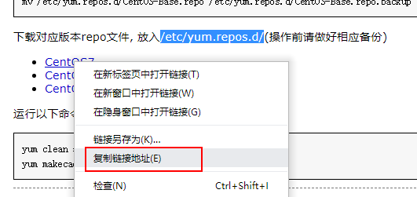
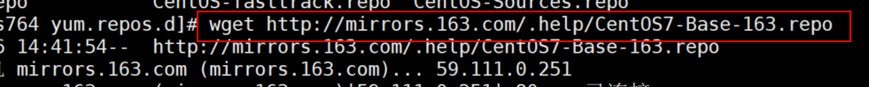
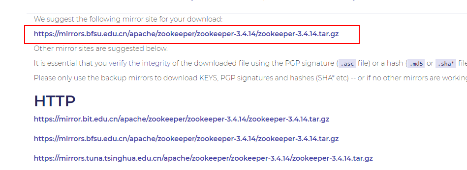
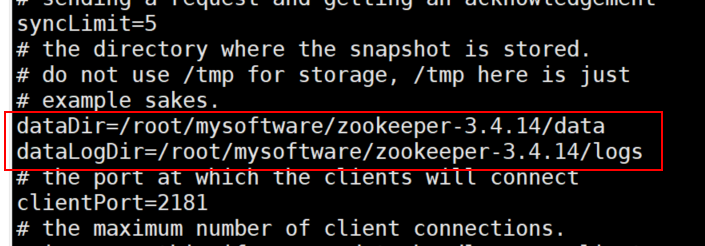
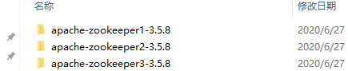
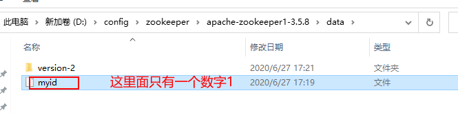

# 替换源

http://mirrors.163.com/.help/centos.html

上面地址是163的地址，我们可以进去按照操作步骤来即可。但是有一点需要注意，如果安装的`centos`系统是最小版本的，那么有一些工具可能没有安装，比如下面的第三步需要使用`wget`命令，所以如果没有安装的话需要先安装`wget`工具

```
yum install wget
```

1. 备份数据  

   ```
   mv /etc/yum.repos.d/CentOS-Base.repo /etc/yum.repos.d/CentOS-Base.repo.backup
   ```

2. 进入目录 `cd /etc/yum.repos.d/`

<!--more-->

3. 下载对应`repo`地址,这里选择自己对应的`centos`版本，然后右键，复制链接地址，在`centos`的`terminal`窗口中执行`wget` 上面复制的地址即可。





4. 执行下面两个命令即可

   ```
   yum clean all
   yum makecache
   ```

# 关闭防火墙

```
systemctl stop firewalld.service
```

# 安装apache

1. 安装

```
yum install httpd
```

2. 启动

   下面的命令是针对`root`用户的，如果不是`root`用户，需要在前面加上`sudo`

```
service httpd start
```

3. 停止服务

```
service httpd stop
```

# 安装nginx

1. 将`nginx`源添加的`centos`中

```
rpm -Uvh http://nginx.org/packages/centos/7/noarch/RPMS/nginx-release-centos-7-0.el7.ngx.noarch.rpm
```

2. 使用下面命令安装

```
yum -y install nginx
```

3. `nginx`基本命令

```
service nginx start     -- 启动nginx
service nginx stop		-- 停止nginx
service nginx reload	-- 重启nginx
```

# 安装java环境

```
yum -y install java-1.8.0-openjdk.*
```

# 安装zookeeper

1. 首先进入`zookeeper`官网，找到想要下载的版本的下载地址(地址有多个，自己选择一个即可)

   ```
   https://mirrors.bfsu.edu.cn/apache/zookeeper/zookeeper-3.4.14/zookeeper-3.4.14.tar.gz
   ```

   

2. 在`centos`终端中执行下面的命令来下载软件

   ```
   wget https://mirrors.bfsu.edu.cn/apache/zookeeper/zookeeper-3.4.14/zookeeper-3.4.14.tar.gz
   ```

3. 然后解压这个下载下来的安装包（你在哪个位置下载的哪个安装包，就需要先进入哪个位置，才能使用解压命令）

   ```
   tar -zxvf tar -zxvf zookeeper-3.4.14.tar.gz
   ```

4. 进入解压的`zookeeper-3.4.14/conf`目录中，将`zoo_sample.cfg`拷贝一份为 `zoo.cfg`，使用`vim`命令修改文件里面的内容，主要添加`dataDir`和`dataLogDir`

   

## 在window环境中搭建集群环境

1. 将下载的`zookeeper`安装包复制到多个目录中

   

2. 每一个目录下面的`conf`目录下有一个`zoo_sample.cfg`配置文件，我们复制一份将名称修改为`zoo.cfg`,里面内容如下（这是其中一个的配置）：

   ```
   tickTime=2000
   initLimit=10
   syncLimit=5
   # dataDir和dataLogDir需要自己配置，这里data和log两个目录是自己创建的
   dataDir=D:\\config\\zookeeper\\apache-zookeeper1-3.5.8\\data
   dataLogDir=D:\\config\\zookeeper\\apache-zookeeper1-3.5.8\\log
   clientPort=2181
   quorumListenOnAllIPs=true
   # 下面就是集群的配置，这里相当于是配置三台服务器
   server.1=192.168.56.1:2222:2223
   server.2=192.168.56.1:3336:4338
   server.3=192.168.56.1:4444:4445
   ```

   * 上面配置的server.1后面的数字1就是服务器标识，这里一共配置了三台服务器，由于都是本地配置，所以ip地址就是自己电脑的ip，clientPort需要配置成不一样的，比如第一个是2181，另外两个可以是2182和2183
   * 上面配置的的dataDir目录和dataLogDir目录需要自己创建
   * 在每一个zookeeper压缩包中的`data`目录中创建一个`myid`文件，里面只需要填写一个数字，这里的数字需要和server.id中的数字id保持一致,另外两台同样配置即可。

   

