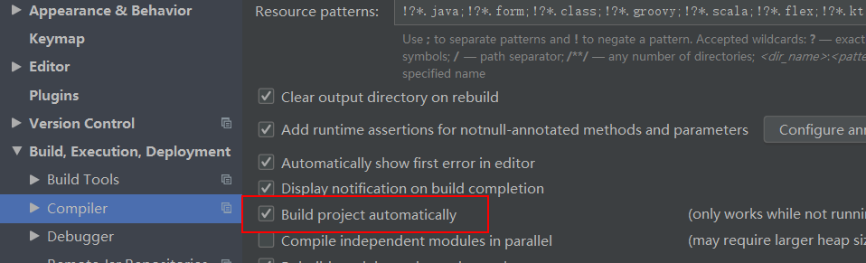
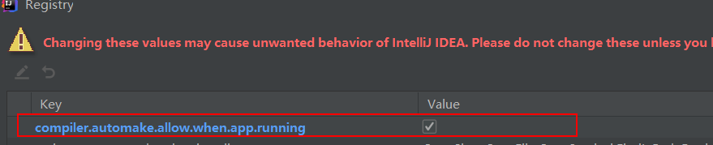
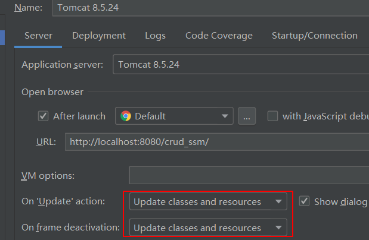

# 设置项目未运行时自动编译

勾上标红的部分。

<!--more-->

# 设置项目运行时自动编译

按下快捷键`ctrl+shift+alt+/`选择`Registry`

# 设置tomcat

部署的时候选择带有`exploded`的那个`war`包

> 1. war模式：将WEB工程以包的形式上传到服务器 ；
> 2. war exploded模式：将WEB工程以当前文件夹的位置关系上传到服务器(这个包可以认为是没有压缩的)

然后如图所示，需要将标红的两个位置都修改成`update classes and resources`，如果上一步部署的时候选择的是不带有`exploded`，那么这里`On update action`是不会有`Update classes and resources`这个选择的。

# 以debug模式启动

经过亲自使用，发现上面的都配置以后，如果没有以`debug`模式启动的话，那些`jsp，js`等资源确实是可以自动更新，但是`java`文件修改后没有自动更新，所以需要以`debug`模式启动，不过尝试的结果是不仅仅要以`debug`模式启动，还需要在修改的地方去打上断点，以调试的模式走过修改部分的代码才起了作用。