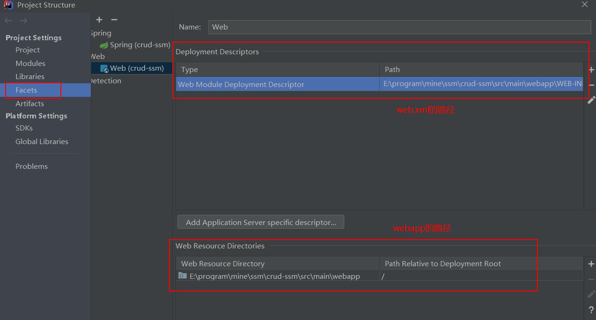
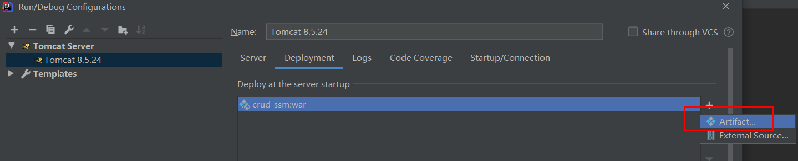
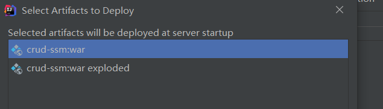
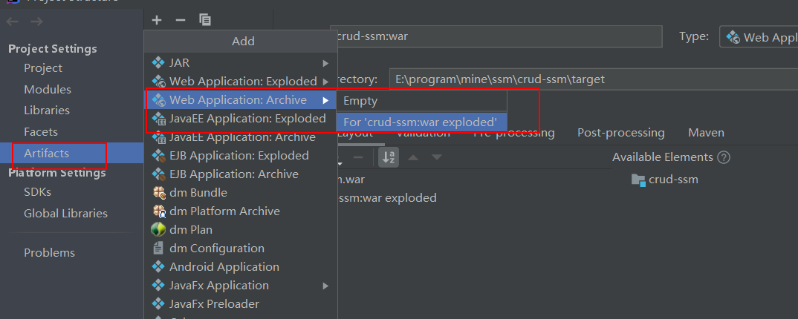

# idea中对于web项目的配置

对于一个`web`项目需要配置`facets`，如下图所示

<!--more-->

`facets`是`idea`中的配置，

还有一个是`Artifacts`,这个是`maven`中的概念，如果想要将项目部署到`tomcat`中就需要`Artifacts`

在选择的时候可以看到有两个可以选择，其中一个是含有`exploded`，另外一个没有，那么他们有什么区别呢，其实可以认为不带有`exploded`就是压缩 的，而带有`exploded`是 没有压缩的文件。

> 1. war模式：将WEB工程以包的形式上传到服务器 ；
> 2. war exploded模式：将WEB工程以当前文件夹的位置关系上传到服务器(这个包可以认为是没有压缩的)

而对于`Artifacts`如果没有添加我们也是可以自己添加的。如下图所示。

