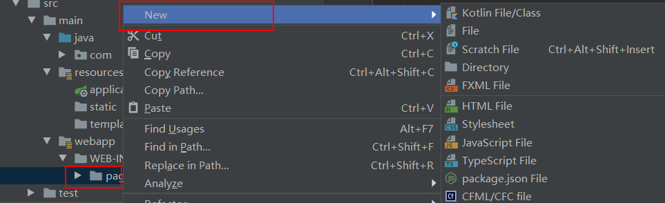
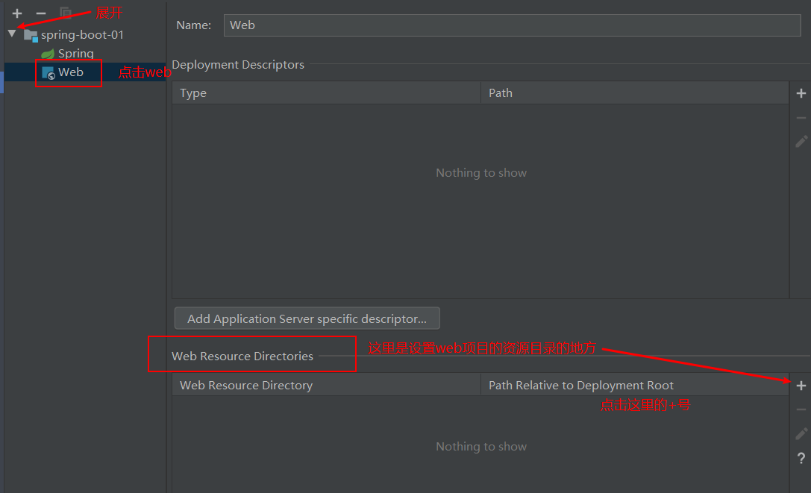
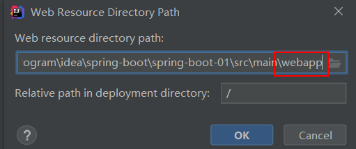
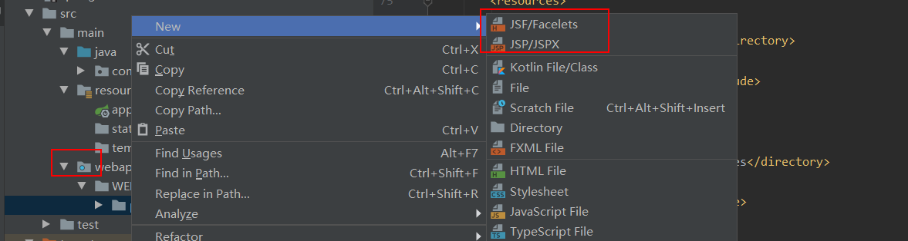
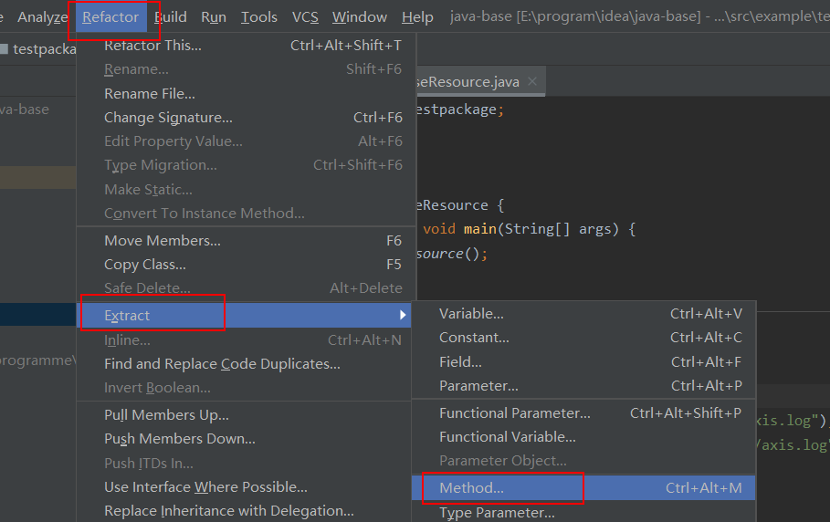
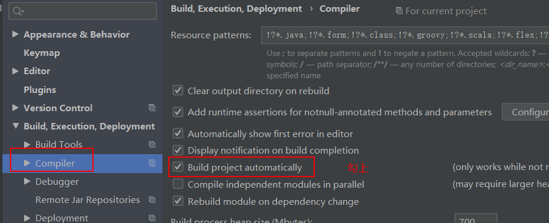
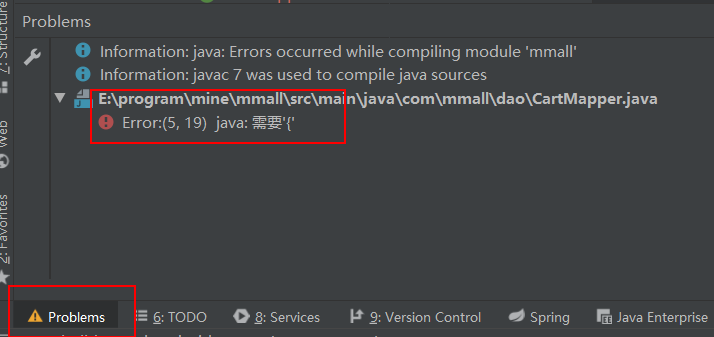
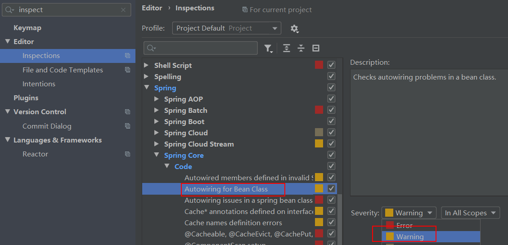
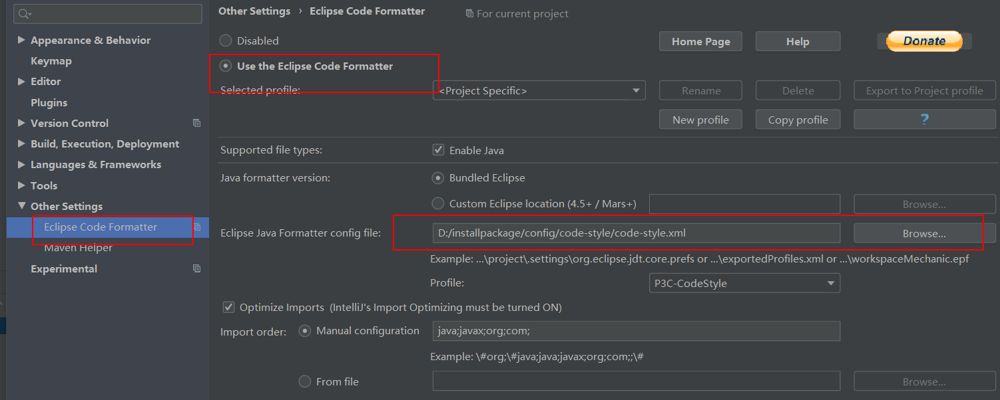
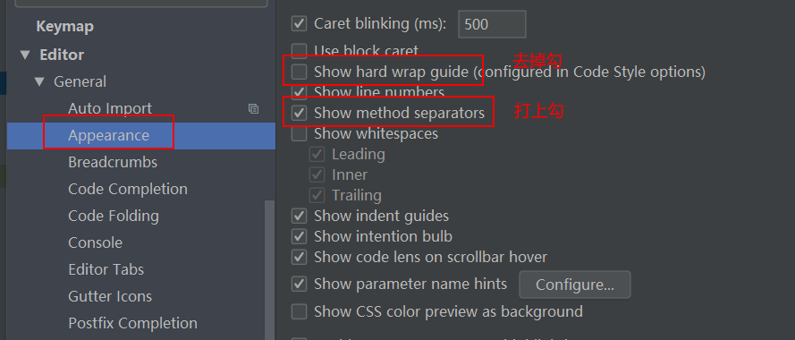

# idea中不能创建jsp文件解决方式

在`idea`中对于一个`web`项目有时候在`webapp/WEB-INF`下右键创建`jsp`文件时并没有该选项。如图所示：

实际上`idea`工具是可以创建`jsp`文件的，之所以不能创建出来是因为没有正确设置，设置方式如下：

然后将`Web Resource directory path`设置到`webapp`目录那一级。

此时再去新增`jsp`文件

可以看到`webapp`那个目录其实已经换了图标，并且其下面的所有目录都可以新增`jsp`文件了。

# idea中将代码抽取中一个单独的方法

* 首先选中需要抽取的代码，然后如下图所示进行操作

也可以进行右键后选择`Refactor->Extract`进行操作

# idea实现自动编译

此时会发现项目会即时编译，如果出现错误下面的图中位置会有提示

# springBean的autowire的报错问题

使用下面的配置即可。

# idea中使用eclipse的格式化插件

下载插件的[地址](https://blog.csdn.net/java_lifeng/article/details/90754099)，就是搜索`eclipse code formatter`即可，下载完之后配置地址如下

# idea中使用gradle编译spring源码很慢的问题解决方式

[参考地址](https://blog.csdn.net/AARON0797/article/details/104424462)

# idea解决控制台中文乱码问题

[参考地址](https://blog.csdn.net/qq_39136928/article/details/81240894)

# idea配置

## idea去掉编辑区的竖线，打开方法分割线

